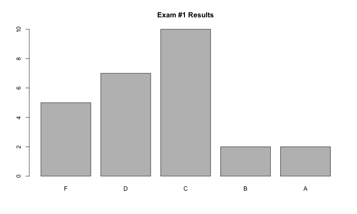
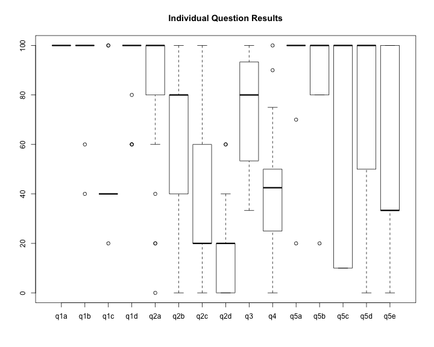

title:        COSC 4820 Database Systems
subtitle:     "Exam #1 Results"
author:       Ruben Gamboa
#logo:         uw-logo-small.png
#biglogo:      uw-logo-large.png
job:          Professor
highlighter:  highlight.js
hitheme:      tomorrow
mode:         selfcontained
framework:    io2012
widgets:      [mathjax, bootstrap]

---

<style>
.title-slide {
     background-color: #EDE0CF; /* CBE7A5; #EDE0CF; ; #CA9F9D*/
     background-image: url(assets/img/uw-logo-large.png);
     background-repeat: no-repeat;
     background-position: center top;
   }
</style>

## Exam Questions

Question   | Points | Topic
-----------|--------|-----------------------------------
q1a        |      5 | Executing Relational Algebra
q1b        |      5 | Executing Relational Algebra
q1c        |      5 | Executing Relational Algebra
q1d        |      5 | Executing Relational Algebra
q2a        |      5 | Writing Relational Algebra
q2b        |      5 | Writing Relational Algebra
q2c        |      5 | Writing Relational Algebra
q2d        |      5 | Writing Relational Algebra
q3         |     15 | Creating E/R Diagram
q4         |     20 | Converting E/R Diagram to Tables
q5a        |     10 | Closure Algorithm
q5b        |      5 | Definition of Keys
q5c        |     10 | BCNF Decomposition
q5d (bonus)|      2 | Lossless Decomposition
q5e (bonus)|      3 | Dependency Preserving Decomposition

----

## Grade Distribution


```
##    Min. 1st Qu.  Median    Mean 3rd Qu.    Max. 
##   44.00   62.25   71.00   70.46   78.75   95.00
```

 

---

## Grade Distribution by Question

 
