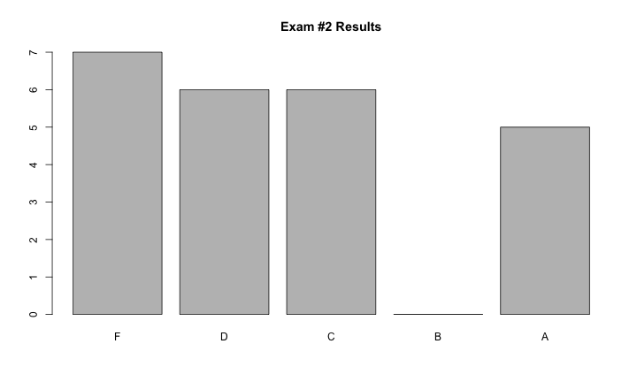
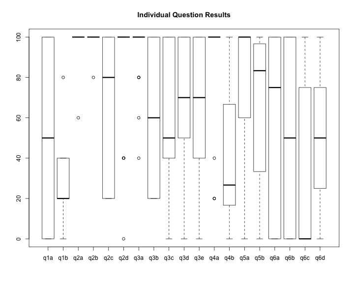

title:        COSC 4820 Database Systems
subtitle:     "Exam #2 Results"
author:       Ruben Gamboa
#logo:         uw-logo-small.png
#biglogo:      uw-logo-large.png
job:          Professor
highlighter:  highlight.js
hitheme:      tomorrow
mode:         selfcontained
framework:    io2012
widgets:      [mathjax, bootstrap]

---

<style>
.title-slide {
     background-color: #EDE0CF; /* CBE7A5; #EDE0CF; ; #CA9F9D*/
     background-image: url(assets/img/uw-logo-large.png);
     background-repeat: no-repeat;
     background-position: center top;
   }
</style>

## Exam Questions

Question    | Points | Topic
------------|--------|-----------------------------------
q1a (bonus) |      5 | Executing Extended Relational Algebra
q1b         |      5 | Executing Extended Relational Algebra
q2a-d       |    4x5 | Executing SQL
q3a-e       |    5x5 | Writing SQL
q4a         |      5 | Recognizing SQL Injection
q4b         |     15 | Preventing SQL Injection
q5a         |      5 | Recognizing Exceptions and DB Resources
q5b         |     15 | Handling Exceptions and DB Resources
q6a-c       |    3x2 | Recognizing Transaction Anomalies
q6d         |      4 | Setting Transaction Isolation Level

----

## Grade Distribution


```
##  [1] 92 62 52 45 48 75 93 96 65 46 64 63 57 67 43 90 74 65 45 98 70 72 79
## [24] 75
```

```
##    Min. 1st Qu.  Median    Mean 3rd Qu.    Max. 
##   43.00   55.75   66.00   68.17   76.00   98.00
```

 

---

## Grade Distribution by Question

 

