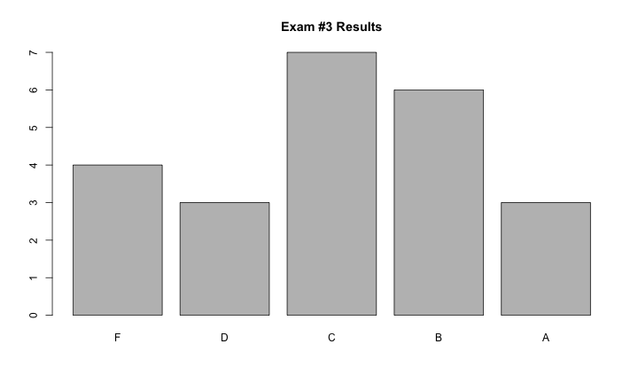
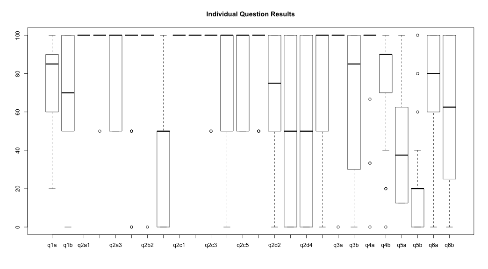

title:        COSC 4820 Database Systems
subtitle:     "Exam #3 Results"
author:       Ruben Gamboa
#logo:         uw-logo-small.png
#biglogo:      uw-logo-large.png
job:          Professor
highlighter:  highlight.js
hitheme:      tomorrow
mode:         selfcontained
framework:    io2012
widgets:      [mathjax, bootstrap]

---

<style>
.title-slide {
     background-color: #EDE0CF; /* CBE7A5; #EDE0CF; ; #CA9F9D*/
     background-image: url(assets/img/uw-logo-large.png);
     background-repeat: no-repeat;
     background-position: center top;
   }
</style>

## Exam Questions

Question    | Points | Topic
------------|--------|-----------------------------------
q1a         |     10 | Writing E/R Diagram
q1b         |     10 | Writing SQL DDL
q2a         |    3x2 | Executing Relational Algebra
q2b         |    3x2 | Writing Relational Algebra
q2c         |    5x2 | Executing SQL
q2d         |    5x2 | Writing SQL
q3a         |      3 | Recognizing SQL Injection
q3b         |     10 | Preventing SQL Injection
q4a         |      3 | Recognizing Exceptions and DB Resources
q4b         |     10 | Handling Exceptions and DB Resources
q5b (bonus) |      5 | Estimating Cost of a Join
q6a         |     10 | Choosing Indexes to Create
q6b         |      4 | Creating Indexes in SQL

----

## Grade Distribution


```
##    Min. 1st Qu.  Median    Mean 3rd Qu.    Max. 
##   40.00   65.50   75.00   73.74   86.50   94.00
```

 

---

## Grade Distribution by Question

 

