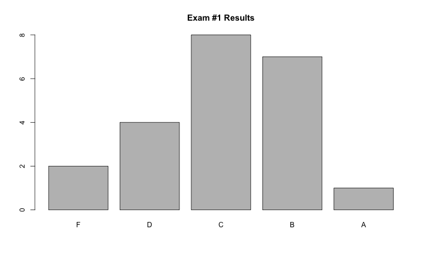
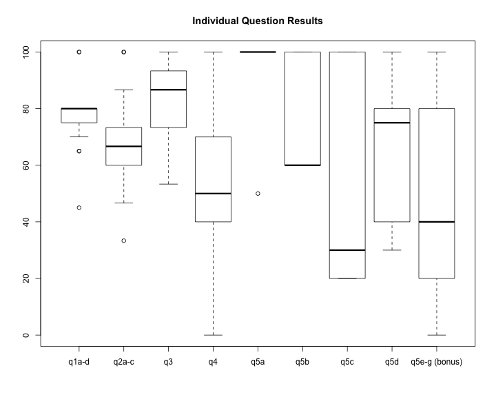
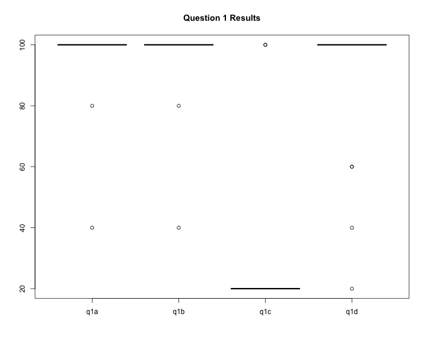
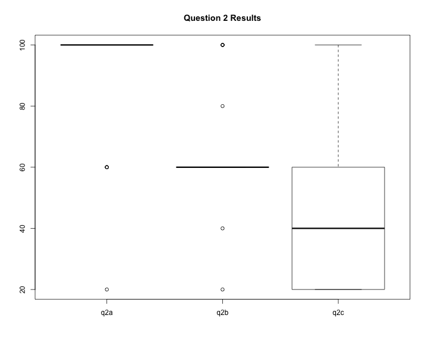
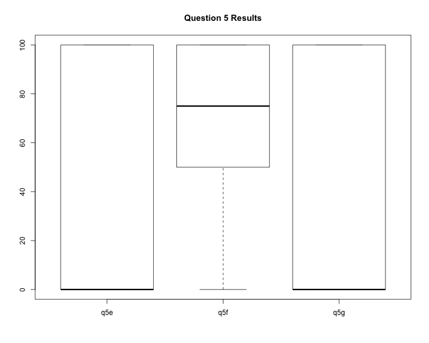

title:        COSC 4820 Database Systems
subtitle:     "Exam #1 Results"
author:       Ruben Gamboa
#logo:         uw-logo-small.png
#biglogo:      uw-logo-large.png
job:          Professor
highlighter:  highlight.js
hitheme:      tomorrow
mode:         selfcontained
framework:    io2012
widgets:      [mathjax, bootstrap]

---

<style>
.title-slide {
     background-color: #EDE0CF; /* CBE7A5; #EDE0CF; ; #CA9F9D*/
     background-image: url(assets/img/uw-logo-large.png);
     background-repeat: no-repeat;
     background-position: center top;
   }
</style>

## Exam Questions


|   Question    |  Points  |                   Topic                    |
|:-------------:|:--------:|:------------------------------------------:|
|     q1a-d     |    20    |         Reading Relational Algebra         |
|     q2a-c     |    15    |         Writing Relational Algebra         |
|      q3       |    15    |             E/R Schema Design              |
|      q4       |    20    |               E/R to SQL DDL               |
|      q5a      |    10    |             Closure Algorithm              |
|      q5b      |    5     |                    Keys                    |
|      q5c      |    5     |               Projecting FDs               |
|      q5d      |    10    |             BCNF Decomposition             |
| q5e-g (bonus) |    5     | Lossless, FD-Preserving, 3NF Decomposition |

---

## Grade Distribution


```
##    Min. 1st Qu.  Median    Mean 3rd Qu.    Max. 
##   56.00   68.50   71.50   73.91   82.00   90.00
```



---

## Grade Distribution by Question



---

## Grade Distribution for Question 1



---

## Grade Distribution for Question 2



---

## Grade Distribution for Question 5 (Bonus)




