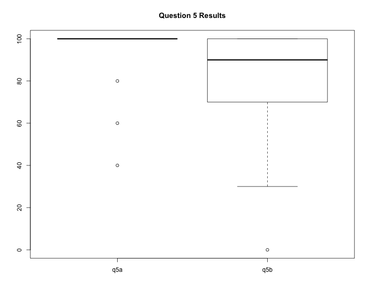

title:        COSC 4820 Database Systems
subtitle:     "Exam #2 Results"
author:       Ruben Gamboa
#logo:         uw-logo-small.png
#biglogo:      uw-logo-large.png
job:          Professor
highlighter:  highlight.js
hitheme:      tomorrow
mode:         selfcontained
framework:    io2012
widgets:      [mathjax, bootstrap]

---

<style>
.title-slide {
     background-color: #EDE0CF; /* CBE7A5; #EDE0CF; ; #CA9F9D*/
     background-image: url(assets/img/uw-logo-large.png);
     background-repeat: no-repeat;
     background-position: center top;
   }
</style>

## Exam Questions


|  Question  |  Points  |       Topic        |
|:----------:|:--------:|:------------------:|
|   q1a-b    |    10    | Relational Algebra |
|   q2a-d    |    20    |    Reading SQL     |
|   q3a-f    |    30    |    Writing SQL     |
|   q4a-b    |    20    |   SQL Injection    |
|   q5a-b    |    15    |     Exceptions     |
|   q6a-d    |    10    |        ACID        |

---

## Grade Distribution


```
##    Min. 1st Qu.  Median    Mean 3rd Qu.    Max. 
##    57.0    72.0    86.0    82.8    92.0    97.0
```


---

## Grade Distribution by Question


---

## Grade Distribution for Question 1


---

## Grade Distribution for Question 2


---

## Grade Distribution for Question 3


---

## Grade Distribution for Question 4


---

## Grade Distribution for Question 5



---

## Grade Distribution for Question 6


