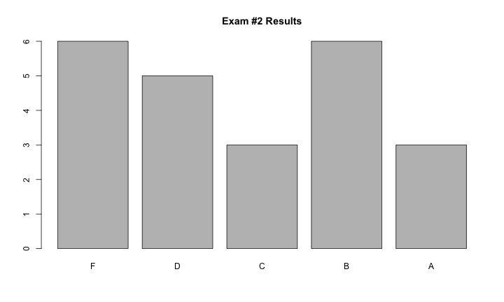
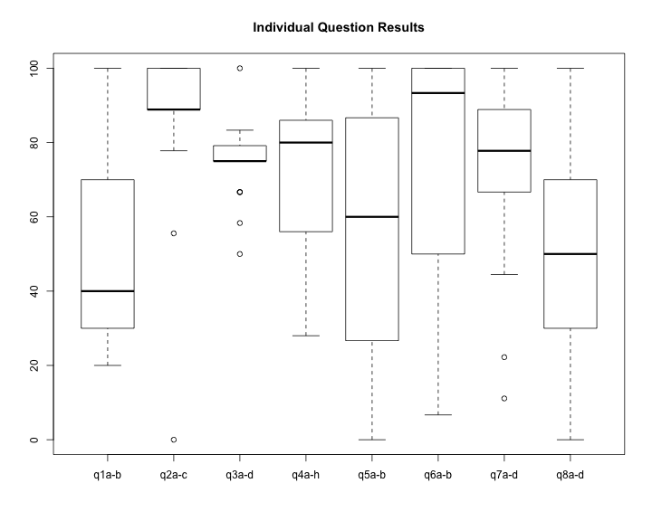
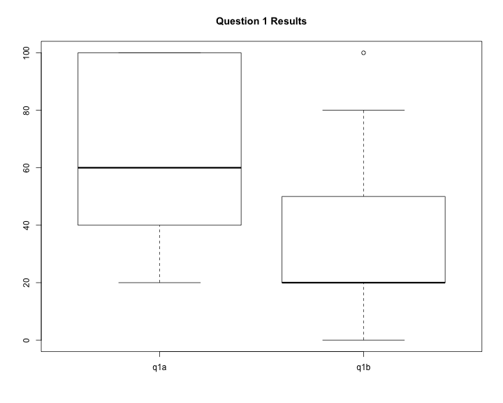
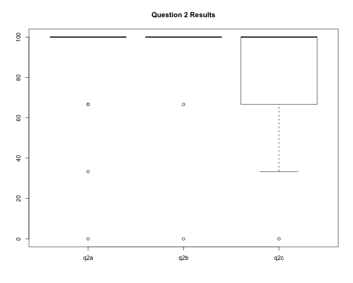
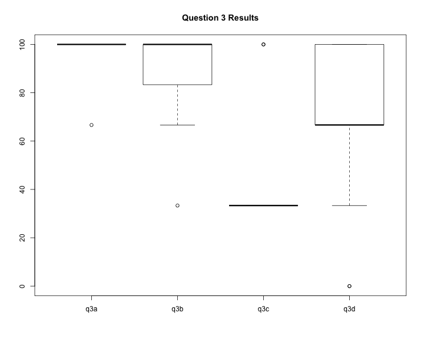
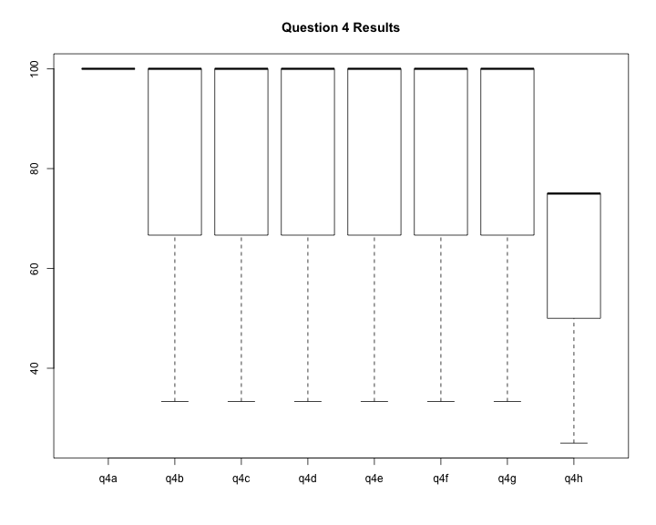
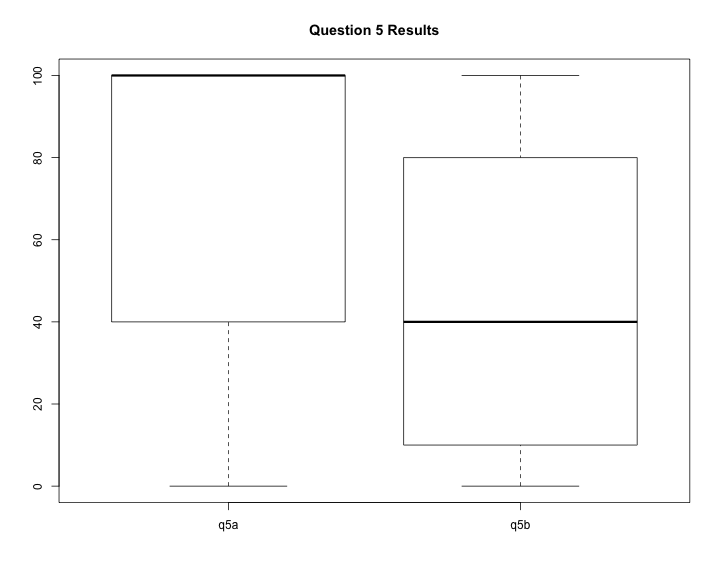
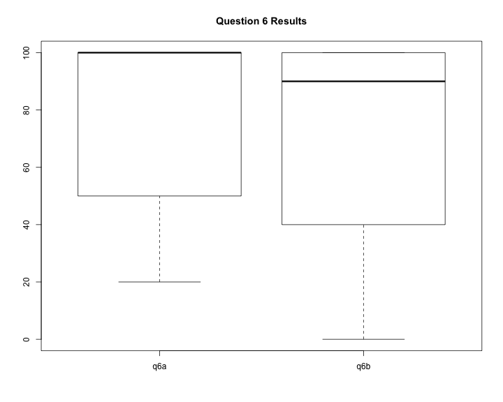
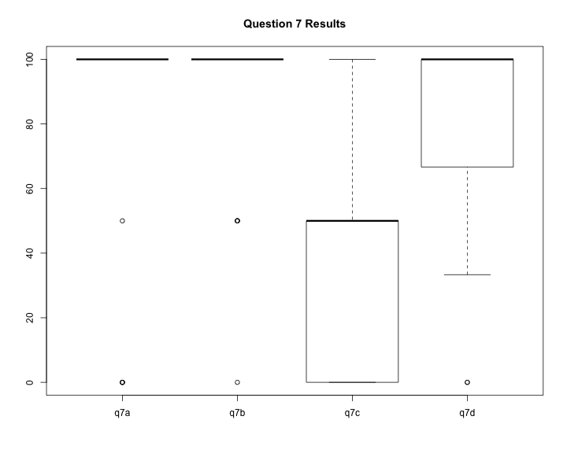
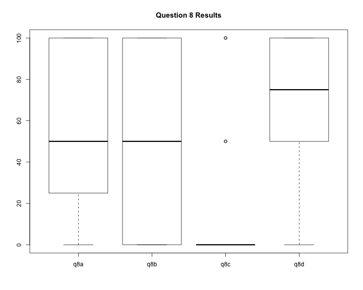

title:        COSC 4820 Database Systems
subtitle:     "Exam #2 Results"
author:       Ruben Gamboa
#logo:         uw-logo-small.png
#biglogo:      uw-logo-large.png
job:          Professor
highlighter:  highlight.js
hitheme:      tomorrow
mode:         selfcontained
framework:    io2012
widgets:      [mathjax, bootstrap]

---

<style>
.title-slide {
     background-color: #EDE0CF; /* CBE7A5; #EDE0CF; ; #CA9F9D*/
     background-image: url(assets/img/uw-logo-large.png);
     background-repeat: no-repeat;
     background-position: center top;
   }
</style>

## Exam Questions


|  Question  |  Points  |       Topic        |
|:----------:|:--------:|:------------------:|
|   q1a-b    |    10    | Relational Algebra |
|   q2a-c    |    9     |      Datalog       |
|   q3a-d    |    12    |    Reading SQL     |
|   q4a-h    |    25    |    Writing SQL     |
|   q5a-b    |    15    |   SQL Injection    |
|   q6a-b    |    15    |     Exceptions     |
|   q7a-d    |    9     |        ACID        |
|   q8a-d    |    10    |  Isolation Levels  |

---

## Grade Distribution


```
##    Min. 1st Qu.  Median    Mean 3rd Qu.    Max. 
##   38.00   59.00   71.00   70.91   84.50   97.00
```



---

## Grade Distribution by Question



---

## Grade Distribution for Question 1



---

## Grade Distribution for Question 2



---

## Grade Distribution for Question 3



---

## Grade Distribution for Question 4



---

## Grade Distribution for Question 5



---

## Grade Distribution for Question 6



---

## Grade Distribution for Question 7



---

## Grade Distribution for Question 8



