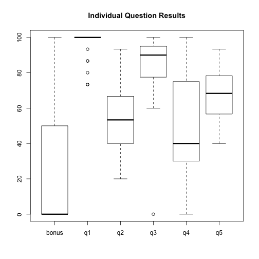
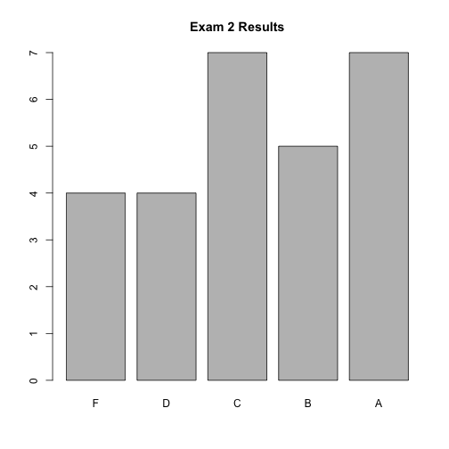
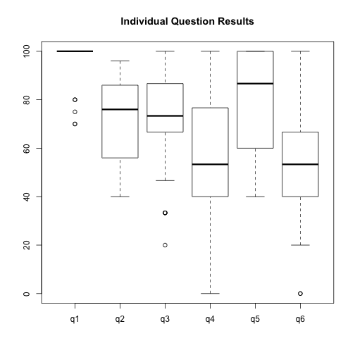
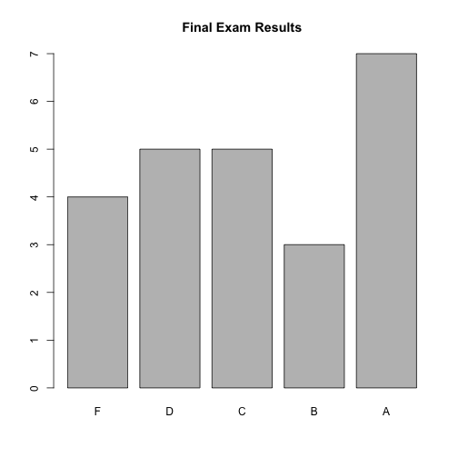
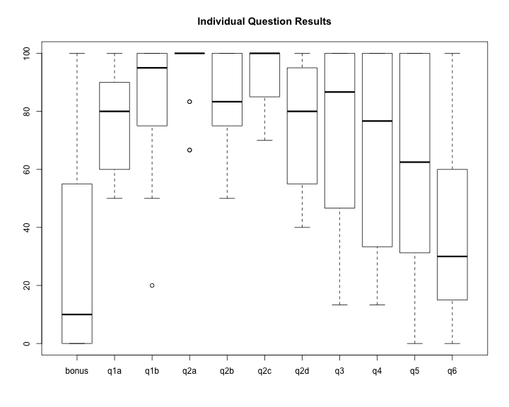

title:        COSC 4820 Database Systems
subtitle:     Spring 2015 Course Evaluation
author:       Ruben Gamboa
#logo:         uw-logo-small.png
#biglogo:      uw-logo-large.png
job:          Professor
highlighter:  highlight.js
hitheme:      tomorrow
mode:         selfcontained
framework:    io2012
widgets:      [mathjax, bootstrap]

---

<style>
.title-slide {
     background-color: #EDE0CF; /* CBE7A5; #EDE0CF; ; #CA9F9D*/
     background-image: url(assets/img/uw-logo-large.png);
     background-repeat: no-repeat;
     background-position: center top;
   }
</style>

## Catalog Description

COSC 4820. **Database Systems.** 3 CR. Provides comprehensive coverage of the problems involved in database design, 
in-depth coverage of data models and database languages. Students acquire practical skills of conceptual/logical 
database design and general familiarity with the problems and issues of database management. 

**Prerequisite:** COSC 3020, Algorithms and Data Structures.

---

## Course Topics

**Textbook:** *A First Course in Database Systems* by J. Ullman and J. Widom. Prentice Hall. 3<sup>rd</sup> Edition.  2007.

* The Relational Data Model
* Relational Design Theory and Normalization
* High-Level Database Models
* Relational Algebra
* SQL
* Constraints & Triggers
* Views & Indexes
* Accessing Databases from Java Programs
* Data Warehousing

---

## Course Objectives

Students who complete this course should be able to perform the following tasks:

* Utilize database management systems that are used in industry and the computing profession.
* Express database queries in modern database languages such as SQL.
* Analyze, design, and implement database projects in accordance with industry standards (i.e. relational model, ER model, UML model, ODL model, SQL).
* Provide written, oral, and visual presentation of database projects.
* Perform basic database administration tasks.

---

## Evaluation Summary

There were 24 students in this course.

15 of the 24 passed the course.

The table below shows the students' performance over time. Not reflected in the table is a steady improvement of the most
important material, e.g., SQL.

Topic                                       | Assessed                       | % Satisfactory
--------------------------------------------|--------------------------------|---------------------------------------
The Relational Data Model                   | 1.4, 2.3, f.1b                 | 61.7
Relational Design Theory and Normalization  | 1.5                            | 50.0
High-Level Database Models                  | 1.3, f.1a                      | 77.5
Relational Algebra                          | 1.1, 1.2, f.2a, f.2b           | 81.2
SQL                                         | 1.4, 2.1, 2.2, 2.3, f.2c, f.2d | 65.0
Constraints & Triggers                      | 2.3, 2.4                       | 40.0
Views & Indexes                             | 2.5, 2.6, f.5                  | 50.0
Accessing Databases from Java Programs      | f.3, f.4                       | 62.5
Data Warehousing                            | f.6                            | 20.0

---

## Action Items

1. Students struggle with conversion from high-level database models to SQL, 
   and they also struggle with relational design theory. But they do well with
   relational algebra and SQL.
   
   We should leverage their comfort level with OOP concepts by introducing Hibernate
   early and using it to connect the high-level E/R diagrams with lower-level OOP
   classes, as a step towards very-low-level tables.

2. Few students are engaging with the advanced/optional material at the end of the
   course, e.g., Data Warehousing.  This is partly due to the nature of the last week
   of the semester.
   
   We should remove this material from the course altogether, and use the last week
   of the semester to better prepare students for the final.

---

# Appendix: Exam #1 Results

---

## Exam Questions

Question   | Points | Topic
-----------|--------|-----------------------------------
q1         |     15 | Relational Algebra, Read
q2         |     15 | Relational Algebra, Write
q3         |     20 | E/R Diagram Design
q4         |     20 | ERD to SQL DDL
q5         |     30 | Normalization
bonus      |      5 | Attend Meeting

---

## Grade Distribution


```
##    Min. 1st Qu.  Median    Mean 3rd Qu.    Max. 
##   58.00   63.50   69.50   70.79   75.00   90.00
```

 

---

## Grade Distribution by Question

 

---

# Appendix: Exam #2 Results

---

## Exam Questions

Question   | Points | Topic
-----------|--------|-----------------------------------
q1         |     20 | SQL, Read
q2         |     25 | SQL, Write
q3         |     15 | SQL DDL Constraints
q4         |     15 | Triggers
q5         |     15 | Views
q6         |     15 | Index Selection and Creation

---

## Grade Distribution


```
##    Min. 1st Qu.  Median    Mean 3rd Qu.    Max. 
##   44.00   66.50   76.00   75.78   88.50   99.00
```

 

---

## Grade Distribution by Question

 

---

# Appendix: Final Exam Results

---

## Exam Questions

Question   | Points | Topic
-----------|--------|-----------------------------------
q1a        |     10 | E/R Diagram Design
q1b        |     10 | SQL DDL
q2a        |      6 | Relational Algebra, Read
q2b        |      6 | Relational Algebra, Write
q2c        |     10 | SQL, Read
q2d        |     10 | SQL, Write
q3         |     15 | Programming, SQL Injection
q4         |     15 | Programming, Closing Resources
q5         |      8 | Types of Indexes
q6         |     10 | Data Warehousing Basics
bonus      |     10 | NoSQL Design

----

## Grade Distribution


```
##    Min. 1st Qu.  Median    Mean 3rd Qu.    Max. 
##   44.00   64.75   75.50   77.04   91.25  105.00
```

 

---

## Grade Distribution by Question

 
