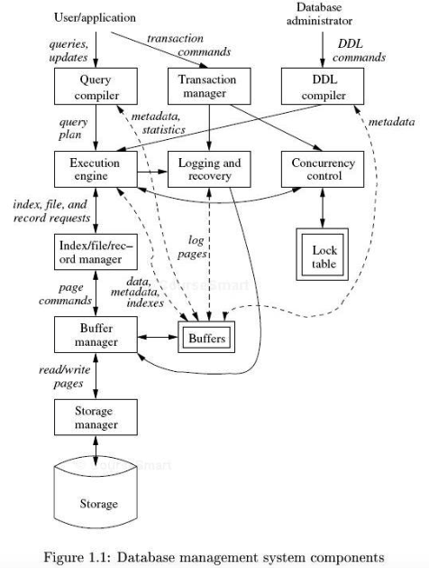

title:        COSC 4820 Database Systems
subtitle:     The Worlds of Database Systems
author:       Ruben Gamboa
#logo:         uw-logo-small.png
#biglogo:      uw-logo-large.png
job:          Professor
highlighter:  highlight.js
hitheme:      tomorrow
mode:         selfcontained
framework:    io2012
widgets:      [mathjax, bootstrap]

---

# The Evolution of Database Systems

---

## Who Uses Databases?

* All your student records are in a database
    
* Every major website is powered by a database
* If a website uses a shopping cart, it's probably using a database
    
* Corporations keep databases of their customers
* (and they're using them to track you)
    
* Your phone uses a database to store your contacts
* And it may be using one to keep track of your health stats over time
    
* Scientists store data from experiments or observations in databases

---

## Why Do Databases Work So Well?

* Building a database system is extremely difficult
* But we've figured out how to do it over the last several decades!
    
* A **Database Management System** or **DBMS** allows us to manage
  large amounts of persistent data
* The DBMS handles a lot of details that are important, but difficult to deal with
  * persistent data format
  * handle crashes and recovery
  * support for multiple users

---

## What Does a Database Do?

* Allow users to create new database **schemas** through a **data-definition language (DDL)**
  * **schema:** logical structure of the data
* Allow users to query or modify the data through a **data-manipulation language (DML)**
* Support efficient storage of data (up to petabytes $10^{15}$ or exabytes $10^{18}$)
* Enforce **durability**, or data recovery after accidents (intentional or otherwise)
* Allow simultaneous access to the data, while ensuring **atomicity** and **isolation**
  * **atomicity:** each user's action is performed fully or not at all
  * **isolation:** no unexpected interactions between users, e.g., no partial results

---

## Brief History of Databases

* The history of computers starts with **ballistics**
  * As in the ballistic equations for hitting a tank with a shell
  * Or hitting a stationary target with a bomb
* But the **commercial** history of computers starts with databases
  * Airline reservation systems
  * Banking systems
  * Corporate records
      
* Those database systems asked the programmer to design the links between the data records
* This led to **hierarchical** or **network** databases
* Note: "network" refers to the data model, as in "graph" -- not to a "database on a cloud"

---

## Relational Database Systems

* Relational database systems were first proposed by Codd in 1970
    
* Key concept: data is organized in **tables** or **relations**
* These are flat, two-dimensional structures (unlike the hierarchical databases)
* Today, we'd call them spreadsheets
    
* A DBMS is free to implement relations in any way it wants
* But the programmer sees them as just tables
    
* In 1980s, relational databases were considered cool, impractical curiosities
* By the 1990s, they were standard
    
* They became popular because we figured out how to implement tables very
  efficiently
* This is similar to the history of high-level languages

---

## Current Trends

* Relational databases are **everywhere**
* Programmers can use database queries to process in-memory data structures!
    
* Databases are getting bigger and more complex
* This creates a new problem: how can we **integrate** data that comes different databases?
  * One database deals with historical beer sales
  * Another has historical weather data
    
* Solid-State Drives (SSDs) are very different than disks
* Some databases exploit these characteristics

---

## Beyond Relational Databases

* Some people are pushing the state-of-the-art on relational database technology
  * query language is not sufficiently expressive
  * special (e.g., multi-media) data types
  * implementation is just too slow
    
* This has resulted in an explosion of **NoSQL** databases
  * But here, history is repeating itself
  * Early NoSQL databases were very similar to hierarchical databases
  * Major innovation was distributing data across 1000s of machines via hashing
  * Actually, that trick is based on relational database technology, too!
  * The other big innovation was breaking some of the traditional guarantees that
    relational databases make
  * But more modern NoSQL databases are reinventing query languages, transactions, 
    and all the other pieces of relational databases!

---

# Overview of a Database Management System

---

## Two Classes of Users

* Users can be broadly categorized into
  * *Conventional users* (and programs) that manipulate data
  * *Database administrators* who set up and modify the structure (or *schema*) of the database
* Both users submit *queries*

---

## Query Processing Stages

1. Query is compiled by the **query optimizer**
2. The "optimal" query plan is executed by the **query engine**
3. The **transaction manager** wraps execution steps into a single transaction, and preserves ACID properties
   * Atomicity
   * Consistency
   * Isolation
   * Durability
4. This requires both *logging* and *concurrency control*, usually via *locking*
   * The **log manager** takes care of **durability** and **atomicity**
   * The **concurrency-control manager** takes care of **isolation**
5. The data is stored on disk files with sophisticated index and record structures, and is accessed by a **record manager**
6. Data is loaded onto main memory into a **buffer pool**

---

    

---

# Studying Database Systems

--- &twocol

## Studying Database Systems

*** =left

1. Relational Database Modeling
   * basic concepts
   * functional dependencies
   * normalization
   * high-level notations
   * SQL notations
2. Relational Database Programming
   * abstract query languages
   * SQL
   * database application programs
3. Database Performance and Integrity
   * indexes
   * constraints
   * views

*** =right

<ol start="4">
    <li> Semistructured Data Modeling and Programming </li>
    <li> Database System Implementation </li>
    <li> Modern Database Issues </li>
</ol>
