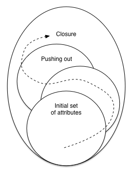

title:        COSC 4820 Database Systems
subtitle:     Design Theory for Relational Databases
author:       Ruben Gamboa
#logo:         uw-logo-small.png
#biglogo:      uw-logo-large.png
job:          Professor
highlighter:  highlight.js
hitheme:      tomorrow
mode:         selfcontained
framework:    io2012
widgets:      [mathjax, bootstrap]

---

## About this Chapter

* The focus of this chapter is on **designing database schemas**
* This is the problem of **modeling**
* I.e., how do we represent the real world inside a database?
    
* Remember, all we have to work with is tables!
* So how do we encode the real world in a bunch of tables?
    
* There are many pitfalls and traps
* Luckily, there is a well understood theory of relational database design
    
* This is a very **mathematical** theory
* But don't be fooled: It's tremendously useful
* (Actually, that's the reason we study math -- it's tremendously useful!)

---

# Functional Dependencies

---

## Functional Dependencies

* The most fundamental property to describe table design is that of **functional dependency**
* This is a generalization of the idea of **(primary) key**
    
* Consider a relation $R(A,B,C)$
* We say that $A$ is a key if
  * Suppose we know that $A$ is equal to $a$
  * Then we also "know" the values of $B$ and $C$
* By "know" $B$ and $C$, we mean that they are **determined** by the value of $A$
    

> * Similarly, we say that $A$ **functionally determines** $B$, written $A \rightarrow B$, if
  * Suppose we know that $A$ is equal to $a$
  * Then we also "know" the value of $B$

---

## Functional Dependency Sanity Check

* Check your understanding
    
* We have the relation $R(A,B,C)$
    
* $A$ is a key if and only if $A$ functionally determines $B$ and $C$
* I.e., $A \rightarrow B, C$
    

> * By the way, this can also be written as
  $$\begin{eqnarray}
    A & \rightarrow & B \\
    A & \rightarrow & C \\
    \end{eqnarray}
  $$

---

## A Sample Table

Title               | Year   | Length | Genre  | StudioName | StarName
--------------------|--------|--------|--------|------------|--------------
Gone With the Wind  | 1939   |    231 | drama  | MGM        | Vivien Leigh
Star Wars           | 1977   |    124 | scifi  | Fox        | Mark Hamill
Wayne's World       | 1992   |     95 | comedy | Paramount  | Dana Carvey

* Would you agree that $\text{title}, \text{year} \rightarrow \text{length}$?
* How about $\text{title}, \text{year} \rightarrow \text{genre}$?
* How about $\text{title}, \text{year} \rightarrow \text{studioName}$?
* How about $\text{title}, \text{year} \rightarrow \text{starName}$?

---

## Another Sample Table

Title               | Year   | Length | Genre  | StudioName | StarName
--------------------|--------|--------|--------|------------|--------------
Gone With the Wind  | 1939   |    231 | drama  | MGM        | Vivien Leigh
Star Wars           | 1977   |    124 | scifi  | Fox        | Mark Hamill
Star Wars           | 1977   |    124 | scifi  | Fox        | Carrie Fisher
Star Wars           | 1977   |    124 | scifi  | Fox        | Harrison Ford
Wayne's World       | 1992   |     95 | comedy | Paramount  | Dana Carvey
Wayne's World       | 1992   |     95 | comedy | Paramount  | Mike Meyers

* Would you agree that $\text{title}, \text{year} \rightarrow \text{length}$?
* How about $\text{title}, \text{year} \rightarrow \text{genre}$?
* How about $\text{title}, \text{year} \rightarrow \text{studioName}$?
* How about $\text{title}, \text{year} \rightarrow \text{starName}$?

---

## About Functional Dependencies and Relation Instances

* Functional dependencies are constraints on **relations**
* They are not constraints on **relation instances**
    

> * Trick question:
  * Here's a relation instance
  * What are the keys?
  * What are the functional dependencies?
    

> * A relation instance can **rule out** a possible functional dependency
* But it can never **rule in** a functional dependency

---

## A Formal Definition of Keys

* We now have the mathematical machinery to define formally what it means to be a key
    
* Suppose we have a relation $R(A_1, A_2, \dots, A_n)$
* Let $\mathcal{A} = \{A_1, A_2, \dots, A_n\}$
* Now, let $\mathcal{S} \subset \mathcal{A}$
* I.e., $\mathcal{S}$ is a subset of the attributes

> * We say that $\mathcal{S}$ is a **key** if and only if 
  1. $\mathcal{S} \rightarrow \mathcal{A} - \mathcal{S}$
  2. If $\mathcal{S'} \subsetneq \mathcal{S}$, then $\mathcal{S'} \nrightarrow \mathcal{A} - \mathcal{S'}$
  
> * If the first condition holds, we call $\mathcal{S}$ a **superkey**, whether the second condition holds or not

---

## A Formal Definition of Keys

* Suppose we have a relation $R(A, B, C, D, E)$
* Suppose that
  * $B \rightarrow C, D, E$
  * $C \rightarrow B, D, E$

> * $\{A, B, C\}$ is a superkey, because $A, B, C \rightarrow D, E$
* But it is not a key, because $A, B \rightarrow C, D, E$ and $\{A, B\} \subsetneq \{A, B, C\}$

> * $\{A, B\}$ is a key, because
  1. $A, B \rightarrow C, D, E$
  2. $A \nrightarrow B, C, D, E$
  3. $B \nrightarrow A, C, D, E$
  4. $\emptyset \nrightarrow A, B, C, D, E$ (and there's no need to check this, since it's implied by the previous two)

---

## A Formal Definition of Keys

* Suppose we have a relation $R(A, B, C, D, E)$
* Suppose that
  * $B \rightarrow C, D, E$
  * $C \rightarrow B, D, E$
* We already know that $\{A, B\}$ is a key

> * Similarly, $\{A, C\}$ is also a key
* We would choose either $\{A, B\}$ or $\{A, C\}$ as the primary key

> * There are many (10) superkeys, but no more keys

---

# Rules about Functional Dependencies

---

## Reasoning about Functional Dependencies

* Suppose we know that $A \rightarrow B$
* And we also know that $B \rightarrow C$

> * Isn't it obvious that $A \rightarrow C$?
* That's the idea behind reasoning about functional dependencies

> * In general, we can say that a particular set $S$ of FDs implies some other FD $F$, which we write as $S \vdash F$
* Or a set $S$ of functional dependencies may imply some other set $T$ of FDs, which we write as $S \vdash T$
  * In this case, We also say that $T$ follows from $S$
  
> * And, whenever $S \vdash T$ and $T \vdash S$, we say that $S$ and $T$ are **equivalent**

---

## Splitting Rule

* Suppose we know that $A \rightarrow B, C$

> * We can write this instead as
  1. $A \rightarrow B$
  2. $A \rightarrow C$
* In fact, we sometimes prefer to write FDs so that they only have one attribute on the right-hand side

---

## Combining Rule

* We can go the other way

* Suppose we know that 
  1. $A \rightarrow B$
  2. $A \rightarrow C$

> * We can write this instead as $A \rightarrow B, C$
* And for some purposes, we want to write FDs to have the maximum number of attributes on the right-hand side

---

## Trivial Functional Dependencies

* Suppose we have a relation $R(A, B, C)$

> * Then all of these hold
  1. $A \rightarrow A$
  2. $B \rightarrow B$
  3. $A, B, C \rightarrow A$

> * More formally, if $\mathcal{A}$ is the set of attributes of relation $R$, then
  * $\mathcal{A}' \rightarrow \mathcal{A}''$ whenever $\mathcal{A}'' \subset \mathcal{A}' \subset \mathcal{A}$

---

## Trivial Dependency Rule

* Suppose we have a relation $R(A, B, C)$
* And suppose that $A, B \rightarrow B, C$

> * This is not a trivial dependency, but there's something strange about it
* In fact, it is easy to see that $A, B \rightarrow C$ is a simpler version that is equivalent to it

> * More formally, if $\mathcal{A}$ is the set of attributes of relation $R$, and $\mathcal{A'} \rightarrow \mathcal{A''}$
  * $\mathcal{A}' \rightarrow \mathcal{A}'' - \mathcal{A'}$

---

## Closure of a Set of Attributes

* Suppose we have a relation $R$ with attributes $\mathcal{A}$
* Let $\{A_1, A_2, \dots, A_n\} \subset \mathcal{A}$

* The **closure** of $\{A_1, A_2, \dots, A_n\}$, written $\{A_1, A_2, \dots, A_n\}^+$ is the set of all attributes that
  are functionally determined by $\{A_1, A_2, \dots, A_n\}$
* Notice that $\{A_1, A_2, \dots, A_n\} \subset \{A_1, A_2, \dots, A_n\}^+$, because of trivial FDs

---

## Closure of a Set of Attributes

    

---

## Closure of a Set of Attributes

INPUT: A set $A$ of attributes of a relation $R$, and a set $S$ of FDs 

OUTPUT: $A^+$

1. Use the splitting on rule on $S$, so that all FDs have a single attribute on the right-hand side
2. Let $X$ be the set of attributes that will become the closure
3. Initially, $X=A$
4. While there is some FD $B_1, B_2, \dots, B_m \rightarrow C$ such that $\{B_1, B_2, \dots, B_m\} \subset X$ but $C \not\in X$
   1. Let $X = X \cup \{C\}$

 
Note that this algorithm terminates
* At each step in the loop, $X$ grows by one attribute
* $X$ can be no larger than the attributes of $R$

---

## Example

Suppose we have a relation $R(A,B,C,D,E,F)$ with the following FDs:
* $A, B \rightarrow C$
* $B, C \rightarrow A, D$
* $D \rightarrow E$
* $C, F \rightarrow B$

Let's find the closure of $\{A, B\}$

---

## Example

Step 1: Use the splitting rule, and replace the FDs with:
* $A, B \rightarrow C$
* $B, C \rightarrow A$
* $B, C \rightarrow D$
* $D \rightarrow E$
* $C, F \rightarrow B$

---&twocol

## Example

*** =left
### Functional Dependencies

* $A, B \rightarrow C$
* $B, C \rightarrow A$
* $B, C \rightarrow D$
* $D \rightarrow E$
* $C, F \rightarrow B$

*** =right

### Algorithm Trace

Step | $X$             | FD            
-----|-----------------|---------------------
   0 | $A, B$          |               
   1 | $A, B, C$       | $A, B \rightarrow C$
   2 | $A, B, C, D$    | $B, C \rightarrow D$
   3 | $A, B, C, D, E$ | $D \rightarrow E$

---

## Why the Closure Algorithm Works, Part 1

* Suppose that we have a set $A$ of attributes from a relation $R$
* The closure algorithm returns $X$
* We claim that $X \subset A^+$
    
* By induction on the number of steps

---

## Why the Closure Algorithm Works, Part 1

* **Basis:** If there are 0 steps, then $X=A$, so it follows that $A \subset A^+$
  
* **Induction:**
  * Suppose $B \in X$
  * $B$ was added because of some FD $B_1, B_2, \dots, B_n \rightarrow B$
  * By the inductive hypothesis, all of the $B_i$ are in $X$ and in $A^+$
  * So $R$ satisfies $A \rightarrow B_1, B_2, \dots, B_n$
  * If $R$ has two tuples with the same values of $A$, then they must also have the values of $B_1, B_2, \dots, B_n$
  * And since $R$ satisfies $B_1, B_2, \dots, B_n \rightarrow B$, those two tuples also have the same values of $B$
  * So $A \rightarrow B$ and $B \in A^+$

---

## Why the Closure Algorithm Works, Part 2

* Suppose that we have a set $A$ of attributes from a relation $R$
* The closure algorithm returns $X$
* We claim that $A^+ \subset X$
* Which means that $A = X^+$ (from Part 1)

---

## Why the Closure Algorithm Works, Part 2

* Suppose that $B \not\in X$
* We need to show that $A_1, A_2, \dots, A_n \rightarrow B$ does not hold
* To do this, we create a relation instance for $R$ in which this FD does not hold
* The instance has two tuples
  * $t$: 1's on all attributes in $X$, and 0's on all other attributes
  * $s$: 1's on all attributes
* Notice that $t$ and $s$ agree on an attribute $C$ if and only $C \in X$

---

## Why the Closure Algorithm Works, Part 2

* The instance has two tuples
  * $t$: 1's on all attributes in $X$, and 0's on all other attributes
  * $s$: 1's on all attributes
* We claim that this instance satisfies all of the FDs in $S$
    
* Consider some FD $C_1, C_2, \dots, C_k \rightarrow D$ in $S$
* If one of the $C_i$ is not in $X$, then we're done
* Otherwise, the algorithm would have added $D$ so $X$ because of this FD
* So we conclude that this case cannot happen
* I.e., the instance satisfies all of the FDs in $S$

---

## Why the Closure Algorithm Works, Part 2

* The instance has two tuples
  * $t$: 1's on all attributes in $X$, and 0's on all other attributes
  * $s$: 1's on all attributes
* We claim that this instance does not satisfy the FD $A_1, A_2, \dots, A_n \rightarrow B$
    
* But this is easy
* All the $A_i$ are in $X$, so the tuples $t$ and $s$ agree on those values
* But we know that $B$ is not in $X$, so $t$ and $s$ disagree on $B$
* That means that this instance does not satisfy the FD $A_1, A_2, \dots, A_n \rightarrow B$

---

## Why the Closure Algorithm Works, Part 2

* Suppose we have a table $R$, a subset of the attributes $A$, and some functional dependencies $F$
* If we run the closure algorithm on $A$, we get a result $X$
* For each $B \in X$, we know that $A \rightarrow B$
* And for any $C \not\in X$, we know that $A \nrightarrow B$
    
* In other words, $X = A^+$

---

## Example: Transitive Rule

* The **transitive rule** says that if $\mathcal{A} \rightarrow \mathcal{B}$ and $\mathcal{B} \rightarrow \mathcal{C}$,
  then $\mathcal{A} \rightarrow \mathcal{C}$
* Remember that $\mathcal{A}$, $\mathcal{B}$, and $\mathcal{C}$ are all **sets** of attributes
    
* It's easy to see that this rule holds using the closure algorithm
* We know that $\mathcal{A}^+$ must include $\mathcal{B}$
* I.e., $\mathcal{B} \subset \mathcal{A}^+$
    
* But then, using $\mathcal{B} \rightarrow \mathcal{C}$, we see that $\mathcal{A}^+$ must include $\mathcal{C}$
* I.e., $\mathcal{C} \subset \mathcal{A}^+$
    
* So indeed, $\mathcal{A} \rightarrow \mathcal{C}$ holds

---

## All the (Needed) Inference Rules

* We've seen trivial rules and transitivity
* Here is a full set of inference rules
  1. **Reflexivity.** This is just a fancy name for trivial rules
  2. **Augmentation.** If $\mathcal{A} \rightarrow \mathcal{B}$, then $\mathcal{A}, \mathcal{C} \rightarrow \mathcal{B}, \mathcal{C}$
  3. **Transitivity.** $\mathcal{A} \rightarrow \mathcal{B}$ and $\mathcal{B} \rightarrow \mathcal{C}$,
  then $\mathcal{A} \rightarrow \mathcal{C}$

* That's it!
* All valid inference rules for FDs follow from the above!

---

## Minimal Functional Dependencies

* An important application of the inference rules for FDs is the idea of **minimal basis**
    
* Suppose $S$ is a set of FDs
* If some other set $S'$ of FDs is equivalent to $S$, we call $S'$ a **basis** for $S$
* We restrict ourselves here to bases that have FDs with only one attribute on the right-hand sides
   

> * A **minimal basis** is a basis $S'$ where
  1. All FDs have singleton right-hand sides
  2. If any FD is removed from $S'$, the result is no longer a basis
  3. If any attribute is removed from the left-hand side of any FD in $S'$, the result is not a basis
* I.e., we need all the FDs, and no FD can be smaller

---

## Functional Dependencies and Projections

* Suppose that $S$ is a set of FDs for relation $R$
    
* What are the FDs for $\pi_{\mathcal{B}}(R)$, where $\mathcal{B}$ is some subset of the attributes of $R$?
   

> * We can follow the **projection of functional dependencies** $S'$, which are all syntactically valid FDs such that
  1. they follow from $S$
  2. they involve only attributes in $\mathcal{B}$
  
> * Note that we're talking about FDs that **follow from** $S$
* This is not the same as the FDs in $S$
* Because of this, the algorithm is actually complex (and expensive)

---

## Projection of Functional Dependencies

INPUT: A relation $R$, a set of attributes $\mathcal{B}$, and a set (basis) of FDs $S$ for $R$

OUTPUT: A set (basis) $S'$ of FDs for $\pi_{\mathcal{B}}(R)$

1. $S' = \emptyset$
2. For each $X \subset \mathcal{B}$
   1. Compute $X^+$ using $S$
   2. For each $A \in X^+ \cap \mathcal{B}$
      1. Add $X \rightarrow A$ to $S'$
3. Repeat until no more changes can be made
   1. If there is an FD in $S'$ that follows from the other FDs in $S'$, remove it
   2. If there is an FD $LHS \rightarrow B$ in $S'$ such that after removing an attribute $A$ from $LHS$, the resulting
      FD $LHS - A \rightarrow B$ still follows from $S'$, then replace $LHS \rightarrow B$ with $LHS - A \rightarrow B$
4. Return $S'$

---

## Projection of Functional Dependencies and Pragmatics

* The algorithm is OK if you're a computer
* But it's very expensive, i.e., the loop iterates over **all subsets** of $\mathcal{B}$

> * As a practical matter, we use these observations
  * Don't worry about the empty set or the set $\mathcal{B}$ (but that still leaves $2^n - 2$ subsets)
  * Once we find that $X^+ \rightarrow Y$, there's no point in considering supersets of $X$ for attributes already in $Y$
  * In particular, if $X^+ \rightarrow \mathcal{B}$, then we can ignore all supersets of $X$

---

# Design of Relational Database Schemas

---

## Designing Relational Database Schemas

* Suppose you want to model some real-world situation in a relational database
* Chances are there will be more than one way to do it
    
* And some ways **will be better** than others!
    
* This is not a matter of opinion
* This is a **technical** matter
* There can be **technical** problems with a database schema
* The problems are called **anomalies**
    
* The root of all evil is usually **redundancy**

---

## Anomalies

Title              | Year | Length  | Genre   | StudioName      | StarName
-------------------|------|---------|---------|-----------------|---------------
Star Wars          | 1977 | 124     | scifi   | Fox             | Carrie Fisher
Star Wars          | 1977 | 124     | scifi   | Fox             | Mark Hamill
Star Wars          | 1977 | 124     | scifi   | Fox             | Harrison Ford
Gone With the Wind | 1939 | 231     | drama   | MGM             | Vivien Leigh
Wayne's World      | 1992 | 95      | comedy  | Paramount       | Dana Carvey
Wayne's World      | 1992 | 95      | comedy  | Paramount       | Mike Meyers

 

* **Redundancy:** Information is stored in multiple places
* **Update Anomalies:** Information is updated in one place, but not in others
* **Deletion Anomalies:** When some rows are deleted, we unexpectedly lose extra information

---

## Decompositions

* The solution to the anomalies is **decomposition**
* Suppose $R$ is a relation with attributes $\mathcal{A}$
* Let $\mathcal{B}$ and $\mathcal{C}$ be subsets of $\mathcal{A}$ that cover $\mathcal{A}$
  * $\mathcal{B} \subset \mathcal{A}$
  * $\mathcal{C} \subset \mathcal{A}$
  * $\mathcal{B} \cup \mathcal{C} = \mathcal{A}$
* Then $R$ can be decomposed into
  * $R_1 = \pi_{\mathcal{B}}(R)$
  * $R_2 = \pi_{\mathcal{C}}(R)$
    
* In general, we may decompose $R$ into $k$ different relations $R_1, R_2, \dots, R_k$

---

## Decompositions

* For example, suppose we have the relation $R(A,B,C)$
    
* One possible decomposition is
  * $R_1(A, B)$
  * $R_2(B, C)$
      
* Of course, there are many other possible decompositions!

---&twocol

## Decompositions

Title              | Year | Length  | Genre   | StudioName      | StarName
-------------------|------|---------|---------|-----------------|---------------
Star Wars          | 1977 | 124     | scifi   | Fox             | Carrie Fisher
Star Wars          | 1977 | 124     | scifi   | Fox             | Mark Hamill
Star Wars          | 1977 | 124     | scifi   | Fox             | Harrison Ford
Gone With the Wind | 1939 | 231     | drama   | MGM             | Vivien Leigh
Wayne's World      | 1992 | 95      | comedy  | Paramount       | Dana Carvey
Wayne's World      | 1992 | 95      | comedy  | Paramount       | Mike Meyers

 

*** =left

Title              | Year | StarName
-------------------|------|---------------
Star Wars          | 1977 | Carrie Fisher
Star Wars          | 1977 | Mark Hamill
Star Wars          | 1977 | Harrison Ford
Gone With the Wind | 1939 | Vivien Leigh
Wayne's World      | 1992 | Dana Carvey
Wayne's World      | 1992 | Mike Meyers

*** =right

Title              | Year | Length  | Genre   | StudioName 
-------------------|------|---------|---------|------------
Star Wars          | 1977 | 124     | scifi   | Fox        
Gone With the Wind | 1939 | 231     | drama   | MGM        
Wayne's World      | 1992 | 95      | comedy  | Paramount  

---

## Boyce-Codd Normal Form (BCNF) 

* **Boyce-Codd Normal Form** (BCNF) is a condition that can tell us when a schema does not suffer from anomalies
    
* A relation $R$ is in BCNF if
  * for each nontrivial FD $X \rightarrow A$, the left-hand side $X$ is a superkey for $R$
    
* That is, the left-hand side of every FD must contain a key
    

> * If there are more than one key, the requirement is for the FD to contain **one of them**
* It is not necessary for the FD to contain all keys

---

## Boyce-Codd Normal Form (BCNF)

Title              | Year | Length  | Genre   | StudioName      | StarName
-------------------|------|---------|---------|-----------------|---------------
Star Wars          | 1977 | 124     | scifi   | Fox             | Carrie Fisher
Star Wars          | 1977 | 124     | scifi   | Fox             | Mark Hamill
Star Wars          | 1977 | 124     | scifi   | Fox             | Harrison Ford
Gone With the Wind | 1939 | 231     | drama   | MGM             | Vivien Leigh
Wayne's World      | 1992 | 95      | comedy  | Paramount       | Dana Carvey
Wayne's World      | 1992 | 95      | comedy  | Paramount       | Mike Meyers

 

* Not in BCNF
* The key is title, year, starName
* But there is an FD title, year $\rightarrow$ Length
    
* Notice that to tell if $R$ is in BCNF, you must be able to find the keys for $R$ first

---

## Boyce-Codd Normal Form (BCNF)

Title              | Year | Length  | Genre   | StudioName 
-------------------|------|---------|---------|------------
Star Wars          | 1977 | 124     | scifi   | Fox        
Gone With the Wind | 1939 | 231     | drama   | MGM        
Wayne's World      | 1992 | 95      | comedy  | Paramount  

 

* This is in BCNF
* The key is title, year
* The only real nontrivial FD is title, year $\rightarrow$ length, genre, studioName
    
* All other FDs must include title, year in the left-hand side
* So all FDs include a key in the left-hand-side

---

## Boyce-Codd Normal Form (BCNF)

Title              | Year | StarName
-------------------|------|---------------
Star Wars          | 1977 | Carrie Fisher
Star Wars          | 1977 | Mark Hamill
Star Wars          | 1977 | Harrison Ford
Gone With the Wind | 1939 | Vivien Leigh
Wayne's World      | 1992 | Dana Carvey
Wayne's World      | 1992 | Mike Meyers

 

* Again, this is in BCNF
* The key is title, year
* The only real nontrivial FD is title, year $\rightarrow$ starName

---

## Decomposing into BCNF

* We now have a goal
* We want to **turn a schema into BCNF**
    
* We can do this by **decomposition**
* With care, we can decompose any relation $R$ into a set of relations $R_1, R_2, \dots, R_k$ such that
  * the $R_i$ are all in BCNF
  * the data in $R$ can be reproduced from the data in the $R_i$

---

## Decomposing into BCNF

* The trick is to use the FDs of $R$ to guide its decomposition
    
* Consider `Movies(title, year, length, genre, studioName, starName)`
* The key is `title, year, starName`
* But we have an FD `title, year` $\rightarrow$ `length, genre, studioName`
* This is a BCNF violation
    
* We fix the violation by decomposing `Movies` into
  * `Movies1(title, year, length, genre, studioName)` 
  * `Movies2(title, year, starName)` 

---

## Decomposing into BCNF

* The FD `title, year` $\rightarrow$ `length, genre, studioName` suggested decomposing
  `Movies(title, year, length, genre, studioName, starName)` into
  * `Movies1(title, year, length, genre, studioName)` 
  * `Movies2(title, year, starName)` 
    
* This follows a simple strategy
    * `Movies1`: All attributes from $LHS \rightarrow RHS$
    * `Movies2`: Attributes from $LHS$ and any attribute not in $RHS$
      
* Repeatedly applying this strategy guarantees that we'll end up with a schema in BCNF
* **Judicious** use of this strategy ensures that we end up with a reasonable schema, 
  i.e., one with a small number of relations

---

## Decomposing into BCNF

INPUT: A relation $R$ with attributes $\mathcal{A}$ and a set of FDs $S$

OUTPUT: A decomposition of $R$ into relations $R_1, R_2, \dots, R_n$, all of which are in BCNF

1. If $R$ is in BCNF, return $\{R\}$
2. Let $X \rightarrow Y$ be a FD in $S$ that violates BCNF
3. Decompose $R$ into $R_1(X^+)$ and $R_2(X, \mathcal{A}-X^+)$
4. Let $S_1$ be the projection of the FDs $S$ for $R_1$
5. Let $S_2$ be the projection of the FDs $S$ for $R_2$
6. Recursively decompose $R_1$ with $S_1$ into a set of BCNF relations
7. Recursively decompose $R_2$ with $S_2$ into a set of BCNF relations
8. Return the union of the decompositions of $R_1$ and $R_2$

---

## Decomposing into BCNF

* Why does this algorithm terminate?

> * When it calls itself recursively after decomposing on $X \rightarrow Y$, it always does with a smaller relation
  * $R_1(X^+)$ has fewer attributes than $R$; otherwise, $X$ would be a key for $R$ and there is no BCNF violation
  * $R_2(X, \mathcal{A}-X^+)$ also has fewer attributes than $R$, since $Y\in X^+$ but $Y \not\in X$
* And when we get to binary relations, we're done
* All binary relations are in BCNF!

---

# Consequences of Decomposition into BCNF

---

## (Wanted) Properties of BCNF Decomposition

* We start with a relation $R$ and decompose it into $R_1, R_2, \dots, R_n$, all of which are in BCNF
    
* What properties do we want of this decomposition?
    

1. **No anomalies** in the $R_i$
2. **Recoverability of information**, meaning that we can recreate $R$ from the $R_i$
3. **Preservation of dependencies**, meaning that any FD about $R$ somehow translates into FDs for some of the $R_i$
     

> * With BCNF decomposition, we get the first two, but not necessarily the third
* Actually, you can't (always) get all three properties with any decomposition strategy!

---

## No Anomalies: Redundancy

* Consider any of the $R_i$
* It's in BCNF
* Let's say the key is $A$, and $X$ and $Y$ are two **other** attributes
* Consider any row of $R_i$
* It is possible to have another row with the same value of $X$ but a different value of $Y$
* This is because $X \rightarrow Y$ cannot be a FD
* So there are no redundancies
* The same value may appear in multiple cells, but **not because it has to**
* I.e., any repeated values are there because they are providing **new information**

---

## No Anomalies: Redundancy

* E.g., consider `Student(name, major, address, college)` with FDs
  * `name` is a key
  * `major` $\rightarrow$ `college`
    

* We decompose it into
  * `Student1(major, college)`
  * `Student2(name, major, address)`
    

* There may be duplicate entries in `address`
* But these are not **redundant** entries
* They simply indicate more than one student living in the same place
* The same goes for duplicate entries in the `major` column

---

## No Anomalies: Update

* Because there are no redundancies, it is impossible to update a value in one place but forget to do so in some other place
    
* The only exception to this is in **keys**
* If you have up update a key, you must update it in every place it appears
    
* This is yet one more reason why **synthetic keys are best**

---

## No Anomalies: Deletion

* If you delete a tuple, may you lose more information than necessary?
    
* Well, this can still happen
    
* Suppose you want to delete Carrie Fisher's phone number
* Doing so may also delete her address, etc.
    
* I.e., if $R(A,B,C)$ and $A \rightarrow B, C$, if you delete the row because the value of $C$ is wrong, you are losing the
  information about $B$
* The answer, of course, is to write a NULL into the $C$ column, instead of deleting the entire row

---

## Recoverability

* How do we get $R$ back from the $R_i$
    
* The answer is to consider $R_1 \bowtie R_2 \bowtie \dots \bowtie R_n$
    
* That looks plausible, but there are two questions
  * If a tuple is in $R$, is it also in $R_1 \bowtie R_2 \bowtie \dots \bowtie R_n$?
  * If a tuple is in $R_1 \bowtie R_2 \bowtie \dots \bowtie R_n$, is it also in $R$?

---

## Recoverability

* Suppose we start with $R(A,B,C)$ and the FD $B \rightarrow C$
* Then we split $R$ into
  * $R(A, B)$
  * $R(B, C)$

> * Now suppose $(a, b, c) \in R$
* This means that $(a, b) \in R_1$ and $(b, c) \in R_2$
* But then, this also means that $(a, b, c) \in R_1 \bowtie R_2$

> * In general, any tuple in $R$ is also in $R_1 \bowtie R_2 \bowtie \dots \bowtie R_n$

---

## Recoverability

* Suppose we start with $R(A,B,C)$ and the FD $B \rightarrow C$
* Then we split $R$ into
  * $R(A, B)$
  * $R(B, C)$

> * Now suppose $(a, b, c) \in R$ and $(d, b, e) \in R$
* This means that $(a, b)$ and $(d, b)$ are in $R_1$, and $(b, c)$ and $(b, e)$ are in $R_2$
* But then, this also means that all of these are in $R_1 \bowtie R_2$:
  * $(a, b, c)$
  * $(d, b, e)$
  * $(a, b, e)$
  * $(d, b, c)$
* Are all of these in $R$?

---

## Recoverability

* Are all of these in $R$?
  * $(a, b, c)$
  * $(d, b, e)$
  * $(a, b, e)$
  * $(d, b, c)$

> * The answer is yes!
* Since $B \rightarrow C$, it must be that $c = e$
* So there are only two tuples, not four:
  * $(a, b, c)$, which is the same as $(a, b, e)$
  * $(d, b, e)$, which is the same as $(d, b, c)$
* So all tuples are in $R$

> * In general, any tuple in $R_1 \bowtie R_2 \bowtie \dots \bowtie R_n$ is also in $R$

---&twocol

## Recoverability

* The FD $B \rightarrow C$ is crucial

* Consider the following table, which does not have this FD

A  | B | C
---|---|---
1  | 2 | 3
4  | 2 | 5
6  | 7 | 8

 

* It's decomposed as follows

*** =left

A  | B 
---|---
1  | 2 
4  | 2 
6  | 7

*** =right

B  | C
---|---
2  | 3
2  | 5
7  | 8

---

## Lossless Joins

* Recoverability is also called a **lossless join**
    
* This means that when we decompose, the join does not **lose information**
    
* There is never any danger that we lose some tuple $t$ that was in the original relation $R$
* The real danger is that we get some extra tuples in the join that were not in the original relation $R$ 
    
* I.e., without **lossless join**, we get extra tuples

---

## The Chase Test for Lossless Joins

* Suppose we have a relation $R$ and a set of dependencies $S$
* We decompose $R$ into $R_1, R_2, \dots, R_n$
* Is this decomposition lossless?
    
* One way to answer this question is with the **chase test**
* The idea is to use the FDs in S to show that any join of the $R_i$ must result in a tuple originally in $R$
* We do this by considering a tuple in the join and looking at the tuples in $R$ that must have generated the
  corresponding tuples in the $R_i$

---

## The Chase Test for Lossless Joins

* Consider $R(A,B,C,D)$
* Suppose it's decomposed into $R_1(A,D)$, $R_2(A,C)$, and $R_3(B, C, D)$
    
* Let $(a,b,c,d) \in R$
* Then $(a,d) \in R_1$, $(a,c) \in R_2$ and $(b,c,d) \in R_3$
* So $(a,b,c,d) \in R_1 \bowtie R_2 \bowtie R_3$
* Which means $R \subset R_1 \bowtie R_2 \bowtie R_3$
    
* That's the easy direction
* The hard part is going the other way

---

## The Chase Test for Lossless Joins

* Consider $R(A,B,C,D)$
* Suppose it's decomposed into $R_1(A,D)$, $R_2(A,C)$, and $R_3(B, C, D)$
    
* Let $(a,b,c,d) \in R_1 \bowtie R_2 \bowtie R_3$
* Then there must be tuples $t_1$, $t_2$, and $t_3$ in $R$ that look like the following

$t_i \in R$ | $A$   | $B$   | $C$   | $D$
------------|-------|-------|-------|-------
$t_1$       | $a$   | $b_1$ | $c_1$ | $d$
$t_2$       | $a$   | $b_2$ | $c$   | $d_2$
$t_3$       | $a_3$ | $b$   | $c$   | $d$

 

* This is called a **tableaux**, not a table (for obvious reasons)
* Our goal is to show that one of the $t_i$ is actually $(a,b,c,d)$

---

## The Chase Test for Lossless Joins

* Next, we use the FDs to "chase" the symbols in the tableaux
* The goal is to to see which symbols must be the same, e.g., $b_1 = b_2 = b$
    
* So suppose that the FDs are $A \rightarrow B$, $B \rightarrow C$ and $C, D \rightarrow A$
    
  
$t_i \in R$ | $A$   | $B$   | $C$   | $D$
------------|-------|-------|-------|-------
$t_1$       | $a$   | $b_1$ | $c_1$ | $d$
$t_2$       | $a$   | $b_2$ | $c$   | $d_2$
$t_3$       | $a_3$ | $b$   | $c$   | $d$

 

* Ah! Since $A \rightarrow B$, $b_1 = b_2$
* We'll rename and **keep the lowest subscript**

---

## The Chase Test for Lossless Joins

* The FDs are $A \rightarrow B$, $B \rightarrow C$ and $C, D \rightarrow A$
    
  
$t_i \in R$ | $A$   | $B$   | $C$   | $D$
------------|-------|-------|-------|-------
$t_1$       | $a$   | $b_1$ | $c_1$ | $d$
$t_2$       | $a$   | $b_1$ | $c$   | $d_2$
$t_3$       | $a_3$ | $b$   | $c$   | $d$

 

* Ah! Since $B \rightarrow C$, $c_1 = c$

---

## The Chase Test for Lossless Joins

* The FDs are $A \rightarrow B$, $B \rightarrow C$ and $C, D \rightarrow A$
    

$t_i \in R$ | $A$   | $B$   | $C$   | $D$
------------|-------|-------|-------|-------
$t_1$       | $a$   | $b_1$ | $c$   | $d$
$t_2$       | $a$   | $b_1$ | $c$   | $d_2$
$t_3$       | $a_3$ | $b$   | $c$   | $d$

 

* And since $C, D \rightarrow A$, $a_3 = a$

---

## The Chase Test for Lossless Joins

* The FDs are $A \rightarrow B$, $B \rightarrow C$ and $C, D \rightarrow A$
    

$t_i \in R$ | $A$   | $B$   | $C$   | $D$
------------|-------|-------|-------|-------
$t_1$       | $a$   | $b_1$ | $c$   | $d$
$t_2$       | $a$   | $b_1$ | $c$   | $d_2$
$t_3$       | $a$   | $b$   | $c$   | $d$

 

* Back to $A \rightarrow B$, $b_1 = b$

---

## The Chase Test for Lossless Joins

* The FDs are $A \rightarrow B$, $B \rightarrow C$ and $C, D \rightarrow A$
    

$t_i \in R$ | $A$   | $B$   | $C$   | $D$
------------|-------|-------|-------|-------
$t_1$       | $a$   | $b$   | $c$   | $d$
$t_2$       | $a$   | $b$   | $c$   | $d_2$
$t_3$       | $a$   | $b$   | $c$   | $d$

 

* We can get rid of one of the duplicate rows

---

## The Chase Test for Lossless Joins

* The FDs are $A \rightarrow B$, $B \rightarrow C$ and $C, D \rightarrow A$
    

$t_i \in R$ | $A$   | $B$   | $C$   | $D$
------------|-------|-------|-------|-------
$t_1$       | $a$   | $b$   | $c$   | $d$
$t_2$       | $a$   | $b$   | $c$   | $d_2$

 

* And now we're done
* Notice that $t_1$ is exactly $(a,b,c,d)$
* We started with a tuple in $R_1 \bowtie R_2 \bowtie R_3$ and showed that it must also be in $R$
* So $R_1 \bowtie R_2 \bowtie R_3 \subset R$
* And therefore $R_1 \bowtie R_2 \bowtie R_3 = R$

---

## Dependency Preservation

* Suppose we have $R(A, B, C, D)$ with FDs
  * $A, B \rightarrow C$
  * $C \rightarrow D$
  * $D \rightarrow A$
* First, notice that $A, B$ is a key, and that the other FDs violate BCNF
    
* We decompose $R$ using $C \rightarrow D$ into
  * $R_1(A,B,C)$
  * $R_2(C,D)$
* In this case, we do not have to decompose any more, since both relations are in BCNF
    
* But, we lost the FD $D \rightarrow A$!

---

# Third Normal Form (3NF)

---

## Third Normal Form (3NF)

* In practice, decomposition into BCNF is
  * free of redundancy anomalies
  * mostly free of other anomalies
  * guaranteed lossless
  * usually dependency-preserving
    
* But what about those few times when it is not dependency-preserving
    
* A solution is to decompose into a weaker normal form, called **Third Normal Form** or **3NF**
    
* Note: 3NF came first, so interview questions are often about 3NF

---

## Third Normal Form (3NF)

* A relation $R$ is in third normal form if for every non-trivial FD $A_1, A_2, \dots, A_n \rightarrow B_1, B_2, \dots B_m$
  * Either $\{A_1, A_2, \dots, A_n\}$ is a **superkey**
  * Or each of the $B_i$ is equal to one of the $A_j$ or is part of a **key** (not necessarily the same key)
    

> * Notice that the first condition is equivalent to BCNF
* So any relation in $BCNF$ is automatically in $3NF$
* But there are $3NF$ relations that are not in $BCNF$
* That's what we mean when we say 3NF is a weaker normal form than BCNF

---

## Third Normal Form Guarantees

* We will now show how to decompose a relation into 3NF
    
* In practice, decomposition into 3NF is
  * not necessarily free of redundancy anomalies
  * mostly free of other anomalies
  * guaranteed lossless
  * guaranteed dependency-preserving

---

## Decomposition into 3NF

INPUT: A relation $R$ with attributes $\mathcal{A}$ and a set of FDs $S$

OUTPUT: A decomposition of $R$ into relations $R_1, R_2, \dots, R_n$, all of which are in 3NF

1. Let $G$ be a minimal basis for the FDs $S$
2. For each $X \rightarrow A$ in $G$, create a relation with attributes $X, A$
3. If the attributes in one of the resulting relations is a superkey for $R$, we're done
4. Otherwise, add an extra relation whose schema is a key for $R$

---

## Example Decomposition into 3NF

* Recall $R(A, B, C, D)$ with FDs
  * $A, B \rightarrow C$
  * $C \rightarrow D$
  * $D \rightarrow A$
* Remember that we failed to decompose it into BCNF in a way that was dependency preserving
    
* Now we'll decompose it into 3NF instead

---

## Example Decomposition into 3NF: Step 1

* We have these FDs
  * $A, B \rightarrow C$
  * $C \rightarrow D$
  * $D \rightarrow A$
    
* No FD follows from the others, so we cannot remove any of the FDs without changing the constraints
    
* The only FD with more than one attribute in the left-hand side is $A, B \rightarrow C$, but removing
  either $A$ or $B$ changes the constraints
    
* We conclude that this set of FDs is already a minimal basis

---

## Example Decomposition into 3NF: Step 2

* We have these FDs
  * $A, B \rightarrow C$
  * $C \rightarrow D$
  * $D \rightarrow A$
    
* So we decompose the relation $R$ into
  * $R_1(A, B, C)$
  * $R_2(C, D)$
  * $R_3(D, A)$

---

## Example Decomposition into 3NF: Step 3

* We have a relation from each FD:

FD                    | Table
----------------------|------------------
$A, B \rightarrow C$  | $R_1(A, B, C)$
$C \rightarrow D$     | $R_2(C, D)$
$D \rightarrow A$     | $R_3(D, A)$

 
  
* Are we done?
* We have to consider all the keys of $R$:
  * $A, B$
  * $B, C$
  * $B, D$
* That means the attributes of $R_1$ are a superkey for $R$, so we're done
* Otherwise, we could have picked any of the key candidates and turned it into $R_4$

---

## Why the Decomposition into 3NF Works

* Clearly, all FDs are preserved
  * Each FD becomes one of the $R_i$, so no FD can be lost
    
* The decomposition is lossless
  * Start with a tuple $t \in R_1 \bowtie R_2 \bowtie \dots R_k$
  * One of the $R_i$ contains a key for $R$
  * Let $t_i$ be the projection of $t$ onto $R_i$
  * Now that we know the tuple $t_i \in R_i$, all the other attributes are determined
  * So only one tuple from each of the other $R_j$ will join with that $t_i$
  * I.e., no "extra" tuples can sneak in the join

---

## Multivalued Dependencies

----

## Multivalued Dependencies

* Consider the following table

Name          | Street          | City          | Title               | Year      
--------------|-----------------|---------------|---------------------|-----------
Carrie Fisher | 123 Maple St.   | Hollywood     | Star Wars           | 1977
Carrie Fisher | 5 Locust Ln.    | Malibu        | Star Wars           | 1977
Carrie Fisher | 123 Maple St.   | Hollywood     | Empire Strikes Back | 1980
Carrie Fisher | 5 Locust Ln.    | Malibu        | Empire Strikes Back | 1980
Carrie Fisher | 123 Maple St.   | Hollywood     | Return of the Jedi  | 1983
Carrie Fisher | 5 Locust Ln.    | Malibu        | Return of the Jedi  | 1983

* Obviously there are many redundancies
* But there is no BCNF violation!
* The reason is that there are no non-trivial dependencies
* There are three different real-world entity types here: actors, addresses, and movies
* But none of them functionally determine any of the others

----

## Multivalued Dependencies

* So what's wrong with this table?

Name          | Street          | City          | Title               | Year      
--------------|-----------------|---------------|---------------------|-----------
Carrie Fisher | 123 Maple St.   | Hollywood     | Star Wars           | 1977
Carrie Fisher | 5 Locust Ln.    | Malibu        | Star Wars           | 1977
Carrie Fisher | 123 Maple St.   | Hollywood     | Empire Strikes Back | 1980
Carrie Fisher | 5 Locust Ln.    | Malibu        | Empire Strikes Back | 1980
Carrie Fisher | 123 Maple St.   | Hollywood     | Return of the Jedi  | 1983
Carrie Fisher | 5 Locust Ln.    | Malibu        | Return of the Jedi  | 1983

* There are no BCNF violations
* But the street/city entries are totally independent from the title/year entries
* So the table must contain the cross product of street/city and title/year
* To address this problem, we must capture that street/city **is independent of** title/year
* This is called a **multivalued dependency (MVD)**

---

## Multivalued Dependencies

Name          | Street          | City          | Title               | Year      
--------------|-----------------|---------------|---------------------|-----------
Carrie Fisher | 123 Maple St.   | Hollywood     | Star Wars           | 1977
Carrie Fisher | 5 Locust Ln.    | Malibu        | Star Wars           | 1977
Carrie Fisher | 123 Maple St.   | Hollywood     | Empire Strikes Back | 1980
Carrie Fisher | 5 Locust Ln.    | Malibu        | Empire Strikes Back | 1980
Carrie Fisher | 123 Maple St.   | Hollywood     | Return of the Jedi  | 1983
Carrie Fisher | 5 Locust Ln.    | Malibu        | Return of the Jedi  | 1983

* The MVD for this table is $\text{name} \twoheadrightarrow \text{street}, \text{city}$
    
* Suppose there are two tuples $t$ and $u$ that agree on name
* Then there must be another tuple $v$ that
  1. agrees with $t$ and $u$ on name
  2. agrees with $t$ on street and city
  3. agrees with $u$ on title and year
    

---

## Multivalued Dependencies

Name          | Street          | City          | Title               | Year      
--------------|-----------------|---------------|---------------------|-----------
Carrie Fisher | 123 Maple St.   | Hollywood     | Star Wars           | 1977
Carrie Fisher | 5 Locust Ln.    | Malibu        | Star Wars           | 1977
Carrie Fisher | 123 Maple St.   | Hollywood     | Empire Strikes Back | 1980
Carrie Fisher | 5 Locust Ln.    | Malibu        | Empire Strikes Back | 1980
Carrie Fisher | 123 Maple St.   | Hollywood     | Return of the Jedi  | 1983
Carrie Fisher | 5 Locust Ln.    | Malibu        | Return of the Jedi  | 1983

* Consider $\text{name} \twoheadrightarrow \text{street}, \text{city}$
  * $t = (\text{Carrie Fisher}, \text{123 Maple St.}, \text{Hollywood}, \text{Star Wars}, 1977)$
  * $u = (\text{Carrie Fisher}, \text{5 Locust Ln.}, \text{Malibu}, \text{Empire Strikes Back}, 1980)$
      
  * $v = (\text{Carrie Fisher}, \text{123 Maple St.}, \text{Hollywood}, \text{Empire Strikes Back}, 1980)$

---

## Multivalued Dependencies

* In general, suppose we have a relation $R$ with attributes $\mathcal{A}$
* An MVD $X \twoheadrightarrow Y$ holds if whenever we find two tuples $t$ and $u$ that agree on $X$, we can find
  another tuple $v$ that
  1. agrees with $t$ and $u$ on $X$
  2. agrees with $t$ on $Y$
  3. agrees with $u$ on $\mathcal{A}-(X \cup Y)$

---

## Rules for Multivalued Dependencies

* **Trivial MVDs** 
  * $A_1, A_2, \dots, A_m \twoheadrightarrow B_1, B_2, \dots, B_n$ holds if
    $\{B_1, B_2, \dots, B_n\} \subset \{A_1, A_2, \dots, A_m\}$
    
* **Transitive Rule**
  * If $A_1, A_2, \dots, A_m \twoheadrightarrow B_1, B_2, \dots, B_n$ and
    $B_1, B_2, \dots, B_n \twoheadrightarrow C_1, C_2, \dots, C_k$, then
    $A_1, A_2, \dots, A_m \twoheadrightarrow C_1, C_2, \dots, C_k$

---

## Caveat on Rules for Multivalued Dependencies

* The use of an arrow $\twoheadrightarrow$ is suggestive, but potentially misleading
* It makes it very natural to believe that, say, the transitive rule holds
    
* The problem is that our intuition can fail us
* E.g., the splitting rule does not hold!
* $A \twoheadrightarrow B, C$ does not mean
  * $A \twoheadrightarrow B$
  * $A \twoheadrightarrow C$
* The reason is that $A \twoheadrightarrow B, C$ says something about the columns $A$, $B$, $C$,
  but also **all other columns** in the relation
* E.g., $\text{name} \twoheadrightarrow \text{street}, \text{city}$ actually says something about
  the relationship between street/city and title/year
* But $\text{name} \twoheadrightarrow \text{street}$ says something about the relationship between
  street and city/title/year (which is bogus)

---

## More Rules for Multivalued Dependencies

* **FD Promotion** 
  * If $X \rightarrow Y$, then $X \twoheadrightarrow Y$
  * To see why, choose $t$ and $u$, and then let $v = u$
    
* **Complementation Rule**
  * If $X \twoheadrightarrow Y$, then $X \twoheadrightarrow \mathcal{A} - Y$
  * To see why, consider the symmetry in the definition of $X \twoheadrightarrow Y$
    
* **Trivial MVDs**
  * $X \twoheadrightarrow \mathcal{A}-X$
  * To see why, choose $t$ and $u$, and then let $v = t$

---

## Fourth Normal Form (4NF)

* A relation $R$ is in **fourth normal form (4NF)** if 
  * whenever $A_1, A_2, \dots, A_m \twoheadrightarrow B_1, B_2, \dots, B_n$ is a nontrivial MVD for $R$,
  * $\{A_1, A_2, \dots, A_m\}$ is a superkey for $R$
    
* Since all FDs are also MVDs, any relation in 4NF is also in BCNF, so it's also in 3NF
* I.e., $\text{4NF} \subset \text{BCNF} \subset \text{3NF}$

> * Good news!
* The algorithm for decomposing into BCNF just works for decomposing into 4NF
* The only difference is that it decomposes on MVDs that violate 4NF instead of on FDs that violate BCNF
* Minor complication: Projecting MVDs is not as easy as projecting FDs

---

## Relationship among Normal Forms

Property                     | 3NF | BCNF | 4NF
-----------------------------|-----|------|-----
Eliminates FD redundancies   | No  | Yes  | Yes
Eliminates MVD redundancies  | No  | No   | Yes
Preserves FDs                | Yes | No   | No
Preserves MVDs               | No  | No   | No

---

# Algorithms for MVDs

---

## The Closure Algorithm

* Earlier we discussed the **closure algorithm** that computes $X^+$
* We also discussed the **chase algorithm** for proving lossless decompositions
    
* In fact the chase algorithm is very useful in many other contexts
* We can restate the closure algorithm as a chase starting from a tableaux
  1. The tableaux starts with two rows that agree on $X$ and on nothing else
  2. After the chase, $A \in X^+$ if and only if the rows agree on attribute $A$

---

## The Chase Algorithm for MVDs

* We've been using the chase algorithm to find which attributes are equal based on some FD
* But an MVD $X \twoheadrightarrow Y$ does not tell us that some values must be equal
* Instead, it tells us that if we have two tuples $t$ and $u$, we can construct another tuple
  $v$ with some properties
* Actually, by symmetry, we can construct two tuples $v$ and $w$ (by swapping $t$ and $u$),
  but sometimes the resulting tuples will not be new
    
* So we modify the chase algorithm
* We start with some tuples
* Then we apply MVDs to create more tuples!

---

## The Chase Algorithm for Inferring MVDs

* Suppose we have some FDs and some MVDs
* We want to decide if the MVD $X \twoheadrightarrow Y$ is implied by these FDs and MVDs
    
* Start a tableaux with two tuples
  * $t$
  * $u$, which agrees with $t$ on $X$ and nothing else
* Repeatedly apply the FDs and MVDs to the tableaux
* If we ever find a tuple $v$ that agrees with $t$ and $u$ on $X$, with $t$ on $Y$,
  and with $u$ on $\mathcal{A}-Y$, then the MVD $X \twoheadrightarrow Y$ is implied
* If we terminate without finding such a tuple, then $X \twoheadrightarrow Y$ is not implied

---

## The Chase Algorithm for Inferring MVDs

* Suppose we have $R(A,B,C,D)$ with dependencies
  * $A \rightarrow B$
  * $B \twoheadrightarrow C$
* Does $A \twoheadrightarrow C$ hold?
    

* Consider this tableaux

$A$ | $B$   | $C$   | $D$ 
----|-------|-------|--------
$a$ | $b_1$ | $c$   | $d_1$
$a$ | $b$   | $c_2$ | $d$

* Keep doing the chase, and look for the tuple $(a,b,c,d)$
* Notice how we have unsubscripted variables for $a$ (lhs, shared) and just $c$ (rhs) on the first tuple,
and $a$ (lhs) and $b$ and $d$ (not in MVD) in second tuple, so it's easier to check when a complete
unsubscripted tuple shows up.

---

## The Chase Algorithm for Inferring MVDs

$A$ | $B$   | $C$   | $D$    | Dependency
----|-------|-------|--------|------------
$a$ | $b_1$ | $c$   | $d_1$  |
$a$ | $b$   | $c_2$ | $d$    |

 

$A$ | $B$   | $C$   | $D$    | Dependency
----|-------|-------|--------|-------------------
$a$ | $b$   | $c$   | $d_1$  | $A \rightarrow B$
$a$ | $b$   | $c_2$ | $d$

 

$A$ | $B$   | $C$   | $D$    | Dependency
----|-------|-------|--------|------------------------
$a$ | $b$   | $c$   | $d_1$  |
$a$ | $b$   | $c_2$ | $d$    |
$a$ | $b$   | $c_2$ | $d_1$  | $B \twoheadrightarrow C$
$a$ | $b$   | $c$   | $d$    | $B \twoheadrightarrow C$

---

## Projecting MVDs

* Suppose we have some FDs and MVDs for a relation $R$ with attributes $\mathcal{A}$
* Then we project $R$ into $R_1$ on some attributes $\mathcal{B}$
* How do we know which dependencies hold on $R_1$?

> * For a given possible MVD (and there are exponentially many), you can construct a
  a tableaux as before
* Then run the chase algorithm and see if you find a **row** that supports the MVD

> * The FDs follow the same process
* Set up a tableaux as in the lossless join process
* Chase the tableaux, and make sure the final tableaux has the same values in the given 
  **columns**
