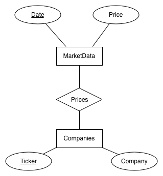
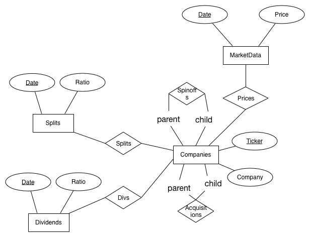
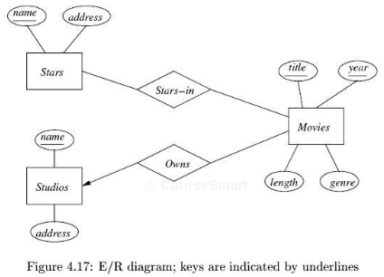
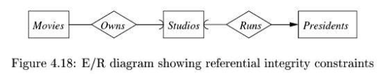
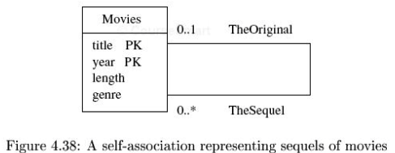
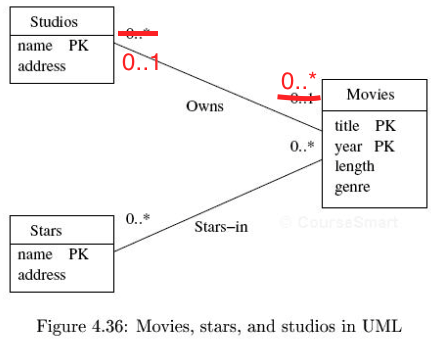

title:        COSC 4820 Database Systems
subtitle:     High-Level Database Models
author:       Ruben Gamboa
#logo:         uw-logo-small.png
#biglogo:      uw-logo-large.png
job:          Associate Professor
highlighter:  highlight.js
hitheme:      tomorrow
mode:         selfcontained
framework:    io2012
widgets:      [mathjax, bootstrap]

---

<style>
.title-slide {
     background-color: #EDE0CF; /* CBE7A5; #EDE0CF; ; #CA9F9D*/
     background-image: url(assets/img/uw-logo-large.png);
     background-repeat: no-repeat;
     background-position: center top;
   }
</style>

## About this Chapter

* The focus of this chapter is on **modeling the real world using database schemas**
* So we have a specific real-world situation
* The goal is to find a schema that can be used to describe this situation
  <br><br>
* Remember, all we have to work with is tables!
* That's bad, because the real world is much more complex than a bunch of tables
  <br><br>
* In practice, we use higher-level data models
* The reason is that we want to have more flexibility during modeling
* So we want more powerful languages to describe the real world, but still be able to
  convert designs into a relational schema
* Among the choices are **Entity-Relationship (E/R) Diagrams**, the **Unified Modeling
  Language (UML)**,  and the **Object Description Language (ODL)**

---

# Entity/Relationship Model

---

## The Entity/Relationship Model

* The **Entity/Relationship (E/R) Model** is the classic high-level database design tool
* The model is represented using an **E/R Diagram**
  <br><br>
* There are three different concepts in E/R Diagrams
  1. Entity (sets)
  2. Attributes
  3. Relationships

---

## Entity Sets

* An **entity** is an abstract object
* Generally, this will correspond to a concrete object in the real world, e.g., a contract,
  a person, a car
  <br><br>
* An **entity set** is a collection of similar entities, e.g., all UW contracts, 
  all persons working at UW, etc.
  <br><br>
* There is a very clear analogy between
  * entity sets and classes
  * entities and objects
* You can get far using your intuition from object-oriented programming here
* The only difference is that entities have data, but no methods
* Go ahead, think of them as C structs!

---

## Attributes

* Entity sets have **attributes**, which are the properties of the entities in that entity set
* All entities in an entity set have the same attributes
* That's what we mean by "similar entities" in an entity set
  <br><br>
* Of course, attributes of entity sets are just like attributes of relations
* This is one place where it's easier to think of the tables than the entity sets, because we
  can think in terms of rows and columns
  <br><br>
* Note that entities have values for the attributes in their entity set
* The values are of a given type or domain
* We will only consider scalar types (e.g., integer, string, date)

---

## Relationships

* **Relationships** are connections among two or more entity sets
* A relationship could also be a connection between an entity set and itself
  <br><br>
* For example, we have the entity sets
  * `Movies`
  * `MovieStars`
* A relationship between them could be called `StarsIn`

---

## E/R Diagrams

* An **E/R Diagram** is a graph that shows entity sets, attributes and relationships
  * Entity sets are represented by **rectangles**
  * Attributes are **ovals**
  * Relationships are **diamonds**
  <br><br>
* Edges connect
  * Entity sets and their attributes
  * Relationships and the entity sets involved in them

> * Note in particular
    * There is **never** an edge between two entity sets
    * There is **never** an edge between two relationships
    * There is **never** an edge between two attributes

---

## E/R Diagram for Movies Schema

<div class="centered">
    
</div>

---

## Multiplicity of Relationships

* Suppose we have a relationship between entity sets
* How many entities on each entity set can be involved in a single instance of the relationship?
  <br><br>
* E.g., suppose we have a relationship between `Advisors` and `Students`
  * An advisor may have many students they advise
  * A student should have only one advisor
  <br><br>
* Or suppose we have a relationship between `Students` and `Courses`
  * A student may be taking many courses 
  * And a course may (should?) have many students
  <br><br>
* Or suppose we have a relationship between `Universities` and `Presidents`
  * A university can have at most one president
  * And a president can work in only one university

---

## Multiplicity of Relationships

* These cases lead to the following notation
* Suppose $R$ is a relationship between entity sets $E$ and $F$
  * If each entity in $E$ can be connected to at most one member of $F$, we say
    $R$ is **many-to-one** from $E$ to $F$
  * Likewise, if each entity in $F$ can be connected to at most one member of $E$,
    we say that $R$ is **many-to-one** from $F$ to $E$
  * If $R$ is many-to-one from $E$ to $F$ and from $F$ to $E$, we call it **one-to-one**
  * If none of these hold, we say $R$ is **many-to-many**
* This possibilities describe the possible **multiplicity** of entities in a relationship

---

## Multiplicity of Relationships

* Arrows are used in the E-R diagram to indicate multiplicity in relationships
* The arrow always goes **from** the relationship **to** an entity set
* The arrow indicates that that entity set is on the **one** side of the relationship
* But the arrow means **at most one**
* There is no guarantee that there is actually one right now (e.g., a university may
  (temporarily) not have a president)

---

## Multiplicity of Relationships

<div class="centered">
    
    <br>
    <br>
    
</div>

---

## Ternary (and Higher) Relationships

* Occasionally, we will want to model a relationship among three (or more) entity sets
  * Law firms organize their records (and billing) under **Attorney-Client-Matter**a
  * A studio may hire an actor to appear in a movie, resulting in **Studio-MovieStar-Movie**

---

## E/R Diagram for Ternary (and Higher) Relationships

<div class="centered">
    
</div>

* Note the meaning of the arrow into `Studios`
* If you know the `Movie` and the `MovieStar`, then only one `Studio` can be associated with them
* But a different `Studio` may have a contract with the same `MovieStar` but in a different `Movie`

---

## Unary Relationships and Roles

* It is fairly common to have relationships between an entity set **and itself**
* For example, movies have sequels
* Or students can be advisors of other students
* Or a person have be a spouse of another person
  <br><br>
* Usually, the relationship is **asymmetric**
  * E.g., *Empire Strikes Back* is a sequel of *Star Wars*
  * But *Star Wars* is **not** a sequel of *Empire Strikes Back*
  <br><br>
* So when we draw the E/R diagram, we have to label each edge, to show the **role** of the given participant
  * E.g., the role may be *sequel* and *original*
  * Or *advisor* and *advisee*

---

## Unary Relationships and Roles

<div class="centered">
    
    <br><br>
    
</div>

---

## Converting Ternary (and Higher) Relationships to Binary Relationships

* Although the E/R model supports ternary (and higher) relationships, it is sometimes useful to convert such relationships
  to binary relationships only
* Partly, this is because binary relationships are simpler
* It's also because some other notations only allow binary relationships
  <br><br>
* Luckily, it's easy to do the conversion
* Suppose $R$ is a relationship among $E$, $F$, and $G$
* Create a new entity set $R_E$
* Connect $R_E$ with the entity sets $E$, $F$, and $G$
* Each of those connections is binary
* And each entity in $R_E$ corresponds to a relationship in $R$

---

## Converting Ternary (and Higher) Relationships to Binary Relationships

<div class="centered">
    
    
</div>

---

## Attributes on Relationships

* Although it may appear unnatural at first, it is very common to have attributes on relationships, not just entity sets
* Examples:
  * The `WorksIn` relationship may have an associated `Salary` attribute
  * The `ProjectMember` relationship may have `PctEffort`
  * The `RecipeIngredient` relationship may have `Amount`
  <br><br>
* These are indicated the same way as attributes on entity sets
* I.e., there is an edge between the attribute and the relationship

---

## Attributes on Relationships

<div class="centered">
    
</div>

* Note: You can always avoid relationship attributes by adding extra entity sets
* But this is seldom necessary (or wise)

---

## Subclasses in the E/R Model

* It is extremely common for an entity set to be just like another entity set, but with some more attributes
* For example, in the university, there may be entity sets for `Students` and `Faculty`
* Both entity sets will have name, address, phone number, etc.
* **In addition**, 
  * Students may have a major, degree program, etc.
  * Faculty may have salary, highest degree earned, etc.
  <br><br>
* It's natural to represent this using subclasses
* The attributes in common are placed in `Person`
* Then the entity sets `Students` and `Faculty` **extend** `Person`, adding their own attributes
  <br><br>
* In the E/R diagram, this is signified by a special type of relationship that is a **triangle** instead of a diamond

---

## Subclasses in the E/R as Opposed to the Object-Oriented Model

* There is a major difference between subclasses in the E/R and OO models
  <br><br>
* Suppose $A$ is a superclass, and $A_1$, $A_2$, and $A_3$ are subclasses
* You have to make two decisions
  * **Coverage:** Does every $A$ have to be one of $A_1$, $A_2$, or $A_3$?
  * **Exclusivity:** Can an $A_1$ also be an $A_2$ or an $A_3$?
  <br><br>
* In OOP, we can actually do this
  * **Coverage:** If $A$ is abstract, then yes -- otherwise, no
  * **Exclusivity:** Typically not, but in C++, yes (by further subclassing)
  * Oh, and Java (and modern OO languages) uses interfaces to get around **exclusivity**

---

## Subclasses in the E/R Model

* In databases, the assumptions are that
  * **Coverage:** No, an $A$ does not have to be one of the $A_i$
  * **Exclusivity:** No, an entity can be an $A$, an $A_i$ and an $A_j$ all at the same time

---

## Subclasses in the E/R Model

<div class="centered">
    
</div>

* Note that a movie may be something other than a cartoon or a murder-mystery
* Also, a movie may be **both** a cartoon and a murder-mystery!

---

# Design Principles

---

## Design Principles

* Now we'll turn our attention to **design principles**
* E/R diagrams are a tool to describe different designs
  <br><br>
* The same real-world situation may be modeled in radically different E/R diagrams
* The important question is, **how can we compare different designs?**
* In other words, **what makes one design better than another?**
  <br><br>
* We'll (try to) answer these questions by identifying important design principles

---

## Faithfulness

* First and foremost, the design should reflect the **real world**
  <br><br>
* An entity set $E$ should have attribute $A$ if and only if that attribute really exists in the real world for that
  entity set
  <br><br>
* Likewise, the **multiplicities** of relationships must reflect the real world

> * Don't be fooled!
* This isn't technical, but it **is** extremely difficult
* It may take years to fully understand a particular aspect of the real world well enough to design a good database

---

## Redundancy

* Avoid redundancy at (almost) all costs
  <br><br>
* Everything we said about redundancy for tables is still applicable
  <br><br>
* And there is an extra complication
* There can be redundancy between an attribute and a relationship
  * Student has an Advisor relationship with Faculty
  * Student has an attribute called Advisor

---

## Redundancy of Relationships

* Relationships also present an extra opportunity for redundancy
* E.g., consider the relationships Parent and GrandParent
  <br><br>
* The problem with having both of these relationship is obvious
  <br><br>
* Even here, though, there is a subtlety
* What if we sometimes don't know all the Parents, but we do know some reliable facts about GrandParents?

---

## Simplicity

* Hoare's Law of Large Problems:
 
  > Inside every large problem is a small problem struggling to get out.

* But never forget H.L. Mencken's take:

  > For every complex problem there is an answer that is clear, simple, and wrong.

* Bottom line: If two solutions work, pick the simpler one, but only if it **really** works

---

## Attributes vs. Entity Sets (or Relationships)

* It is easy to add an attribute to an existing entity set
* In general, attributes are lightweight
  <br><br>
* The problem is that sometimes an attribute does not work:
  * It may have nested attributes (especially if there are FDs between the attributes)
  * Different values of the attribute may have natural relationships
  * A single value of the attribute may be involved in many-one or many-many relationships with other entity sets
  <br><br>
* In general: Err on the side of having entity sets
* This heuristic works because we will be naturally biased in favor of attributes!

---

## Example: Historical Market Data

* Take a very simple example
* We want to store market data, which looks like this

Ticker   | Company               | Date     | Price
---------|-----------------------|----------|----------
AAPL     | Apple Inc.            | 2/18/15  | 128.71
AAPL     | Apple Inc.            | 2/17/15  | 127.83
MSFT     | Microsoft Corporation | 2/18/15  |  43.53
MSFT     | Microsoft Corporation | 2/17/15  |  43.58
C        | Citigroup Inc.        | 2/18/15  |  51.42
C        | Citigroup Inc.        | 2/17/15  |  51.69

---

## Example: Historical Market Data

<p class="centered">
    
</p>

---

## Example: Historical Market Data

<p class="centered">
    
</p>

---

## Example: Historical Market Data

<p class="centered">
    
</p>

---

## Example: Historical Market Data

<p class="centered">
    
</p>

---

## Example: Historical Market Data

* Another complication: Splits

Ticker   | Company               | Date     | Price
---------|-----------------------|----------|----------
AAPL     | Apple Inc.            | 6/05/14  | 647.35
AAPL     | Apple Inc.            | 6/06/14  | 647.57
AAPL     | Apple Inc.            | 6/09/14  |  93.70
AAPL     | Apple Inc.            | 6/10/14  |  94.25

---

## Example: Historical Market Data

* Yet another complication: Dividends

Ticker   | Company               | Date     | Price
---------|-----------------------|----------|----------
AAPL     | Apple Inc.            | 2/03/15  | 118.65
AAPL     | Apple Inc.            | 2/04/15  | 119.56
AAPL     | Apple Inc.            | 2/05/15  | 119.94
AAPL     | Apple Inc.            | 2/06/15  | 118.93

---

## Example: Historical Market Data

* Yet another complication: Acquisitions (Beats)

Ticker   | Company               | Date     | Price
---------|-----------------------|----------|----------
AAPL     | Apple Inc.            | 5/23/14  | 614.13
AAPL     | Apple Inc.            | 5/27/14  | 625.63
AAPL     | Apple Inc.            | 5/28/14  | 624.01
AAPL     | Apple Inc.            | 5/29/14  | 635.38

---

## Example: Historical Market Data

* Yet another complication: Spinoffs (Apperian)

Ticker   | Company               | Date     | Price
---------|-----------------------|----------|----------
AAPL     | Apple Inc.            | 1/13/09  | 87.71
AAPL     | Apple Inc.            | 1/14/09  | 85.33
AAPL     | Apple Inc.            | 1/15/09  | 83.38
AAPL     | Apple Inc.            | 1/16/09  | 82.33

Not very exciting: But read up on AT&T's breakup in 1984!

---

## Example: Historical Market Data

<p class="centered">
    
</p>

---

## Example: Historical Market Data

* Even More Complications: Ticker Symbols and Exchanges

Ticker    | Company               | Date     | Price    | Exchange
----------|-----------------------|----------|----------|----------
AAPL      | Apple Inc.            | 2/18/15  | 128.71   | NMS
AAPL34.SA |	Apple Inc.            | 2/18/15  | 36.61	| SAO
AAPL.MX   | Apple Inc.            | 2/18/15  | 1,911.41 | MEX
AAPL.SW   | APPLE                 | 2/18/15  | 120.50   | EBS
AAPL.BA   | Apple Inc.            | 2/18/15  | 155.00   | BUE

---

## Example: Historical Market Data

* Even More Complications: Ticker Symbols

Ticker    | Company               | Date      | Price    | Exchange
----------|-----------------------|-----------|----------|----------
C         | Chrysler Corporation  |     1997  |          | NYSE
DCX       | DaimlerChrysler AG    |     1998  |          | NYSE
FCAU      | Fiat Chrysler         | 10/13/14  |   9.55   | NYSE
C         | Citigroup Inc.        |     1998  |          | NYSE
C         | Corn Futures          |     1960  |          | CME

There are CUSIP (Committee on Uniform Securities Identification Procedures) symbols, which 
give a unique identifier for each security traded in North America:
* 037833100 - Apple
* 172967101 - Citigroup

But, you guessed it.  CUSIPs change over time, so you need another entity set to handle "CUSIP chaining"

---

## Example: Historical Market Data

Did we mention AAPL?

* Apple Computer Inc., on 1/3/77
* Apple Inc., 1/9/07

---

## Example: Historical Market Data

* One More Complication: Things change
* AAPL is trading at 138.72 on 2/18/15
  <br><br>
* No, wait!
* That was a typo!!!
* I meant 128.72 on 2/18/15
  <br><br>
* So what if my target for APPL was 135 and I sold all my AAPL holdings?
* And what if I am working for a hedge fund that just lost \$100M selling its AAPL stock because the sell order
  triggered a "flash crash"
  <br><br>
* Maybe all data points in the historical data should have a date and corrections history attached to them
* The same may be said for names, etc.

---

# Constraints in the E/R Model

---

## Constraints in the E/R Model

* We saw that constraints play an important role in the relational model
* We want to represent constraints in the E/R model, too
  <br><br>
* We've already seen some of this: **arrowheads represent multiplicity**
* This is actually a type of constraint
* It's a bit like an FD, but it goes across relations!
* (We'll model it later as an FD in the relationship table)

---

## Keys in the E/R Model

* Keys are another very important constraint
* It has the same meaning as in the relational model
* And it's represented in the same way
  * The attributes in the key are underlined
  <br><br>
* There is one extra subtlety
* If $A$ is an entity set and $A_1$, $A_2$, $A_3$ are subclasses (or subentity sets)
  * There must be a key in $A$ (with the attributes of $A$)
  * The key of $A_i$ is $\pi_{\mathcal{A_i}}(A)$
* I.e., if you have an instance of the superclass, you can get the associated instance(s) in the subclasse(s)
* In particular, $A \bowtie A_1$ returns all the information for the entities in $A_1$

---

## Keys in the E/R Model

<p class="centered">
    
</p>

Note: It is purely a coincidence that the key attributes are always above the entity set!

In general, this will not be the case

---

## Referential Integrity

* **Referential Integrity** is a crucial constraint
* Basically, it says that if you point to something, it really exists
  * In programming: No garbage pointers
  * In the web: No *404 Not Found* errors
  <br><br>
* You may (should) remember how we specified this constraint using relational algebra
  <br><br>
* The basic referential integrity is **assumed** in E/R Diagrams
* If there is a many-to-one relationship from $E$ to $F$, we take it for granted that
  * if an instance $e$ of $E$ claims to be associated with an instance $f$ of $F$,
  * then $f$ actually exists

---

## Referential Integrity

* In E/R diagrams, **referential integrity** also refers to a similar (but different) notion
  <br><br>
* Again, suppose there is a many-to-one relationship from $E$ to $F$
* And consider an entity $e$ of $E$
* Does there need to be an entity $f$ in $F$ that $e$ is associated with?
  <br><br>
* If the answer is "yes", then this is also a sort of referential integrity constraint
* It is denoted in E/R Diagrams by **rounded** arrowheads

<p class="centered">
    
</p>

---

## Degree Constraints

* What the "referential integrity" really says is that **every $e$ in $E$ must be associated with at least one $f$ in $F$**
* In addition, since the relationship is many-to-one, then we know $e$ is associated with **exactly one** $f$
  <br><br>
* This idea can be generalized to different **degree constraings**
* E.g., each $e$ in $E$ must be associated with **at most 10** $f_i$ in $F$
* Or each $e$ in $E$ must be associated with **at least 3** $f_i$ in $F$

<p class="centered">
    
</p>

---

# Weak Entity Sets

---

## Weak Entity Sets

* Consider an entity set $E$ with key $A_1$, $A_2$, $A_3$
* It is possible that $A_1$ is actually a key for some other entity set $F$
* In this case, we say that $E$ is a **weak entity set**
  <br><br>
* That's actually the **definition** of weak entity set
* It is an entity set whose key is a superset of the key of some other entity set

---

## Weak Entity Sets: Because of Mergers

* For example, UW has many students
* Each student has a unique ID, the W#
* As far as UW is concerned, the ID is unique
  <br><br>
* But what if we want to have a database that combines students from many universities
* Then the key for the Student table may consist of
  * University key
  * Student key (relative to the university)

University    | StudentID     | Name
--------------|---------------|---------------------
UWyo          | W12345678     | John Galt
UWyo          | W24683579     | Francisco d'Anconia
TAMU          | 010-CS-193a   | Dagny Taggart
UTAus         | a73e9fxe$3    | Hank Rearden

---

## Weak Entity Sets: Because of Hierarchies

* Another classic reason for weak entity sets is hierarchies
* Consider a **purchase order**
* It contains
  * one or more line items, each with a product, quantity, and price
  * subtotal
  * tax
  * total
  <br><br>
* The line items **belong to** the purchase order
* So their key contains the key of the purchase order
* E.g., lime item #2 of purchase order #429

---

## Keys for Entity Sets

* The key for an entity set consists of
  * Some of its own attributes (e.g., StudentID)
  * Keys from entity sets that can be **reached** from the weak entity set (e.g., University)
  <br><br>
* By "reached", we are referring to **relationships**
* The relationship between a weak entity set and the "owning" entity set is called a **supporting relationship**
* The "owning" entity set is called a **supporting entity set**

---

## Supporting Relationships and Entity Sets

* Suppose we have 
  * a weak entity set $E$
  * with supporting relationship $R$
  * and supporting entity set $F$

* Then the following requirements must hold
  1. $R$ is a binary many-to-one or one-to-one relationship from $E$ to $F$ (i.e., there is at most one owner)
  2. There must be at least one $F$ associated with each $E$ (i.e., there is exactly one owner)
  3. The key of $E$ must have some attributes that form a key in $F$
  4. If $F$ is also a weak entity, then its key will have some attributes from its supporting entity set, and those
     will also appear in $E$
  <br><br>
* Note that there may be more than one supporting relationship between $E$ and $F$, but this is quite rare

---

## Weak Entity Sets in E/R Diagrams

* Weak entity sets are denoted in **double rectangles**
* Supporting relationships are denoted as **double diamonds**
* The (underlined) key of a weak entity set does not include the attributes from its supporting entity set

<p class="centered">
    
</p>

---

# Converting E/R Diagrams to Relations

---

## Converting E/R Diagrams to Relations

* One of the reasons that E/R diagrams are so useful is that they can be mechanically converted into 
  equivalent relations
* So we can convert our high-level design to a low-level implementation
  <br><br>
* The basic strategy is 
  * turn each entity set into a relation with the same name and attributes
  * turn a relationship into an entity set with attributes corresponding to the primary keys of the connected entity sets,
    as well as any attributes defined for the relationship itself

---

## Converting E/R Diagrams to Relations

<p class="centered">
    
</p>

```
Movies(_title_, _year_, length, genre)
Stars(_name_, address)
StarsIn(_title_, _year_, _name_)
```

---

## Converting E/R Diagrams to Relations

<p class="centered">
    
</p>

```
Movies(_title_, _year_, length, genre)
Studios(_name_, address)
Owns(_title_, _year_, _name_)
```

With the following FD to account for the constraint on Studios:
* title, year $\rightarrow$ name

---

## Converting E/R Diagrams to Relations

<p class="centered">
    
</p>

For many-to-one relationships, it is common to merge the relationship table with the "many" side:

```
Movies(_title_, _year_, length, genre, name)
Studios(_name_, address)
```

---

## Handling Weak Entity Sets

* Weak entity sets can also be converted to relations, but with a little more care
  <br><br>
* The list of attributes must also include the attributes in the key of the supporting relation
  <br><br>
* Whenever a relationship table refers to a weak entity set, it must do so with the **entire key**, including
  the part contributed by the supporting relation
  <br><br>
* There is no need to create the supporting relationship table
  * It is a many-to-one or one-to-one table, so it can be merged into the weak entity set, as we did before

---

## Handling Weak Entity Sets

<p class="centered">
    
</p>

```
Studios(_name_, address)
Crews(_number_, _studioName_, crewChief)
```

<br>

Notice there is no need to create the relationship table
```
UnitOf(_number_, _studioName_, _name_)
```

---

## Handling Subclasses (or Subentity Sets)

* Care must also be taken with the conversion of E/R diagrams that involve **inheritance**
* This particular case is a little controversial
* There is no widespread agreement on the best way to do it
  <br><br>
* The book suggests three approaches
  * The E/R viewpoint
  * A single class
  * NULL values

---

## Subclasses: The E/R Viewpoint

* Suppose we have root $A$ and subclasses $A_1$, $A_2$, and $A_3$
  <br><br>
* We create a relation for each entity set
* Each of the $A_i$ must have all the attributes in the key of $A$
* I.e., the $A_i$ explicitly inherit the key attributes from $A$
* That becomes the key of the $A_i$, so if an $A_i$ participates
  in a relationship, the entire key is used to identify an entity

---

## Subclasses: The E/R Viewpoint

<p class="centered">
    
</p>


```
Movies(_title_, _year_, length, genre)
Cartoons(_title_, _year_)
MurderMysteries(_title_, _year_, weapon)
```

**Important:** 
* Each entity must exist in the `Movies` table
* In addition, an entity may also exist in `Cartoons`, `MurdermMysteries`, or both

---

## Subclasses: The Single Class Approach

* The idea behind this is to enumerate all possible subclasses and create a table for each
  <br><br>
* In our case, the "possible subclasses" are
  * Movies
  * CartoonMovies
  * MurderMysteryMovies
  * CartoonMurderMysteryMovies
  <br><br>
* Yes, that is building a table for each **subtree** of the hierarchy that includes the root
* (And, by the way, it's not much different than what C++ does)

---

## Subclasses: Using NULL Values

* The traditional way of doing this is to construct **just one relation**
* This relation would be named after the root, and have the attributes of **all** subclasses
* E.g., $A$ would have the attributes of $A$, $A_1$, $A_2$, and $A_3$
* In addition, there is an extra attribute (often called "type") that says whether this instance
  is of type $A_1$, $A_2$, or $A_3$
* If multiple combinations are possible, then "type" needs to be more complicated

---

## Subclasses: Using NULL Values

<p class="centered">
    
</p>

```
Movies(_title_, _year_, movieType, length, genre, weapon)
```

Note that the attribute "weapon" would have NULLs for all entities except murder mysteries!

---

## Handling Subclasses (or Subentity Sets)

* The traditional (single-table) approach has some advantages
  * There is only one row for each entity
  * You can get all information for a given entity in just one lookup, without having to join
    lots of tables
* But it also has disadvantages
  * The tuples are **big**, so it is more expensive to read a tuple from disk
  * Most queries may use only some of the attributes, so the rest is wasted
  <br><br>
* Generally speaking, database administrators prefer the single-table approach, while OO programmers
  prefer the "one table per entity set" approach
* Almost nobody prefers the "one table per subtree" approach, except in very small cases

---

# Unified Modeling Language

---

## Unified Modeling Language

* **Unified Modeling Language (UML)** is a graphical language designed to describe object-oriented designs
* Since there is a close correspondence between classes/entity sets and objects/entities, it's natural to
  use UML to describe database designs as well

---

## UML Classes

* A class consists of
  1. a name
  2. one or more attributes (with keys identified by **PK**)
  3. methods (but not for entity sets)

<p class="centered">
    
</p>

---

## UML Associations

* A associations is an **edge** linking two classes
* This is a little different than E/R Diagrams, where such an edge would be a syntax error
* The edges can have names
* They can also specify cardinalities for the endpoints

<p class="centered">
    
</p>

---

## Arrowheads in UML Associations

* **Important:** UML associations can have arrowheads, but they **do not mean cardinality**
* Arrowheads in UML denote **navigation**, i.e., you can get from an instance of one class to the related instances in the other
* Navigability is not a notion in relational databases
* So we won't be using them

---

## Cardinality in UML Associations

* Cardinalities are listed at the endpoints, and read like this:
  1. Suppose we have a relationship between A and B
  2. The cardinality on end B is 1..1
  3. We read "Each A has one B"
* E.g., below, you should read
  * Each Movie has **one** Studio
  * Each Studio has **one or more** Movies
  * Each President has **one** Studio
  * Each Studio has **zero or one** President

<p class="centered">
    
</p>

---

## Cardinality in UML Associations

* Spot the typo!

<p class="centered">
    
</p>

* Be sure to get this right!!!
* (I actually like the arrows better...)

---

## UML Self-Associations

* Nothing much to see here
* Same concept, slightly different notation
* Notice the multiplicities
  * The original can have **zero or more** sequels
  * A sequel can have **zero or one** originals

<p class="centered">
    
</p>

---

## Association Classes in UML

* Relationships can have attributes!
* This is true in any (useful) modeling language
  <br><br>
* But associations in UML are just lines between classes
* So UML developed the idea of an **association class**
* This is an auxiliary class that is attached to a relationship
* The association class is attached to the middle of the relationship edge (with a dashed line, according to the standard)

<p class="centered">
    
</p>

---

## Subclasses in UML

* UML was built to describe inheritance hierarchies!
* UML supports all four types of inheritance:
  1. **Coverage:** Incomplete vs. Complete
  2. **Exclusivity:** Disjoint vs. Overlapping
  <br><br>
* The default has changed from
  * Unspecified
  * incomplete & disjoint (UML 2.0 to 2.4.1)
  * incomplete & overlapping (as of UML 2.5)
* You can actually specify what you mean in the diagram by labeling an inheritance link,
  e.g., as **{complete, overlapping}**

---

## Subclasses in UML

<p class="centered">
    
</p>

* Note: The book assumes **complete & disjoint**, but this is no longer the default
* It pays to be explicit

---

## Aggregation and Composition in UML

* UML has a special notation for two types of relationships:
  * **Aggregation** from $A$ to $B$ means that $A$ *contains* zero or more $B$s, e.g., a course section contains one or more students
  * **Composition** from $A$ to $B$ means that $A$ *is made up of* zero or more $B$s, e.g., a book is made up of one or more chapters
  <br><br>
* Aggregation is represented by an open diamond on the **owner** class
* Composition is represented by a filled diamond on the **owner** class
  <br><br>
* Note: aggregation and composition are **special cases** of plain associations between classes

---

## Association, Aggregation, and Composition in UML

* Here are the subtle differences:
  * An association from $A$ to $B$ means that there is some relationship between them, but each entity is independent
  * An aggregation from $A$ to $B$ means that each $B$ entity is owned by some $A$ entity 
  * A composition from $A$ to $B$ means that each $B$ entity is owned by some $A$ entity, and that a $B$ entity cannot live on its own
    (i.e., without an $A$ parent)
  <br><br>
* Pragmatics:
  * If there is no notion of "parent", then use a plain association
  * If you delete the parent $A$, does that mean the related $B$s should also be deleted?
  * If so, use composition
  * If not, use aggregation (or association)

---

## UML Association, Aggregation, Composition Example

<p class="centered">
    
</p>


---

## Association, Aggregation, and Composition in UML

* There is also a difference in cardinalities
  * For association, there is no restriction (unless you write one on the endpoint)
  * For aggregation, it's zero or one on the parent
  * For composition, it's exactly one on the parent
  <br><br>
* This is the distinction that the book focuses on
* It has a direct translation to a database schema
* But if you use aggregation and composition, make sure that you are using them to
  model the world correctly!

---

## UML Association, Aggregation, Composition Example

<p class="centered">
    
</p>

---

# Converting UML Diagrams to Relations

---

## Converting UML Diagrams to Relations

* The basic strategy is 
  * turn each class into a relation with the same name and attributes
  * turn each association into an entity set with attributes corresponding to the primary keys of the connected classes,
    as well as any attributes defined in an association class
    <br><br>
* If this seems familiar, it's because it should
* It's the exact same strategy as in converting E/R Diagrams to relations!

---&twocol

## Converting UML Diagrams to Relations

*** =left
<p class="centered">
    
</p>

*** =right
```
Movies(_title_, _year_, length, genre)
Stars(_name_, address)
Studios(_name_, address)
StarsIn(movieTitle, movieYear, starName)
Owns(movieTitle, movieYear, studioName)
```

We need the FD movieTitle, movieYear $\rightarrow$ studioName 

---

## Converting UML Diagrams to Relations

<p class="centered">
    
</p>

```
Movies(_title_, _year_, length, genre, studioName)
Stars(_name_, address)
Studios(_name_, address)
StarsIn(title, year, name)
```

Of course, we can avoid adding a relationship table for the many-to-one relationship

---

## Handling Subclasses

* The approach to subclasses is exactly the same as with E/R diagrams
* The OO flavor of UML favors the single-class approach
  <br><br>
* But since we have explicit ways of dealing with coverage and exclusivity, we can 
  tailor our approach:
  1. If all classes are disjoint, then the single-class approach is not as crazy as it sounds.
     Simply, the attributes of the parent are pushed into each descendant table.
     It's still crazy, in that it's hard to find the data for a single row if you don't know
     where it is.
  2. If the hierarchy is both complete and disjoint, then the only classes that are needed
     are at the leaves.
  3. Otherwise, use the traditional E/R approach or the NULL-values approach

---

## Handling Subclasses

* The approach to subclasses is exactly the same as with E/R diagrams
* The OO flavor of UML favors the single-class approach
  <br><br>
* But since we have explicit ways of dealing with coverage and exclusivity, we can 
  tailor our approach:
  1. If all classes are disjoint, then the single-class approach is not as crazy as it sounds.
     Simply, the attributes of the parent are pushed into each descendant table.
     It's still crazy, in that it's hard to find the data for a single row if you don't know
     where it is.
  2. If the hierarchy is both complete and disjoint, then the only classes that are needed
     are at the leaves.
  3. Otherwise, use the traditional E/R approach or the NULL-values approach

---

## Handling Subclasses

<p class="centered">
    
</p>

```
Movies(_title_, _year_, length, genre)
MurderMysteries(_title_, _year_, length, genre, weapon)
Cartoons(_title_, _year_, length, genre)
CartoonMurderMysteries(_title_, _year_, length, genre, weapon)
```
Using the single-class approach

---

## Handling Subclasses

<p class="centered">
    
</p>

```
Movies(_title_, _year_, length, genre)
MurderMysteries(_title_, _year_, weapon)
Cartoons(_title_, _year_)
CartoonMurderMysteries(_title_, _year_, weapon)
```
Using the E/R approach

---

## Handling Aggregations and Compositions

* Recall that cardinality view that
  * **Aggregation** really means at most one parent
  * **Composition** really means exactly one parent
  <br><br>
* Then aggregations and compositions are translated using nothing more than the cardinality-based rules
* In particular, since both denote a many-to-one relationship, we never create the explicit relationship table

---&twocol

## Handling Aggregations and Compositions

```
Studios(_name_, address)
Movies(_title_, _year_, length, genre, studioName)
MovieExecs(_cert#_, name, address, networth)
Presidents(_cert#_, studioName)
```

*** =left
<p class="centered">
    
</p>

*** =right

* Notice that the empty diamond is just treated as a 0..1 annotation
  <br><br>
* We also have the constraint that studioName in Presidents cannot be NULL
* That constraint handles the "filled" diamond

---

## Handling Weak Entities

* There is really **no concept** of weak entities in UML
* Note: Please do not confuse this with the notion of **weak references** in OOP
  <br><br>
* The related concept in UML is actually **composition**
  * If class $A$ is the owner of class $B$ under composition, then each
    instance of $B$ is scoped inside an instance of $A$ and can't live outside $A$
  * That just about captures "weak entity" by itself
    <br><br>
* We can emphasize this fact by using a special "PK" notation on the weak class
* If we do so, we drop the part of the key that comes from the relationship

<p class="centered">
    
</p>

---

## Handling Weak Entities

<p class="centered">
    
</p>

The translation to a schema is just as before

```
Studios(_name_, address)
Crews(_number_, _studioName_, crewChief)
```

---

# Object Definition Language

---

## Object Definition Language

* **Object Definition Language (ODL)** was originally designed to describe schemas in
  object-oriented databases
* Conceptually, just think of the data definition portion of C++
* A slightly different syntax, and you have ODL

---

## Object Definition Language

```
class Movie {
    attribute string title;
    attribute integer year;
    attribute integer length;
    attribute enum Genres {drama, comedy, scifi} genre;
    relationship Set<Star> stars inverse Star::starredIn;
    relationship Studio ownedBy inverse Studio::owns;
};
class Star {
    attribute string name;
    attribute Struct Addr {
        string street,
        string city
    } address;
    relationship Set<Movie> starredIn inverse Movie::stars;
};
```

---

## Object Definition Language

```
class Movie {
    attribute string title;
    attribute integer year;
    attribute integer length;
    attribute enum Genres {drama, comedy, scifi} genre;
    relationship Set<Star> stars inverse Star::starredIn;
    relationship Studio ownedBy inverse Studio::owns;
};
class Studio {
    attribute string name;
    attribute Star::Addr address;
    relationship Set<Movie> owns inverse Movie::ownedBy;
};
```

---

## Converting ODL to Relations

* In essence, the conversion of ODL to relations follows the same patters as before
* But things are quite a bit more complicated because ODL supports complex data types
* The usual approach is to expand the complex datatypes and then consider the FDs and MVDs
  to normalize the resulting tables

---

## Relevance of ODL

* ODL is not as common as E/R diagrams or UML
* However, the ideas in ODL (e.g., relationships, inverse relationships) appear in many
  other contexts
* E.g., object-relational mappers that make database schemas look like class hierarchies to code
  use little languages similar to ODL
