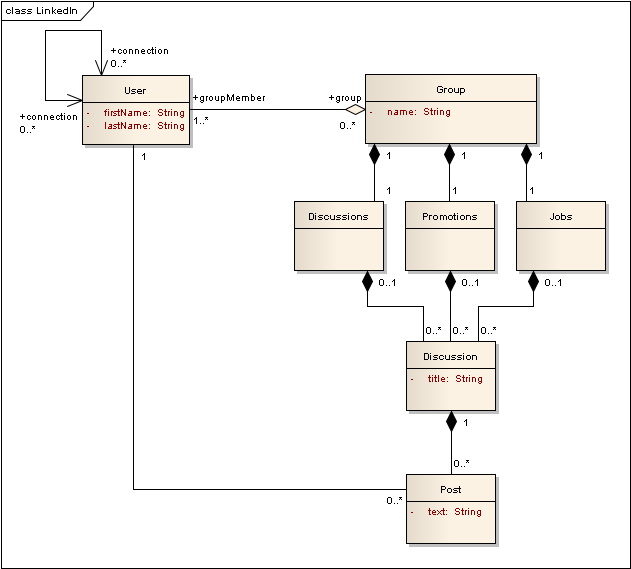
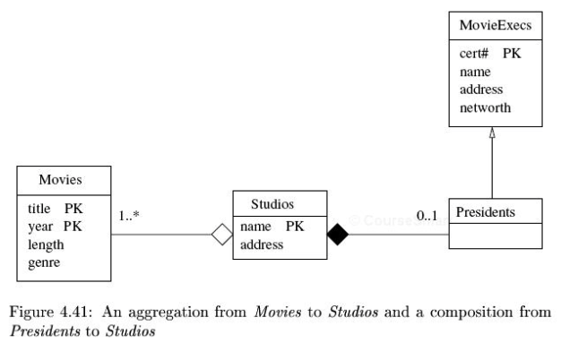

---

# Unified Modeling Language

---

## Unified Modeling Language

* **Unified Modeling Language (UML)** is a graphical language designed to describe object-oriented designs
* Since there is a close correspondence between classes/entity sets and objects/entities, it's natural to
  use UML to describe database designs as well

---

## UML Classes

* A class consists of
  1. a name
  2. one or more attributes (with keys identified by **PK**)
  3. methods (but not for entity sets)

<p class="centered">
    
</p>

---

## UML Associations

* A associations is an **edge** linking two classes
* This is a little different than E/R Diagrams, where such an edge would be a syntax error
* The edges can have names
* They can also specify cardinalities for the endpoints

<p class="centered">
    
</p>

---

## Arrowheads in UML Associations

* **Important:** UML associations can have arrowheads, but they **do not mean cardinality**
* Arrowheads in UML denote **navigation**, i.e., you can get from an instance of one class to the related instances in the other
* Navigability is not a notion in relational databases
* So we won't be using them

---

## Cardinality in UML Associations

* Cardinalities are listed at the endpoints, and read like this:
  1. Suppose we have a relationship between A and B
  2. The cardinality on end B is 1..1
  3. We read "Each A has one B"
* E.g., below, you should read
  * Each Movie has **one** Studio
  * Each Studio has **one or more** Movies
  * Each President has **one** Studio
  * Each Studio has **zero or one** President

<p class="centered">
    
</p>

---

## Cardinality in UML Associations

* Spot the typo!

<p class="centered">
    
</p>

* Be sure to get this right!!!
* (I actually like the arrows better...)

---

## UML Self-Associations

* Nothing much to see here
* Same concept, slightly different notation
* Notice the multiplicities
  * The original can have **zero or more** sequels
  * A sequel can have **zero or one** originals

<p class="centered">
    
</p>

---

## Association Classes in UML

* Relationships can have attributes!
* This is true in any (useful) modeling language
  <br><br>
* But associations in UML are just lines between classes
* So UML developed the idea of an **association class**
* This is an auxiliary class that is attached to a relationship
* The association class is attached to the middle of the relationship edge (with a dashed line, according to the standard)

<p class="centered">
    
</p>

---

## Subclasses in UML

* UML was built to describe inheritance hierarchies!
* UML supports all four types of inheritance:
  1. **Coverage:** Incomplete vs. Complete
  2. **Exclusivity:** Disjoint vs. Overlapping
  <br><br>
* The default has changed from
  * Unspecified
  * incomplete & disjoint (UML 2.0 to 2.4.1)
  * incomplete & overlapping (as of UML 2.5)
* You can actually specify what you mean in the diagram by labeling an inheritance link,
  e.g., as **{complete, overlapping}**

---

## Subclasses in UML

<p class="centered">
    
</p>

* Note: The book assumes **complete & disjoint**, but this is no longer the default
* It pays to be explicit

---

## Aggregation and Composition in UML

* UML has a special notation for two types of relationships:
  * **Aggregation** from $A$ to $B$ means that $A$ *contains* zero or more $B$s, e.g., a course section contains one or more students
  * **Composition** from $A$ to $B$ means that $A$ *is made up of* zero or more $B$s, e.g., a book is made up of one or more chapters
  <br><br>
* Aggregation is represented by an open diamond on the **owner** class
* Composition is represented by a filled diamond on the **owner** class
  <br><br>
* Note: aggregation and composition are **special cases** of plain associations between classes

---

## Association, Aggregation, and Composition in UML

* Here are the subtle differences:
  * An association from $A$ to $B$ means that there is some relationship between them, but each entity is independent
  * An aggregation from $A$ to $B$ means that each $B$ entity is owned by some $A$ entity 
  * A composition from $A$ to $B$ means that each $B$ entity is owned by some $A$ entity, and that a $B$ entity cannot live on its own
    (i.e., without an $A$ parent)
  <br><br>
* Pragmatics:
  * If there is no notion of "parent", then use a plain association
  * If you delete the parent $A$, does that mean the related $B$s should also be deleted?
  * If so, use composition
  * If not, use aggregation (or association)

---

## UML Association, Aggregation, Composition Example

<p class="centered">
    
</p>


---

## Association, Aggregation, and Composition in UML

* There is also a difference in cardinalities
  * For association, there is no restriction (unless you write one on the endpoint)
  * For aggregation, it's zero or one on the parent
  * For composition, it's exactly one on the parent
  <br><br>
* This is the distinction that the book focuses on
* It has a direct translation to a database schema
* But if you use aggregation and composition, make sure that you are using them to
  model the world correctly!

---

## UML Association, Aggregation, Composition Example

<p class="centered">
    
</p>

---

# Converting UML Diagrams to Relations

---

## Converting UML Diagrams to Relations

* The basic strategy is 
  * turn each class into a relation with the same name and attributes
  * turn each association into an entity set with attributes corresponding to the primary keys of the connected classes,
    as well as any attributes defined in an association class
    <br><br>
* If this seems familiar, it's because it should
* It's the exact same strategy as in converting E/R Diagrams to relations!

---&twocol

## Converting UML Diagrams to Relations

*** =left
<p class="centered">
    
</p>

*** =right
```
Movies(_title_, _year_, length, genre)
Stars(_name_, address)
Studios(_name_, address)
StarsIn(movieTitle, movieYear, starName)
Owns(movieTitle, movieYear, studioName)
```

We need the FD movieTitle, movieYear $\rightarrow$ studioName 

---

## Converting UML Diagrams to Relations

<p class="centered">
    
</p>

```
Movies(_title_, _year_, length, genre, studioName)
Stars(_name_, address)
Studios(_name_, address)
StarsIn(title, year, name)
```

Of course, we can avoid adding a relationship table for the many-to-one relationship

---

## Handling Subclasses

* The approach to subclasses is exactly the same as with E/R diagrams
* The OO flavor of UML favors the single-class approach
  <br><br>
* But since we have explicit ways of dealing with coverage and exclusivity, we can 
  tailor our approach:
  1. If all classes are disjoint, then the single-class approach is not as crazy as it sounds.
     Simply, the attributes of the parent are pushed into each descendant table.
     It's still crazy, in that it's hard to find the data for a single row if you don't know
     where it is.
  2. If the hierarchy is both complete and disjoint, then the only classes that are needed
     are at the leaves.
  3. Otherwise, use the traditional E/R approach or the NULL-values approach

---

## Handling Subclasses

* The approach to subclasses is exactly the same as with E/R diagrams
* The OO flavor of UML favors the single-class approach
  <br><br>
* But since we have explicit ways of dealing with coverage and exclusivity, we can 
  tailor our approach:
  1. If all classes are disjoint, then the single-class approach is not as crazy as it sounds.
     Simply, the attributes of the parent are pushed into each descendant table.
     It's still crazy, in that it's hard to find the data for a single row if you don't know
     where it is.
  2. If the hierarchy is both complete and disjoint, then the only classes that are needed
     are at the leaves.
  3. Otherwise, use the traditional E/R approach or the NULL-values approach

---

## Handling Subclasses

<p class="centered">
    
</p>

```
Movies(_title_, _year_, length, genre)
MurderMysteries(_title_, _year_, length, genre, weapon)
Cartoons(_title_, _year_, length, genre)
CartoonMurderMysteries(_title_, _year_, length, genre, weapon)
```
Using the single-class approach

---

## Handling Subclasses

<p class="centered">
    
</p>

```
Movies(_title_, _year_, length, genre)
MurderMysteries(_title_, _year_, weapon)
Cartoons(_title_, _year_)
CartoonMurderMysteries(_title_, _year_, weapon)
```
Using the E/R approach

---

## Handling Aggregations and Compositions

* Recall that cardinality view that
  * **Aggregation** really means at most one parent
  * **Composition** really means exactly one parent
  <br><br>
* Then aggregations and compositions are translated using nothing more than the cardinality-based rules
* In particular, since both denote a many-to-one relationship, we never create the explicit relationship table

---&twocol

## Handling Aggregations and Compositions

```
Studios(_name_, address)
Movies(_title_, _year_, length, genre, studioName)
MovieExecs(_cert#_, name, address, networth)
Presidents(_cert#_, studioName)
```

*** =left
<p class="centered">
    
</p>

*** =right

* Notice that the empty diamond is just treated as a 0..1 annotation
  <br><br>
* We also have the constraint that studioName in Presidents cannot be NULL
* That constraint handles the "filled" diamond

---

## Handling Weak Entities

* There is really **no concept** of weak entities in UML
* Note: Please do not confuse this with the notion of **weak references** in OOP
  <br><br>
* The related concept in UML is actually **composition**
  * If class $A$ is the owner of class $B$ under composition, then each
    instance of $B$ is scoped inside an instance of $A$ and can't live outside $A$
  * That just about captures "weak entity" by itself
    <br><br>
* We can emphasize this fact by using a special "PK" notation on the weak class
* If we do so, we drop the part of the key that comes from the relationship

<p class="centered">
    
</p>

---

## Handling Weak Entities

<p class="centered">
    
</p>

The translation to a schema is just as before

```
Studios(_name_, address)
Crews(_number_, _studioName_, crewChief)
```

