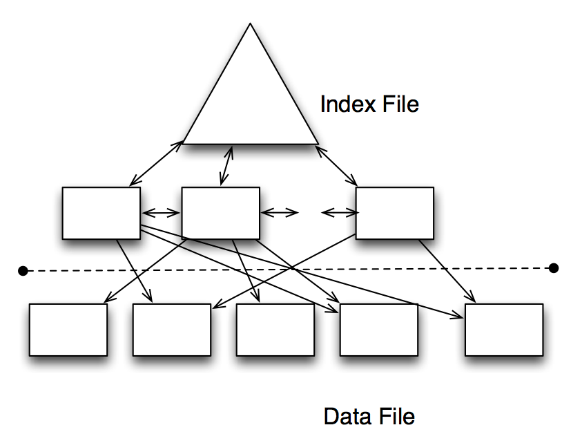
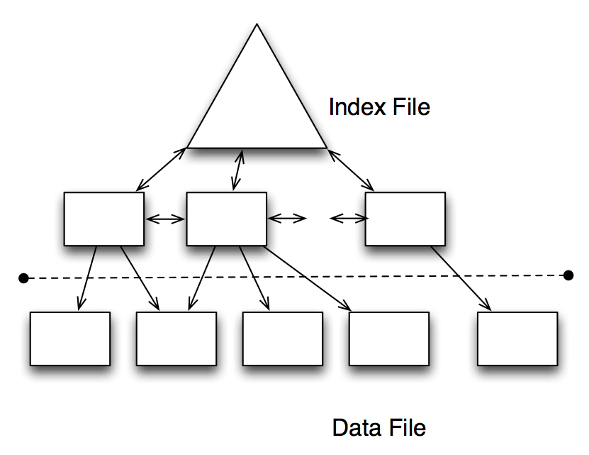

---

title:        COSC 4820 Database Systems
subtitle:     Views and Indexes
author:       Ruben Gamboa
#logo:         uw-logo-small.png
#biglogo:      uw-logo-large.png
job:          Professor
highlighter:  highlight.js
hitheme:      tomorrow
mode:         selfcontained
framework:    io2012
widgets:      [mathjax, bootstrap]

---

<style>
.title-slide {
     background-color: #EDE0CF; /* CBE7A5; #EDE0CF; ; #CA9F9D*/
     background-image: url(assets/img/uw-logo-large.png);
     background-repeat: no-repeat;
     background-position: center top;
   }
</style>

## Chapter Overview

* First, we'll address the last **active element**
* A **view** is a SQL query that is stored in the database
* It appears to be a table
* But it's actually a query that is executed as needed
  <br><br>
* Then we'll discuss a very important topic for relational databases
* An **index** is a specialized data structure
* Its only purpose is to **speed up** certain queries
* Without indexes, relational databases would be totally impractical

---

# Virtual Views

---

## Virtual Views

* A **virtual view** is just a query that is stored in the database
* It can be queried just as any other table
* But it may be a read-only table (i.e., no inserts, updates, deletes)
  <br><br>
* Views are created with the `CREATE VIEW ... AS ...` command

```
CREATE VIEW GoodMovies AS
  SELECT title, year, length, genre
    FROM Movies JOIN StarsIn ON title = movieTitle AND year = movieYear
   WHERE StarsIn.name = 'Harrison Ford'
     AND Movies.studioName = 'Lucasfilm'
```

---

## Querying Virtual Views

* There is actually no magic here
* As far as querying is concerned, a view is the same as a table

```
SELECT title, year
  FROM GoodMovies
 WHERE year < 2000
```

* This query shows only the movies made by Lucasfilm and starring Harrison Ford
* But the only reason we know that is because we know the **definition** of the view

---

## Querying Virtual Views

* In fact, you can think of the view as being replaced by its definition

```
SELECT title, year
  FROM (SELECT title, year, length, genre
          FROM Movies JOIN StarsIn ON title = movieTitle AND year = movieYear
         WHERE StarsIn.name = 'Harrison Ford'
           AND Movies.studioName = 'Lucasfilm')
       AS GoodMovies
 WHERE year < 2000
```


---

## Virtual Views to Simplify Queries

* One use of Virtual Views is to create "tables" that would otherwise violate normal forms
* E.g., suppose relation $R$ is decomposed into $R_1$ and $R_2$
* Then we can use a view to **recreate** the original relation $R$
* This may make it easier for people to query the database

```
CREATE VIEW MovieInfo AS
  SELECT Movies.title, Movies.year, Movies.length, Movies.genre,
         Studios.name AS studioName, Studios.address AS studioAddress,
         Stars.name AS starName, Stars.address AS starAddress
    FROM Movies JOIN StarsIn ON title = movieTitle AND year = movieYear
                JOIN Stars   ON starName = Stars.name
                JOIN Studios ON studioName = Studios.name
```

---

## Renaming Attributes

* Notice that we used AS in the SELECT query to rename the attributes
* This gives good attribute names to the view
* An alternative is to explicitly provide the names to the table
* This has the advantage of making the view's schema more transparent

```
CREATE VIEW MovieInfo (title, year, length, genre,
                       studioName, studioAddress,
                       starName, starAddress) AS
  SELECT Movies.title, Movies.year, Movies.length, Movies.genre,
         Studios.name, Studios.address,
         Stars.name, Stars.address
    FROM Movies JOIN StarsIn ON title = movieTitle AND year = movieYear
                JOIN Stars   ON starName = Stars.name
                JOIN Studios ON studioName = Studios.name
```

---

## Virtual Views to Secure Data

* Another use of Virtual Views is to create "tables" that hide information
  that some user is not entitled to
* E.g., the MovieStars table shows a star's **address** and **birthdate**
* Perhaps these two fields should be kept private

```
CREATE VIEW StarInfo AS
  SELECT name, gender
    FROM MovieStars
```

---

# Updating Views

---

## Updating Views

* Updates on views may or may not make sense
* E.g., consider this view:

```
CREATE VIEW StudentCourseCount(studentId, courseCount) AS
  SELECT Students.id, COUNT(*)
    FROM Students JOIN EnrolledIn ON Students.id = EnrolledIn.StudentId
   GROUP BY Students.id
```

* How are we supposed to interpret this update statement?

```
UPDATE StudentCourseCount
   SET courseCount = courseCount + 1
 WHERE studentId = 42
```

---

## Updating Views

* On the other hand, there's a perfectly good expectation for this query

```
UPDATE StudentCourseCount
   SET courseCount = 0
 WHERE studentId = 42
```

* The same goes for

```
DELETE FROM StudentCourseCount
 WHERE studentId = 42
```

* But that's too much to expect from a database!
* Instead, we want to find cases where the meaning is clear, both to a programmer and the database system

---

## Removing Views

* We start with an easy case

```
DROP VIEW StudentCourseCount
```

* This removes the view from the database
* But it **does not** remove the underlying tables


---

## Removing Views

* Even this case is subtle

```
DROP TABLE EnrolledIn
```

* What happened to the view?
* Sadly, **nothing**
* The view is still there, and we can still query it
* But when we query it, we will get a run-time error
* There is no "referential integrity" for views!

---

## Updating Views

* We've seen that not all views can be updated
* What about the following view

```
CREATE VIEW ScifiMovies(title, year, length) AS
  SELECT title, year, length
    FROM Movies
   WHERE genre = 'scifi'
```

* Now, suppose we did the following

```
UPDATE ScifiMovies
   SET length = 120
 WHERE title = 'Blade Runner'
   AND year = 1982
```

* That should work, right?

---

## Updating Views

```
CREATE VIEW ScifiMovies(title, year, length) AS
  SELECT title, year, length
    FROM Movies
   WHERE genre = 'scifi'
```

* And what if we did this

```
INSERT INTO ScifiMovies(title, year, length)
     VALUES ('Blade Runner', 1982, 120)
```

* That should work, too, right?

---

## Updating Views

* And what if we changed the definition of the view to this

```
CREATE VIEW ScifiMovies(title, year, length) AS
  SELECT title, year, length
    FROM Movies
   WHERE TO_LOWER(genre) = 'scifi'
```

* Should the updates still work?
  <br><br>
* Maybe we're asking too much from the database!

---

## Updatable Views

* We can remove all ambiguity by deciding on which types of views are updatable
* That is, without asking databases to be full-fledged AIs!

> 1. The FROM clause must have only one relation $R$ and only one occurrence of the relation $R$
2. The relation $R$ may be a table or another updatable view
3. The WHERE clause must not involve $R$ in a subquery (though it may have subqueries referencing other relations)
4. The SELECT clause must involve only simple attributes from $R$
5. Any attribute that is left out of the SELECT must allow NULL values or have a declared DEFAULT value
6. The SELECT clause must not be SELECT DISTINCT

---

## Updating Updatable Views

* Updating (inserting, deleting) an updatable view simply propagates the update (insertion, deletion) to the
  underlying table
* E.g., UPDATE $R$ ... instead of UPDATE $V_R$ ...
* If the command has a WHERE clause, the condition of the view is automatically added
  <br><br>
* The definition of "updatable view" is meant to make this process straightforward
* There are a number of surprises waiting for us, though!

---

## Inserting into an Updatable View

* Consider again this view

```
CREATE VIEW ScifiMovies(title, year, length) AS
  SELECT title, year, length
    FROM Movies
   WHERE genre = 'scifi'
```

* This meets all the requirements for updatable views!

---

## Inserting into an Updatable View

```
CREATE VIEW ScifiMovies(title, year, length) AS
  SELECT title, year, length
    FROM Movies
   WHERE genre = 'scifi'
```

* Consider this insertion

```
INSERT INTO ScifiMovies(title, year, length)
     VALUES ('Blade Runner', 1982, 120)
```

* Following our rules, this translates into

```
INSERT INTO Movies(title, year, length)
     VALUES ('Blade Runner', 1982, 120)
```

* That works, but the genre of the new row is NULL!
* This is extra embarrassing, since it means the new tuple **will not show up on the view**

```
SELECT * FROM ScifiMovies
```

---

## Deleting from an Updatable View

```
CREATE VIEW ScifiMovies(title, year, length) AS
  SELECT title, year, length
    FROM Movies
   WHERE genre = 'scifi'
```

* Consider this deletion

```
DELETE FROM ScifiMovies
      WHERE title = 'Blade Runner'
```

* Suppose we translated this as

```
DELETE FROM Movies
      WHERE title = 'Blade Runner'
```

* This would delete the rows we want, and also some innocent rows in the original table!

---

## Deleting from an Updatable View

```
CREATE VIEW ScifiMovies(title, year, length) AS
  SELECT title, year, length
    FROM Movies
   WHERE genre = 'scifi'
```

* Consider this deletion

```
DELETE FROM ScifiMovies
      WHERE title = 'Blade Runner'
```

* To avoid problems, this is actually treated as

```
DELETE FROM Movies
      WHERE (title = 'Blade Runner')
        AND (genre = 'scifi')
```

* The parentheses are there to show us that the query could be arbitrarily complex

---

## Updating an Updatable View

```
CREATE VIEW ScifiMovies(title, year, length) AS
  SELECT title, year, length
    FROM Movies
   WHERE genre = 'scifi'
```

* Consider this update

```
UPDATE ScifiMovies
   SET length = 120
 WHERE title = 'Blade Runner' AND year = 1982
```

* Following our rules, this is translated into

```
UPDATE Movies
   SET length = 120
 WHERE (title = 'Blade Runner' AND year = 1982)
   AND (genre = 'scifi')
```

---

## Updatable Views

* We've seen how we can update some views
* DELETE and UPDATE worked well, but INSERT was problematic at best
  <br><br>
* SQL provides an awkward solution
* What's needed is a way to say
  * When you INSERT a row into ScifiMovies, be sure to set the genre to 'scifi'
  <br><br>

> * Hey, that sounds like a trigger!

---

## INSTEAD OF Triggers

* SQL provides INSTEAD OF triggers to take carte of this scenario
* These are in the same category as BEFORE or AFTER triggers

```
CREATE TRIGGER ScifiMoviesInsert
INSTEAD OF INSERT ON ScifiMovies
REFERENCING 
    NEW ROW AS NewRow
FOR EACH ROW
    INSERT INTO Movies(title, year, length, genre)
         VALUES (NewRow.title, NewRow.year, NewRow.length, 'scifi')
```

---

## Aside: Aspect-Oriented Programming

* Aspect-Oriented Programming (AOP) is a flavor of OOP that includes the notions of
  * cross-cutting concerns
  * advice
  <br><br>
* It is supported directly in some languages (e.g., AspectJ)
* It is also supported by some frameworks (e.g., Spring for Java)
  <br><br>
* There are three kinds of **advice**:
  1. Before advice
  2. After advice
  3. Instead of advice
* Hmmm....

---

# Materialized Views

---

## Materialized Views

* So far, we've considered the **nested query** interpretation of views
* This is the default, and it works remarkably well for the purposes we've seen so far
  <br><br>
* But there's another reason why views may be useful
* If we can precompute the view, we may be able to use it to make queries faster
  <br><br>
* So we may be able to improve performance by saving the results of views to disk
* Then we really are treating them the same as tables

---

## Materialized Views

* For example, suppose we often issue queries where we need the president of a studio
* We can do this with the following view

```
CREATE MATERIALIZED VIEW MovieProd AS
    SELECT title, year, length, genre, name AS producerName
      FROM Movies JOIN MovieExec on producerC# = cert#
```

* Now, we can get movies and producers without needing to execute a join

```
SELECT title, year, producerName
  FROM MovieProd
 WHERE year >= 2010
```

---

## Materialized Views

* We believe that executing a query on a view is faster than performing the defining join
* Suppose we find a query such as

```
SELECT year, name
  FROM Movies JOIN MovieExec on producerC# = cert#
 ORDER BY year
```

* We should replace this query with

```
SELECT year, producerName as name
  FROM MovieProd
 GROUP BY year
```

---

## Materialized Views

* Consider this query

```
SELECT name, COUNT(*)
  FROM Movies JOIN MovieExec on producerC# = cert#
 GROUP BY cert#
```

* We may want to replace it with

```
SELECT producerName as name, COUNT(*)
  FROM MovieProd
 GROUP BY producerName
```

* The problem is that this **does not work**, because we are grouping by name instead of cert#
* There could be two producers with the same name!

---

## Materialized Views

* To take advantage of materialized views, we must replace tables and conditions with the equivalent materialized views
* But we must be very careful that we are being faithful to the original query!
  <br><br>
* In some databases, the optimizer can use materialized views automatically
* But this is not something you should depend on!

---

## Maintaining Materialized Views in Sync

```
CREATE MATERIALIZED VIEW MovieProd AS
    SELECT title, year, length, genre, name AS producerName
      FROM Movies JOIN MovieExecs on producerC# = cert#
```

* First, let's observe that MovieProd is **not** an updatable view
* The real question is, how do we maintain the rows in MovieProd when
  Movies or MovieExecs change?
  <br><br>
* This is an example of the more general **cache coherency** problem
* We have three possible solutions
  1. Recompute the view every time there's a change
  2. Try to figure out how to change the view **incrementally**
  3. Recompute the view every night

---

## Maintaining Materialized Views in Sync

* Obviously, these solutions can be very expensive!
  1. Recompute the view every time there's a change
  2. Try to figure out how to change the view **incrementally**
  3. Recompute the view every night
  <br><br>
* This only makes sense when
  * there are very few (or no) updates to the data
  * the materialized view does not need to be very current

---

## Incremental Insertions

```
CREATE MATERIALIZED VIEW MovieProd AS
    SELECT title, year, length, genre, name AS producerName
      FROM Movies JOIN MovieExecs on producerC# = cert#
```

* Suppose we insert a new tuple into Movies

```
INSERT INTO Movies(title, year, cert#) VALUES ('Kill Bill', 2003, 23456)
```

* We can keep MovieProd in sync by adding the corresponding tuple for 'Kill Bill'
* All we need to do is find the producerName, and we can get that by querying the MovieExecs table

```
INSERT INTO MovieProd(title, year, producerName) 
    SELECT 'Kill Bill', 2003, name
      FROM MovieExecs 
     WHERE cert#=23456
```

---

## Incremental Insertions

```
CREATE MATERIALIZED VIEW MovieProd AS
    SELECT title, year, length, genre, name AS producerName
      FROM Movies JOIN MovieExecs on producerC# = cert#
```

* Suppose we insert a new tuple into MovieExecs

```
INSERT INTO MovieExecs(cert#, name) VALUES (23456, 'Quentin Tarantino')
```

* We can keep MovieProd in sync by adding the corresponding tuple for cert# 23456
* All we need to do is find the movies produced by this cert#

```
INSERT INTO MovieProd(title, year, producerName) 
    SELECT title, year, 'Quentin Tarantino'
      FROM Movies
     WHERE producerC# = 23456
```

---

## Incremental Deletions

```
CREATE MATERIALIZED VIEW MovieProd AS
    SELECT title, year, length, genre, name AS producerName
      FROM Movies JOIN MovieExecs on producerC# = cert#
```

* Suppose we delete a tuple from Movies

```
DELETE FROM Movies WHERE title='Kill Bill' AND year=2003
```

* We can keep MovieProd in sync by deleting the corresponding tuples

```
DELETE FROM MovieProd
 WHERE (title, year) IN (SELECT title, year
                           FROM Movies
                          WHERE title='Kill Bill' AND year=2003)
```

---

## Incremental Deletions

```
CREATE MATERIALIZED VIEW MovieProd AS
    SELECT title, year, length, genre, name AS producerName
      FROM Movies JOIN MovieExecs on producerC# = cert#
```

* Suppose we delete a tuple from MovieExecs

```
DELETE FROM MovieExecs WHERE cert#=23456
```

* We can keep MovieProd in sync by deleting the corresponding tuples

```
DELETE FROM MovieProd
 WHERE producerName IN (SELECT name
                          FROM MovieExecs
                         WHERE cert#=23456)
```

> * Wait! That doesn't work!


---

## Incremental Deletions

```
CREATE MATERIALIZED VIEW MovieProd AS
    SELECT title, year, length, genre, name AS producerName
      FROM Movies JOIN MovieExecs on producerC# = cert#
```

* Suppose we delete a tuple from MovieExecs

```
DELETE FROM MovieExecs WHERE cert#=23456
```

* We can't just delete entries with the given producerName
* That fails because there could be more than one producer with the name
* Here's an approach that always works (but be careful with timeline of execution)

```
DELETE FROM MovieProd
 WHERE (title, year, producerName) IN (SELECT title, year, name
                                         FROM Movies JOIN MovieExecs on producerC# = cert#
                                        WHERE cert#=23456)
```

---

## Incremental Updates

```
CREATE MATERIALIZED VIEW MovieProd AS
    SELECT title, year, length, genre, name AS producerName
      FROM Movies JOIN MovieExecs on producerC# = cert#
```

* The same approach works for updates

```
UPDATE MovieExecs SET name='Quentin Tarantino' WHERE cert#=23456
```

* This can be translated into

```
UPDATE MovieProd
   SET name='Quentin Tarantino'
 WHERE (title, year, producerName) IN (SELECT title, year, name
                                         FROM Movies JOIN MovieExecs on producerC# = cert#
                                        WHERE cert#=23456)
```

---

# Indexes in SQL

---

## Indexes in SQL

* An **index** is a **data structure** that makes it more efficient to retrieve tuples that have a given value 
  for a given attribute
  <br><br>
* For example, an index on the **Student ID** attribute would make it efficient to find a student with W# "W123456789"
* Or an index on **phone number** would make it efficient to find a student or students with phone number "307-234-5678"

---

## Indexes in SQL

* In memory, you would solve this problem by using a data structure such as
  1. a sorted array
  2. a (binary) search tree
  3. a hash table
  <br><br>

> * Actually, all of these are used in databases
  1. A sorted file
  2. A B-tree with as many children as fit in a disk page
  3. A hash table, with "buckets" mapping to different disk pages
  <br><br>

> * Note: Sorted files and B-trees can handle comparisons with <, <=, >, >=, and =
* But hash tables can only handle equality checks
* And (rule of thumb) they are more efficient than the others

---

## Motivation for indexes

* Suppose we need to compute $S \bowtie S$, where $S$ is the Students table at UW
* Since $|S| \approx 13000$, the naive method takes up $13000^2 =$ `r 13000^2` steps
* Each step is a disk access, so even if disk I/O is 1ms, that works out to `r 13000^2/1000` seconds
* Which is `r 13000^2/1000/60` minutes
* Which is `r 13000^2/1000/60/60` hours
* Which is `r 13000^2/1000/60/60/24` days
  <br><br>
  
> * That's a little unfair
* Instead of reading each tuple at a time, we can read many tuples at the same time, since they are 
  on the same disk page

> * Disk I/Os is what matters, so we'll stop worrying about seconds
* After all, disks get faster!

---

## Motivation for indexes

* Suppose we need to compute $S \bowtie S$, where $S$ is the Students table at UW
* Suppose each disk page can handle 100 students
* Since $|S| \approx 13000$ or 130 pages, the **Block Nested Loop** join method takes up $130+130^2 =$ `r 130+130^2` disk I/Os
  <br><br>

* That's a lot better, but it's still quadratic!
* A good index will bring that **up** to `r (130+13000*2.5)` disk I/Os
* But it's **linear**
* You'd see an improvement in a larger school
* E.g., with 100,000 students, it becomes
  * Without an index: $1000^2 =$ `r 1000^2` disk I/Os
  * With an index: `r 1000 + 100000*2.5` disk I/Os

---

## Motivation for indexes

* The "hard" numbers in the previous slides involve joins
* Here's a similar argument with selections

* Suppose we need to compute $\sigma(S)$, where $S$ is the Students table at UW
* Suppose each disk page can handle 100 students
* Since $|S| \approx 13000$ or 130 pages, without an index, we can execute the selection with $130$ disk I/Os

<br>

* A good (and applicable) index will bring that down to 2.5 disk I/Os!
* Actually, it could be a few more, depending on the **selectivity** of the index (more on this later)
  * If we're looking for a single record, then 2.5 disk I/Os is about right
  * If we're looking for all students in COSC, it may take $200$ disk I/Os!

---

## Motivation for indexes

* Indexes can be used to speed up queries that involve selections, e.g.,

```
SELECT title, year
  FROM Movies
 WHERE year = 2000
```

* They can also be used to speed up queries involving joins

```
SELECT title, year, name
  FROM Movies JOIN MovieExecs ON producerC# = cert#
 WHERE year = 2000
```

* And indexes can speed up checking of integrity constraints, e.g., W# must be unique

---

## Declaring Indexes

* Making an index is as easy as calling `CREATE INDEX`

```
CREATE INDEX MovieYearIdx ON Movies(year)
```

* You would not have to make an index on cert#, because databases automatically create an index on the PRIMARY KEY


---

## Multidimensional Indexes

* You can create an index that spans more than one attribute

```
CREATE INDEX StudentNameIdx ON Students(first_name, last_name)
```

* The order of the attributes matters!
* If you know the first_name, but not the last_name, you may still be ab;e to use the index above effectively
* But if you know the last_name and not the first_name, this index is useless
  <br><br>

> * Note that if the index is a hash index, then knowing one or the other does not help!
* This only helps for indexes that have a sort order, e.g., sorted files or tree indexes

---

## Dropping Indexes

* No surprises here:

```
DROP INDEX MovieYearIdx
```

---

# What Indexes to Pick?

---

## What Indexes to Pick?

* The choices you make when picking indexes will likely determine whether the database performance is acceptable or not
  <br><br>
* One approach is to create all possible indexes! (Why not?)
  * If you have a table with 10 attributes, that's `r 2^10 - 1` indexes
  * If you have a table with 20 attributes, that's `r 2^20 - 1` indexes
  <br><br>
* OK, that may be too much
* How about an index on each column?
* 10 attributes means 10 indexes, 20 attributes means 20 indexes
  <br><br>
* This is manageable, but consider that each update to the database needs to update each of the indexes!

---

## Basic Tradeoffs

* Indexes may speed up queries with selections and joins
  <br><br>
* Indexes may slow down insertions, deletions, and updates

<br>
  
> * These are just guidelines!
* An index may slow down a query, e.g, adding an index on "gender" may confuse the optimizer
* An index may speed up an insertion, e.g., by making a constraint check faster

<br>

> * We'll now discuss some indexes that are usually good ideas

---

## Primary Key Indexes

* It is usually a good idea to have an index on a primary key
  * Queries typically join on primary keys, so the index will be used a lot
  * The index returns at most one tuple, so at most one page will need to be read
  <br>
* Suppose we need to compute $S \bowtie S$, where $S$ is the Students table at UW
* Suppose each disk page can handle 100 students
* Since $|S| \approx 13000$ or 130 pages, the **Index Nested Loop** join method takes up
  * $130$ disk I/Os to read the entire table
  * for each tuple, at most one more disk I/O to find the matching tuple
* The grand total is $130 + 13000 \times 1 =$ `r 130 + 13000` disk I/Os

---

## Primary Key Indexes

* Actually, the analysis is slightly wrong
* We counted the disk I/Os to read the tuples, but **we never counted the disk I/Os for the index itself**

<br>

* Rule of thumb: Each lookup on a tree-based index costs 3 disk I/Os (but it would be probably be just 2 on 13,000 rows)
* Rule of thumb: Each lookup on a hash-based index costs 1.5 disk I/Os

<br>

* Using these rough estimates, we find
  * Using a tree index: $130 + 13000 \times (1 + 3) =$ `r 130 + 13000*(1+3)` disk I/Os
  * Using a hash index: $130 + 13000 \times (1 + 1.5) =$ `r 130 + 13000*(1+1.5)` disk I/Os

---

## Primary Key Indexes

* These indexes are such a good idea that databases routinely build them for us!
* So you should not to build your won primary key indexes, **ever**
  <br><br>
* If you use synthetic keys, then the comparison $K_1 < K_2$ is probably not meaningful
* I.e., all lookups will be based on equality ($K1 = \dots$)
* That means you should be using hash indexes on *synthetic* primary keys

> * Hint: The default is usually a tree index

---

## Clustered Indexes

* An index is **clustered** if all the entries for a given value are on one (or just a very few) pages
* Extreme case: If there's only one matching tuple, then of course it's on only one disk page
* Another case: If the data is sorted on the index attributes, then it's clustered

---

## Clustered Indexes

<div class="centered">
    
    <br>    
    An Unclustered Index
</div>

---

## Clustered Indexes

<div class="centered">
    
    <br>    
    A Clustered Index
</div>

---

## Clustered Indexes

```
SELECT title, year
  FROM Movies
 WHERE year = 2000
```

* If the index is clustered, an index on year is very likely to be efficient
  * How likely depends on how **selective** year is in this table
  * I.e., if there are only movies from the year 2000, then the index is useless (selectivity 100%)
  * But if there are movies from all years from 1980-2010, then the index is good (selectivity $\approx$ 3%)

---

## Clustered Indexes

```
SELECT title, year
  FROM Movies
 WHERE year = 2000
```

* If the index is unclustered, an index on year may be worse than useless
  * Even if there is data from 1980-2010, we still have to read each tuple separately
  * That means we need $0.03 \times N$ disk I/Os
  * If a table holds more than 33 records, we would be better off ignoring the index!

---

## Picking Indexes

* It's hard to pick indexes in a vacuum
* What you really need is a list of queries that are important to your application(s)
* Also, these queries should be weighted, since some queries may be **more important or frequent** than others

<br>

* With this information, you can compare the cost of implementing different indexes

---

## Example

* Q1, with probability $.6$

```
SELECT movieTitle, movieYear
  FROM StarsIn
 WHERE starName = ?
```

* Q2, with probability $.3$

```
SELECT starName
  FROM StarsIn
 WHERE movieTitle = ? AND movieYear = ?
```

* Q3, with probability $.1$

```
INSERT INTO StarsIn VALUES(?,?,?)
```

---

## Example (Assumptions)

1. StarsIn takes up 10 pages
2. Typically, a star appears in 3 movies and each movie has 3 stars
3. The 3 movies a star is in will be in different pages of StarsIn, so it will take 3 disk I/Os 
   to fetch these 3 movies, even with an index
4. 1.5 disk accesses are required to read the index for an equality lookup
5. For inserts, we need 1 disk I/O to read the original page, 1 disk I/O to write the modified page,
   and 2.5 disk I/Os to update the index (1.5 read, 1 write) -- for a total of 4.5 disk I/Os

---&twocol

## Example

*** =left

Query | No Index                 | starName Index              | movieTitle Index            | Both Indexes
------|--------------------------|-----------------------------|-----------------------------|--------------------
Q1    | 10                       | 4.5                         | 10                          | 4.5
Q2    | 10                       | 10                          | 4.5                         | 4.5
Q3    | 2                        | 4.5                         | 4.5                         | 7
Total | `r 10*.6 + 10*.3 + 2*.1` | `r 4.5*.6 + 10*.3 + 4.5*.1` | `r 10*.6 + 4.5*.3 + 4.5*.1` | `r 4.5*.6 + 4.5*.3 + 7*.1`

*** =right

* Q1, with probability $.6$

```
SELECT movieTitle, movieYear
  FROM StarsIn
 WHERE starName = ?
```

* Q2, with probability $.3$

```
SELECT starName
  FROM StarsIn
 WHERE movieTitle = ? AND movieYear = ?
```

* Q3, with probability $.1$

```
INSERT INTO StarsIn VALUES(?,?,?)
```

---&twocol

## Example

*** =left

Query | No Index                 | starName Index              | movieTitle Index            | Both Indexes
------|--------------------------|-----------------------------|-----------------------------|--------------------
Q1    | 10                       | 4.5                         | 10                          | 4.5
Q2    | 10                       | 10                          | 4.5                         | 4.5
Q3    | 2                        | 4.5                         | 4.5                         | 7
Total | `r 10*.3 + 10*.2 + 2*.5` | `r 4.5*.3 + 10*.2 + 4.5*.5` | `r 10*.3 + 4.5*.2 + 4.5*.5` | `r 4.5*.3 + 4.5*.2 + 7*.5`

*** =right

* Q1, with probability $.3$

```
SELECT movieTitle, movieYear
  FROM StarsIn
 WHERE starName = ?
```

* Q2, with probability $.2$

```
SELECT starName
  FROM StarsIn
 WHERE movieTitle = ? AND movieYear = ?
```

* Q3, with probability $.5$

```
INSERT INTO StarsIn VALUES(?,?,?)
```

---

## Picking Indexes Globally

* We only considered two indexes
* But what if we had dozens of tables with dozens of attributes?

<br>

* This is where automated tools coms in
* A typical approach is to choose indexes **greedily**
  1. First, fix a workload of queries
  2. Consider the cost of executing these queries with no index
  3. Now consider the cost of executing these queries with one (out of many possible) indexes
  4. Pick the index that works best
  5. Keep adding one index at a time, until it stops helping


