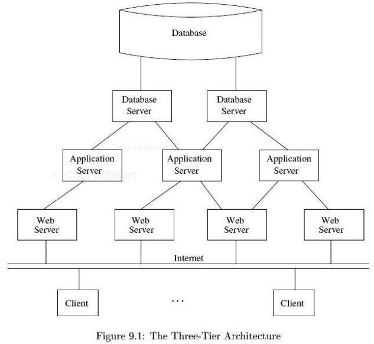
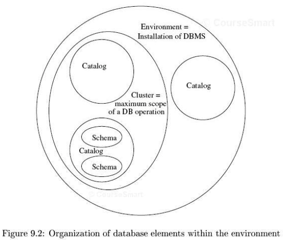
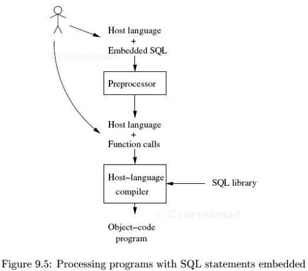

title:        COSC 4820 Database Systems
subtitle:     SQL in a Server Environment
author:       Ruben Gamboa
#logo:         uw-logo-small.png
#biglogo:      uw-logo-large.png
job:          Associate Professor
highlighter:  highlight.js
hitheme:      tomorrow
mode:         selfcontained
framework:    io2012
widgets:      [mathjax, bootstrap]

---

<style>
.title-slide {
     background-color: #EDE0CF; /* CBE7A5; #EDE0CF; ; #CA9F9D*/
     background-image: url(assets/img/uw-logo-large.png);
     background-repeat: no-repeat;
     background-position: center top;
   }
</style>

## Chapter Overview

* This chapter is about programming **database applications**
* We will begin with the model for client/server computing and how this is really done in modern systems (i.e., the web)
* We will also discuss different ways that a program can interact with a database

---

# The Three-Tier Architecture

---

## The Three-Tier Architecture

* This is the dominant architecture for modern enterprise systems

1. **Web servers** create a layer for humans to interact with the system
2. **Application servers** perform the actual business logic of the application
   * These may be provided strictly to the web servers
   * They man also be available to **other programs** via **web services**
3. **Database servers** perform queries and manipulate the data

---

## The Three-Tier Architecture

<div class="centered">
    
</div>

---

## The Web Server Tier

* The web server is responsible for creating the **view** or user interface
* This will consist of HTML, CSS, JavaScript, media files, etc.

<br>

* User interaction will be in the way of **requests**, e.g., an filling out HTTP form or clicking on a link
* The server with send **responses**, which may be new HTML pages or documents

<br>

* Of course, the UI may be implemented in other ways

---

## The Application Tier

* This is responsible for handling user requests **at the database level**
* I.e., it does not care about the actual UI
* It only cares about what the requests mean for the enterprise systems

<br>

* In very simple systems, the application tier directly accesses the database
* In more complex systems, there can be a very complicated network of objects or services,
  and the application tier may have to **integrate** them
* Different services may communicate with each other
  * synchronously
  * asynchronously
  * via messaging
  * indirectly, e.g., via the database
* There may even be a need to make transactions that span multiple services!

---

## The Database Tier

* This are services or classes that interact with the database
* It is also known as the **persistence layer**

<br>

* Remember that connections to the database are expensive
* Also, connections may take a long time to start up
* These types of details are handled in the database tier, e.g., by **connection pooling**

---

# The SQL Environment

---

## The SQL Environment

* A **SQL Environment** is a particular installation of a relational database that you can access
* It may consist of one or more database **instances** running on one or more physical servers
* The largest unit of information is a **cluster**, which corresponds to a "database"

<div class="centered">
    
</div>

---

## Components of a SQL Environment

> * **Schemas** are collections of related tables, views, indexes, triggers, assertions, etc.
    * Schemas also have information about the tables, etc., that they contain
    <br><br>
* **Catalogs** are collections of schemas, and they provide information on the schemas they manage
  <br><br>
* **Clusters** are collections of catalogs

---

## Schemas

* You can create a schema with `CREATE SCHEMA ...` command
  * `CREATE SCHEMA MovieInformation`
* A schema may also be associated with a particular user
  <br><br>
* You can also select a particular schema to be the **current** schema
  * `SET SCHEMA MovieInformation`
  * `USE MovieInformation`
  * ...
  <br><br>
* After this, you can create tables, etc.

---

## Catalogs

* Catalogs let you manage multiple schemas
* They often correspond to different **instances** of a database
* I.e., they are managed by different database processes
* There is no standard way to create catalogs or select the current catalog

---

## Database Processes

* A **SQL Server** is just a database server
* It handles requests and sends back responses (e.g., query results)
  <br><br>
* A **SQL Client** is an application that sends requests to a SQL Server
* Note a "SQL Client" may in turn be an "application server"
* Words like "client" and "server" have limited meaning, but they are useful in the proper context

---

## Connections

* A SQL client needs a **connection** to talk to a database server
* This may be as simple as

  ```
  CONNECT TO server_name AS connection_name AUTHORIZATION username AND password
  ```

* Later, you can (and **should**) release the connection with

  ```
  DISCONNECT connection_name
  ```

<br>

* Of course, the syntax for this is very incompatible between systems

---

## Database Sessions

* A **session** is associated with each connection
* The session refers to the commands that are executed within a connection
* Note: a session may consist of one or more **transactions**

<br>

* Sessions have state associated with them, including
  * current user, with associated privileges
  * user preferences (e.g., language)
  * current catalog, schema, etc.
  * database cursors

---

## SQL Modules

* A **SQL module** is an application that interacts with the database
* The SQL standard recognizes three types of modules:
  1. **Generic SQL Interface** allows a user to type in ad-hoc queries that are executed one at a time
  2. **Embedded SQL** involves SQL statements that are blended with the application language
     * Usually requires a preprocessor that extracts the SQL from the application language
     * The application language used to be COBOL, but it can be C or Java
  3. **True modules** include a collection of cooperating application modules and stored procedures

<br>

* When a SQL module is executing, it is called a **SQL agent**
* This is the same distinction as between programs and processes

---

# The SQL/Host Language Interface

---

## The SQL/Host Language Interface

<div class="centered">
    
</div>

---

## The SQL/Host Language Interface

1. **Call-Level Interface** is a set of language functions that communicate with the database
   * E.g., it can be a set of Java classes that provide access to a database server
   * SQL queries are treated as **strings** only
   * So there is no syntax checking of SQL queries
<br><br>
2. **Embedded SQL** is an approach where the language is **extended** to allow SQL in program blocks
   * There can be a specialized compiler than handles the extended language
   * Or there can be a preprocessor that converts the X+SQL into plain X using the call-level interface
   * In either case, syntax checking of SQL queries is possible

---

## The Impedance Mismatch

* Procedural languages have a strict set of data types (integers, strings, pointers, etc.)
* They support mutable variables, loops, if statements, etc.
* They work with one data at a time
* In order to process N data items, they would use a loop

<br>

* Databases work on many items at a time (e.g., all rows in a table)
* They have predefined data types, some of which are specialized and ill-defined
* They do not (for the most part) support if statements, loops, etc.

<br>

* The challenge is to get these two different programming models to coexist
* This is called the **impedance mismatch**

---

## Embedded SQL

* Embedded SQL is one way to solve the impedance mismatch
* This provides a special way to include SQL commands in C (or your programming language of choice)
* The SQL code and C code communicate via shared variables

```
EXEC SQL BEGIN DECLARE SECTION;
    char studioName[50];
    int  presNetWorth;
    char SQLSTATE[6];
EXEC SQL END DECLARE SECTION;

strcpy(studioName, "Lucasfilm");

EXEC SQL SELECT netWorth INTO :presNetWorth
           FROM Studios JOIN MovieExecs ON presC# = cert#
          WHERE Studios.name = :studioName;
          
printf ("The president of Lucasfilm is worth $%d", presNetWorth);
```

---

## Embedded SQL Concepts

* SQL blocks are introduced via `EXEC SQL`
* The SQL code and C code communicate via shared variables
  * These look like regular variables to C
  * They have a leading ":" in the SQL code
* Shared variables are declared inside `DECLARE SECTION` blocks

```
EXEC SQL BEGIN DECLARE SECTION;
    char studioName[50];
    int  presNetWorth;
    char SQLSTATE[6];
EXEC SQL END DECLARE SECTION;
```

---

## SQLSTATE

```
EXEC SQL BEGIN DECLARE SECTION;
    ...
    char SQLSTATE[6];
EXEC SQL END DECLARE SECTION;
```

* The variable SQLSTATE is special
* If you declare a variable with this name (and you should), it will receive a special status code from the last SQL statement
  * The codes are **strings** (not numbers) of 5 characters
  * (So in C, you must declare an array of 6 characters, to leave room for the trailing '\0' character)

* Many of the codes are standard (and many more are database-specific)
  * **00000** means "no error"
  * **02000** means "no (more) answers"

---

## Cursors

* In the last example, we saw a query that returned **only one row**
* But what if you want to find all the Movies made by Lucasfilm?
* This is part of what we mean by **impedance mismatch**

<br>

* A modern solution might be to return a **collection** of results
* You  have to be careful, because there may not be enough memory to hold all the results in the client

---

## Cursors

* A modern solution might be to return an **iterator** over a collection
* This gives the illusion that we are working on a collection of items, but the collection may actually be held in the database
* Note: This does **not** mean that getting the next result means sending a request to the database
* I.e., the iterator may hold several results in memory at a time

<br>

* A **cursor** is the database term for an iterator
* It lets you step through all the rows in your query result

---

## Using Cursors

* To use a cursor from your code, you need to complete four steps

<br>

1. **Declare** the cursor, which also associates it with a query
2. **Open** the cursor, which initializes the query at the database
3. **Fetch** each row
3. **Close** the cursor when finished

   ```
   EXEC SQL DECLARE cursor_name CURSOR FOR query;
   EXEC SQL OPEN cursor_name;
   EXEC SQL FETCH FROM cursor_name INTO :var1, :var2, ..., :varn;
   ...
   EXEC SQL CLOSE cursor_name;
   ```

* Note: You know you're finished when SQLSTATE has the value **02000**

---

## Using Cursors

```
EXEC SQL BEGIN DECLARE SECTION;
    int  cert_number;
    char title[100];
    int  year;
    char SQLSTATE[6];
EXEC SQL END DECLARE SECTION;

EXEC SQL DECLARE c_movies CURSOR FOR
     SELECT title, year
       FROM Movies
      WHERE presC# = :cert_number
      ORDER BY year;
```

---

## Using Cursors

```
EXEC SQL OPEN c_movies;
for (;;) {
    EXEC SQL FETCH FROM c_movies INTO :title, :year;
    if (!strcmp(SQLSTATE,"02000"))
        break;
    printf ("%d, %s\n", year, title);
}
EXEC SQL CLOSE c_movies;
```

---

## Modifying Rows

* One way to modify rows is simply to execute an UPDATE command
* Sometimes, it's convenient to update the row we happen to be reading currently
* This is possible with cursors
* The WHERE clause should be "WHERE CURRENT OF cursor_name"

---

## Modifying Rows

```
EXEC SQL DECLARE c_emps CURSOR FOR
     SELECT employee_id, rating, salary
       FROM Employees;
EXEC SQL OPEN c_emps;
for (;;) {
    EXEC SQL FETCH FROM c_emps INTO :id, :rating, :salary;
    if (!strcmp(SQLSTATE,"02000"))
        break;
    if (rating >= 9)
        EXEC SQL UPDATE Employees
                    SET salary = 1.1 * :salary
                  WHERE CURRENT OF c_emps;
    else if (rating <= 2)
        EXEC SQL DELETE FROM Employees
                  WHERE CURRENT OF c_emps;
}
EXEC SQL CLOSE c_emps;
```

---

## Dynamic SQL

* So far, the SQL code that will be executed has been visible in the code
* But what if you have to create the SQL code in C?
* E.g., your application can build a string by appending conditions to some base

  ```
  q = "SELECT * FROM Employees WHERE rating >= 10";
  q = q + " AND location='US'";
  q = q + " AND last_name LIKE '%jones%";
  ```

* Note: You should **avoid** dynamic SQL
* Repeat: **Avoid** dynamic SQL

<br>

* Note: If all that changes is a parameter, you can use static SQL and a shared variable
* E.g., "rating >= :min_rating"

---

## Using Cursors

```
EXEC SQL BEGIN DECLARE SECTION;
    int  cert_number;
    char *query = "SELECT title, year
                     FROM Movies
                    WHERE presC# = :cert_number";
EXEC SQL END DECLARE SECTION;
EXEC SQL PREPARE sql_query FROM :query;
EXEC SQL DECLARE c_query CURSOR FOR sql_query;

cert_number = 12345;
EXEC SQL OPEN c_query;
for (;;) {
    EXEC SQL FETCH FROM c_query INTO :title, :year;
    if (!strcmp(SQLSTATE,"02000"))
        break;
    printf ("%d, %s\n", year, title);
}
EXEC SQL CLOSE c_movies;
```

---

## Using Cursors

```
EXEC SQL BEGIN DECLARE SECTION;
    int  cert_number;
    char *query = "SELECT title, year
                     FROM Movies
                    WHERE presC# = ?";
EXEC SQL END DECLARE SECTION;
EXEC SQL PREPARE sql_query FROM :query;
EXEC SQL DECLARE c_query CURSOR FOR sql_query;

cert_number = 12345;
EXEC SQL OPEN c_query USING :cert_number;
for (;;) {
    EXEC SQL FETCH FROM c_query INTO :title, :year;
    if (!strcmp(SQLSTATE,"02000"))
        break;
    printf ("%d, %s\n", year, title);
}
EXEC SQL CLOSE c_movies;
```

---

# Stored Procedures

---

## Stored Procedures and Functions

* The SQL standard defines **stored procedures**
* This is a bit of SQL (plus some extensions) that is stored with the database
* You can **call** it from the SQL interface
* You write a stored procedure to **perform an action**, e.g., insert a student to the database
  <br><br>
* There are also **stored functions**
* These are similar, but also return a value
* You call them from a query, wherever you can use an expression
* E.g., you can write a function that converts a date to a Julian number

---

## Stored Procedures and Functions

```
CREATE PROCEDURE Move(IN oldAddr VARCHAR(255),
                      IN newAddr VARCHAR(255))
BEGIN
    UPDATE MovieStar
       SET address = newAddr
     WHERE address = oldAddr;
END;
```

```
CALL Move ('1 Innovation Way', '1 Infinite Loop');
```

```
EXEC SQL CALL Move ('1 Innovation Way', '1 Infinite Loop');
```

Note: SQL recognizes IN, OUT, and INOUT parameters

---

## Stored Procedures and Functions

```
CREATE FUNCTION NumMovies(IN name VARCHAR(255)) RETURNS NUMBER
BEGIN
    RETURN (SELECT COUNT(*)
              FROM StarsIn
             WHERE StarsIn.starName = name);
END;
```

```
SELECT name, NumMovies(name)
  FROM Stars
 WHERE NumMovies(name) > 10
```

---

## Procedural Extensions

* The body of a procedure or function can be **procedural**
* I.e., it can have
  * variables
  * assignment statements
  * multiple statements
  * conditional statements
  * loops
* The syntax is loosely based on Ada (but you can't blame Ada for this)

<br>

* Of course, the body can also call other stored procedures or functions

---

## Variables

```
CREATE FUNCTION NumMovies(IN name VARCHAR(255)) RETURNS NUMBER
DECLARE movieCount NUMBER;
BEGIN
    SET movieCount = (SELECT COUNT(*)
                        FROM StarsIn
                       WHERE StarsIn.starName = name);
    RETURN movieCount;
END;
```

* The SET keyword is mandatory
* This is the way we can tell the difference between assignment and equality comparisons

---

## Conditional Statements

* The syntax is `IF ... THEN ... ELSEIF ... THEN ... ELSE ... END IF`

```
CREATE FUNCTION StarList(IN name VARCHAR(255)) RETURNS NUMBER
DECLARE movieCount NUMBER;
BEGIN
    SET movieCount = NumMovies(name);
    IF movieCount > 10 THEN
        RETURN 'A-list';
    ELSEIF movieCount > 5 THEN
        RETURN 'B-list';
    ELSE
        RETURN 'C-list';
    ENDIF;
END;
```

Note: EXISTS and NOT EXISTS are used in the condition often

---

## Loops

```
CREATE FUNCTION triangle(IN n NUMBER) RETURNS NUMBER
DECLARE i NUMBER;
DECLARE t NUMBER;
BEGIN
    SET t = 0;
    SET i = 0;
    mainLoop: LOOP
        IF i > n THEN
            LEAVE mainLoop;
        END IF;
        SET t = t + i;
        SET i = i + 1;
    END LOOP;
    RETURN t;
END;
```

* Loops must have labels
* Use LEAVE to exit loops

---

## Loops and Cursors

```
CREATE FUNCTION AvgNumMovies() RETURNS NUMBER
DECLARE movieSum    NUMBER;
DECLARE starCount   NUMBER;
DECLARE starName    VARCHAR(255);
DECLARE movieCount  NUMBER;
DECLARE movieCursor FOR
    SELECT movieStar, COUNT(movieTitle)
      FROM StarsIn
     GROUP BY movieStar;
```

---

## Loops and Cursors

```
BEGIN
    SET movieSum  = 0;
    SET starCount = 0;
    OPEN movieCursor;
    mainLoop: LOOP
        FETCH FROM movieCursor INTO starName, movieCount;
        IF SQLSTATE '02000' THEN
            LEAVE mainLoop;
        END IF;
        SET movieSum  = movieSum + movieCount;
        SET starCount = starCount + 1;
    END LOOP;
    CLOSE movieCursor;
    RETURN movieSum / starCount;
END;
```

---

## Loops and Cursors

```
CREATE FUNCTION AvgMovieLength(IN s VARCHAR(255)) RETURNS NUMBER
DECLARE movieSum    NUMBER;
DECLARE movieCount  NUMBER;
DECLARE title       VARCHAR(255);
DECLARE year        NUMBER;
DECLARE length      NUMBER;
DECLARE movieCursor FOR
    SELECT title, year, length
      FROM Movies
     WHERE studioName = s;
DECLARE NoMoreRows CONDITION FOR SQLSTATE '02000';
```

---

## Loops and Cursors

```
BEGIN
    SET movieSum   = 0;
    SET movieCount = 0;
    OPEN movieCursor;
    mainLoop: LOOP
        FETCH FROM movieCursor INTO title, year, length;
        IF NoMoreRows THEN
            LEAVE mainLoop;
        END IF;
        SET movieSum   = movieSum + length;
        SET movieCount = movieCount + 1;
    END LOOP;
    CLOSE movieCursor;
    RETURN movieSum / movieCount;
END;
```

---

## FOR Loops

* SQL support FOR loops!
* But they are not like FOR loops in any other language
* They iterate over cursors

<br>

* The advantage of using FOR loops is that they handle the details of handling cursors automatically

<br>

* But FOR loops are really syntactic sugar
* A preprocessor converts them into conventional LOOPs before compilation

---

## FOR Loops

```
CREATE FUNCTION AvgMovieLength(IN s VARCHAR(255)) RETURNS NUMBER
DECLARE movieSum    NUMBER;
DECLARE movieCount  NUMBER;
BEGIN
    SET movieSum   = 0;
    SET movieCount = 0;
    FOR movieLoop AS movieCursor CURSOR FOR
        SELECT title, year, length
          FROM Movies
         WHERE studioName = s;
    DO
        SET movieSum   = movieSum + length;
        SET movieCount = movieCount + 1;
    END LOOP;
    RETURN movieSum / movieCount;
END;
```

---

## WHILE Loops

```
CREATE FUNCTION triangle(IN n NUMBER) RETURNS NUMBER
DECLARE i NUMBER;
DECLARE t NUMBER;
BEGIN
    SET t = 0;
    SET i = 0;
    WHILE i <= n DO
        SET t = t + i;
        SET i = i + 1;
    END WHILE;
    RETURN t;
END;
```

---

## REPEAT Loops

```
CREATE FUNCTION triangle(IN n NUMBER) RETURNS NUMBER
DECLARE i NUMBER;
DECLARE t NUMBER;
BEGIN
    SET t = 0;
    SET i = 0;
    REPEAT
        SET t = t + i;
        SET i = i + 1;
    UNTIL i > n
    END WHILE;
    RETURN t;
END;
```

---

## Exceptions

* Exceptions are tied to SQLSTATE
* I.e., you can add an exception to handle the case when no more tuples are found
  * SQLSTATE = '02000'
* Or when a nested query returns more than one result
  * SQLSTATE = '21000'

---

## Exceptions

```
CREATE FUNCTION GetYear(IN t VARCHAR(255)) RETURNS NUMBER
DECLARE NoMoreRows  CONDITION FOR SQLSTATE '02000';
DECLARE TooManyRows CONDITION FOR SQLSTATE '21000';
BEGIN
    DECLARE EXIT HANDLER FOR NoMoreRows, TooManyRows 
        RETURN NULL;
    RETURN (SELECT year FROM Movies WHERE title = t);
END;
```

---

## Exceptions

```
DECLARE EXIT HANDLER FOR NoMoreRows, TooManyRows 
    SET year = NULL;
```

* The EXIT keyword says that control should follow after the BEGIN ... END block
* You can also specify
  * CONTINUE, which means go on to the next statement, as if nothing had happened
  * UNDO, which is just like EXIT but also enforces transaction semantics,
    including **updates** and **assignment statements**

---

# Call-Level Interface

---

## Call-Level Interface

* The more common approach to interacting with a database is to use a **library** that connects
  to the database
* SQL queries are handled as strings
* The library is called a **call-level interface** or **CLI**

<br>

* Advantages:
  * No need for a pre-processor
  * Programming tools (debugger, editor, syntax highlighter) work "as-is"
  
* Disadvantage:
  * SQL queries are checked at run-time, not at compile-time

---

## JDBC

* **JDBC** is Java's base database connectivity API
  * Java offers other alternatives, e.g., SQLJ and JDO, which sit on top of JDBC
  <br><br>
* JDBC is DBMS-neutral
  * A **driver** traps calls and translates them into DBMS-specific code
  * But SQL commands are strings and not completely portable
  <br><br>
* Database can run across a network, and connection info is passed in the form of URLs 

---

## JDBC Architecture

*  **Application:** initiates and terminates connections, and submits SQL statements
   <br><br>
*  **Driver Manager:** only one per Java instance.  It loads the right JDBC driver for the given connection
   <br><br>
*  **Driver:** connects to the data source, transmits requests, and returns/translates results and error codes
   <br><br>
*  **Data source:** the actual database that processes SQL statements

---

## Basic JDBC Application


* The Java application must perform the following steps
  * Load the JDBC driver (e.g., Oracle's JDBC driver).  This also registers the driver with the driver manager
  * Connect to the data source (e.g., provide username/password)
  * Execute SQL statements
  * Close all open statements and connections
  * Handle exceptions

---

## DriverManager

* **DriverManager** is a class implemented in the JDBC library
* It's responsible for creating an instance of the right driver for your database connection
* But, it needs to know which database drivers work for which connections types
* This is done by **registering** the driver, and drivers register themselves when they are loaded
* You can load a driver by creating an instance of it or loading the class

```
Class.forName("jdbc.driver.Oracledriver");
```

---

## JDBC Sessions and Connections

* We interact with a data source through a session
* This is not just a JDBC notion, but a database notion
* A session has its own set of preferences, etc.
* Sessions are initiated via a URL
  * jdbc:*subprotocol*:*otherparameters*
  * The *subprotocol* identifies the driver, e.g., Oracle
  * The *otherParameters* is driver specific, e.g., username/password, network port, database name, etc.

---

## Starting a Connection

```
Class.forName("jdbc.driver.Oracledriver");

String url = "jdbc:oracle:www.bookstore.com:3083";
Connection conn;
try {
    con = DriverManager.getConnection(url, "scott", "tiger");
}
catch (SQLException e) {
    // handle error
}
```

---

## Connection Configuration

* How do we know to
  * connect to *jdbc:oracle:www.bookstore.com:3083*
  * username/password is *scott/tiger*
* These credentials should be different in development, testing, production, etc.

<br>

* There are 5 typical solutions:
  * Hardcode them in the source file (like we did) -- **bad** idea
  * Get information from a **property file**
  * Use **dependency injection** (pass the buck)
  * Use a framework (JNDI) that gives you the connection URL
  * Use a framework (J2EE, Spring) that connects to the database for you and gives you a Connection

---

## Aside: Dependency Injection

* **Dependency Injection (DI)** is a great technique for writing code that is **loosely coupled**
* E.g., the code uses a database, but does not need to know **what database it uses**

<br>

* This is huge!
* It allows us to use a bit of code in many different contexts
* So it makes code reuse much more likely

---

## Aside: Dependency Injection

* The basic idea is **not to write** code like this:

  ```
  Class.forName("jdbc.driver.Oracledriver");

  String url = "jdbc:oracle:www.bookstore.com:3083";
  Connection conn;
  try {
      con = DriverManager.getConnection(url, "scott", "tiger");
  }
  ```

* Notice all the assumptions this little bit of code is making about its environment

---

## Aside: Dependency Injection

* Instead, write code like this

  ```
  class Foo {
      public void setDriverName (String driver) { this.dbDriver = driver; }
      public void setConnectionUrl (String url) { this.dbUrl = url; }
      public void setDbUser (String user) { this.dbUser = user; }
      public void setDbPassword (String password) { this.dbPassword = password; }
      ...
      public void connect() {
          Class.forName(dbDriver);
          Connection con;
          try {
               DriverManager.getConnection (dbUrl, dbUser, dbPassword);
          }
          ...
      }
  }
  ```

---

## Connection API

* **getTransactionIsolation()** and **setTransactionIsolation()**

<br>

* **getReadOnly()** and **setReadOnly()**

<br>

* **getAutoCommit()** and **setAutoCommit()**
  * If true (default), each SQL statement executes in its own transaction
  * If false, you must explicitly call **commit()** or **rollback()**

<br>

* **isClosed()**

---

## Executing SQL Statements

* JDBC offers three classes for interacting with SQL statements
  * **Statement:** both static and dynamic
  * **PreparedStatement:** allows parameters, e.g., :cert_num
  * **CallableStatement:** calls a stored procedure (if your database supports these)

* You can call **executeUpdate()** or **executeQuery()** to execute a query

---

## Executing SQL Statements

```
// The "?" indicate where the parameters go
String sql="INSERT INTO Movies (title, year, genre, length) VALUES(?,?,?,?)";

PreparedStatment pstmt=con.prepareStatement(sql);
pstmt.clearParameters(); // not needed here
pstmt.setString(1, title);     // one- (not zero-)based offsets
pstmt.setInt(2, year);
pstmt.setString(3, genre);
pstmt.setInt(4, length);

// no rows are returned, thus we use executeUpdate()
int numRowsChanged = pstmt.executeUpdate();
```

Note: You can use column names instead of position indexes in the getXXX() and setXXX() methods

---

## Getting Results Back

* **executeUpdate()** returns the number of rows affected by the query
  * Useful to make sure you changed the expected number of records
  * E.g., 1 for an insert
* **executeQuery()** returns rows encapsulated in a **ResultSet**
  * ResultSet is JDBC's class for representing a database cursor

```
ResultSet rs=pstmt.executeQuery(sql);
// rs is now a cursor
while (rs.next()) {
  // process the data
}
rs.close ();
```

---

## ResultSet

* ResultSet has some powerful features
  * **next():** moves to the next row, and returns false if none
  * **previous():** moves to the previous row
  * **absolute(n):** moves to the nth row
  * **relative(n):** moves forward (backward if n is negative) by n rows
  * **first()} / \textbf{last():** moves to the first / last row

<br>

* If your database supports it, ResultSet also allows you to modify the current row

---

## SQL/Java Data Types

SQL Type     | Java Class                | ResultSet get/set Method
-------------|---------------------------|--------------------------
BIT          | Boolean                   | getBoolean() 
CHAR         | String                    | getString() 
VARCHAR      | String                    | getString() 
DOUBLE       | Double                    | getDouble() 
FLOAT        | Double                    | getDouble() 
INTEGER      | Integer                   | getInt() 
REAL         | Double                    | getFloat() 
DATE         | java.sql.Date             | getDate() 
TIME         | java.sql.Time             | getTime() 
TIMESTAMP    | java.sql.TimeStamp        | getTimestamp() 

---

## Dealing with SQL NULL Values

* If a field is NULL, the getXXX() will return Java null if possible
  ```
  String title = rs.getString(1);
  if (title == null) {
      ...
  }
  ```

* But some types (e.g., int, float, double) do not have NULL equivalents
* In this case, you can use **wasNull()** to check
  ```
int year = rs.getInt(2);
if (rs.wasNull()) {
    ...
}
  ```

---

## Handling Exceptions

* Almost all **java.sql** functions can throw a **SQLException** if an error occurs
* Your code must explicitly deal with this exception
  * ignore it (i.e., add it to the list of throws and let the caller handle it)
  * catch it and recover
  * catch it and fail or terminate the program

<br>

* **Note:** SQLException is a checked exception, so you must do **something**

---

## Handling Exceptions

```
try {
    con = DriverManager.getConnection(url, "scott", "tiger");
    pstmt = con.prepareStatement(sql);
    rs = pstmt.executeQuery ();
    while (rs.next ()) {
        // ... rs.getString(1) ...
    }
    // DO NOT close resources here!  
    // (See finally clause on next page)
}
catch (SQLException e) {
    // handle error, e.g., print message, terminate
    // ... e.getErrorCode() ...
    // ... e.getSQLState() ...
    // ... e.getMessage() ...
}
```

---

## Handling Exceptions

```
finally {
    if (rs != null) {
        try {
            rs.close ();
        }
        catch (SQLException e2) {
            // handle it....
        }
    }
    if (pstmt != null) {
        try {
            pstmt.close ();
        }
        catch (SQLException e2) {
            // handle it....
        }
    }
```

---

## Handling Exceptions

```
    if (con != null) {
        try { con.close (); }
        catch (SQLException e2) {
            // handle it....
        }
    }
}
```

---

## Database Metadata

The **DatabaseMetaData** object gives information about the database system and the catalog

```
DatabaseMetaData md = con.getMetaData();
System.out.println ("Name: " + md.getDriverName());
System.out.println ("Version: " + md.getDriverVersion());
```

---

## Database Metadata

```
DatabaseMetaData md=con.getMetaData();
ResultSet trs=md.getTables(null,null,null,null);
String tableName;
while(trs.next()) {
  tableName = trs.getString("TABLE_NAME");
  System.out.println("Table: " + tableName);
  ResultSet crs = md.getColumns(null,null,tableName, null);
  while (crs.next()) {
    System.out.println("  " + crs.getString("COLUMN_NAME"));
  }
}
```


---

## ResultSet Metadata

* You can also get metadata from a ResultSet
* The **ResultSetMetaData** class allows you to see the names and types of columns returned by
  a ResultSet
  * Usually, you don't need this!
  * You **know** what the query is that you're executing, so you know the columns returned

<br>

* This is only useful with **dynamic SQL**
* E.g., a program that provides a GUI to execute arbitrary SQL statements

---

## Template for Executing Queries

```
try { 
    con = DriverManager.getConnection(url, "login", "pass"); 
    String query = "SELECT title, year FROM Movies";
    stmt = con.prepareStatement(query); 
    rs = pstmt.executeQuery();
    while (rs.next()) {
        String title = rs.getString("title");
        int year = rs.getInt("year");
        System.out.println(title + "    " + year);
    }
} 
catch(SQLException ex) {
    System.out.println(ex.getMessage ()
        + ex.getSQLState () + ex.getErrorCode ());
}
```

---

## Template for Executing Queries

```
finally {
    if (rs != null) {
        try {
            rs.close ();
        }
        catch (SQLException e2) {
            // handle it somehow
            // e.g., log it or retry N times....
        }
    }
    if (pstmt != null) {
        try {
            pstmt.close ();
        }
        catch (SQLException e2) {
            // handle it somehow
        }
    }
```

---

## Template for Executing Queries

```
    if (con != null) {
        try {
            con.close ();
        }
        catch (SQLException e2) {
            // handle it somehow
        }
    }
} // end finally
```

---

# Spring Database Templates

---

## Spring Database Templates

* Spring is a Java framework that makes it easier to build enterprise applications
* It started out as a way to access databases via **templates**
* It grew to a **dependency injection** framework that 
  * defines **beans** (run-time objects that perform some functionality)
  * **wires** beans together (sets up the run-time graph of cooperating objects)
  * ...

<br>

* You've probably noticed it takes a lot of (repetitive) code to execute even a simple query!

---

## Specifying the Database

* First things first -- we need to tell the application what database to use

```
@Configuration
@Import({JettyConfiguration.class, SpringSecurityConfiguration.class})
@ComponentScan(basePackages = {"uwyo.cs.acm2013"},
               excludeFilters = {@ComponentScan.Filter(Controller.class),
                                 @ComponentScan.Filter(Configuration.class)})
public class RootConfiguration {
    @Bean
    public DataSource getDataSource() {
      DataSource dbsrc = null;
      try {
          dbsrc = new SimpleDriverDataSource(new com.mysql.jdbc.Driver(),
                                             "jdbc:mysql://localhost/test", 
                                             "root", "");
      } catch (SQLException e) {
          e.printStackTrace();
      }      
      return dbsrc;
    }
}
```

---

## Data Access Objects

* Spring uses **Data Access Objects** or **DAOs**
* These are classes that interface with the database
* Each method of a DAO corresponds to a concrete chunk of functionality
  * E.g., find movies made in a certain year
* The method returns Java objects called **Data Transfer Objects** or **DTOs**

<br>

* DTOs usually don't have sophisticated behavior
* They can be converted into model objects (which may have behavior)
* But DTOs are only designed to transfer information
* I.e., they do not follow the typical OO design strategies

---

## Writing a DAO

```
public class TestDAOImpl implements TestDAO {
    
    private JdbcTemplate jdbcTemplate = null;
    
    public TestDAOImpl(DataSource dataSource) {
        jdbcTemplate = new JdbcTemplate(dataSource);
    }
```

---

## Writing a DAO

```
    @Override
    public List<Foo> getFoos() {
        String sql = "SELECT a, b FROM foo";
        List<Foo> foos = jdbcTemplate.query(sql, new RowMapper<Foo>() {
     
            @Override
            public Foo mapRow(ResultSet rs, int rowNum) throws SQLException {
                Foo foo = new Foo(rs.getInt("a"), rs.getInt("b"));
                return foo;
            }
     
        });
     
        return foos;
    }
```

---

## Writing a DAO

```
    @Override
    public void deleteFoo(int a) {
        String sql = "DELETE FROM foo WHERE a=?";
        jdbcTemplate.update(sql, a);
    }

}
```

