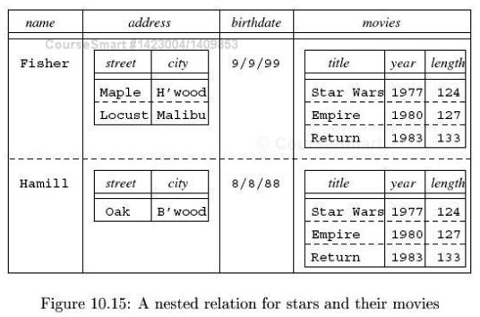
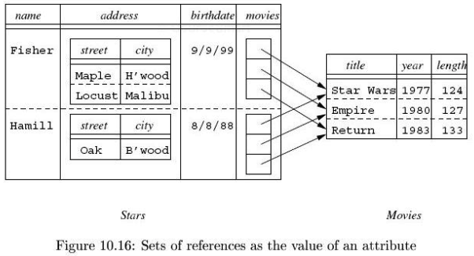

title:        COSC 4820 Database Systems
subtitle:     Advanced Topics in Relational Databases
author:       Ruben Gamboa
#logo:         uw-logo-small.png
#biglogo:      uw-logo-large.png
job:          Associate Professor
highlighter:  highlight.js
hitheme:      tomorrow
mode:         selfcontained
framework:    io2012
widgets:      [mathjax, bootstrap]

---

<style>
.title-slide {
     background-color: #EDE0CF; /* CBE7A5; #EDE0CF; ; #CA9F9D*/
     background-image: url(assets/img/uw-logo-large.png);
     background-repeat: no-repeat;
     background-position: center top;
   }
</style>

## Chapter Overview

* This chapter is a potpourri of advanced topics, including
  * Security
  * Recursion
  * Object-Relational Model
  * OLAP
  * Timeseries
  * Spatial data

---

# Relational Database Security

---

## Relational Database Security

* Access to a database is through **authorization IDs** or **usernames**
* Authorization IDs (usernames) may be grouped according to **roles**
* A given ID may have many roles, and a role may include many IDs

<br>

* Each ID or role can have **privileges**, which grant it access to 
  database objects

---

## SQL Privileges

* There are many different types of privileges an ID may have:

1. SELECT
2. INSERT
3. DELETE
4. UPDATE
5. REFERENCES
6. USAGE
7. TRIGGER
8. EXECUTE
9. UNDER

---

## Table Privileges

* SELECT, INSERT, DELETE, UPDATE apply to tables
* They can also apply to table attributes, e.g., SELECT(title, year, length)

<br>

* The privilege can be granted with SQL

```
GRANT SELECT(title, year, genre, length) ON Movies TO PUBLIC;
GRANT SELECT ON Movies TO movie_admin;
```

---

## Table Privileges

* REFERENCES also applies to tables
* This privilege allows the user to create a FOREIGN KEY constraint

<br>

* The privilege can be granted with SQL

```
GRANT REFERENCES(title, year) ON Movies TO movie_users
```

* Now the movie_users user (or role) can create a table such as

```
CREATE TABLE ShowTimes (
    theater_id  VARCHAR(10) REFERENCES Theaters(id),
    title       VARCHAR(40),
    year        INTEGER,
    show_time   DATETIME,
    PRIMARY KEY (theater_id, title, year),
    FOREIGN KEY (title, year) REFERENCES Movies(title, year)
)
```

---

## Table Privileges

* TRIGGER also applies to tables
* It grants the user the ability to create triggers on a particular table

---

## Active Element Privileges

* EXECUTE applies to active elements
  * User-defined functions
  * Stored procedures
  * Triggers
* It grants the user the ability to run the active element

---

## Other Privileges

* The USAGE privilege is a bare bones privilege that everyone should have
  * MySQL uses this privilege as a synonym for "no privileges"!
* Basically, if you have USAGE to a catalog, you can see the relations it contains

<br>

* The UDNER privilege applies to user-defined types
* If you have UNDER privilege to a type, you can create a subtype of that type

---

## Active Elements and Privileges

* A subtlety of privileges is that active elements run assuming the privileges of the **creator**, not the user executing the code

<br>

* Consider a trigger
* The creator must have TRIGGER privilege on the given table
* The trigger may have a condition, and also code that is executed
  * The creator must have SELECT privileges on the condition tables
  * He or she must also have SELECT/INSERT/DELETE/UDPATE privileges appropriate to the body

---

## Connections and Privileges

* When a session is initialized with CONNECT, you can provide an AUTHORIZATION clause

```
CONNECT TO sql-server AS conn AUTHORIZATION john_galt
```

* Check the specific syntax for your database!
* If you do not use an AUTHORIZATION class, your database may use a fallback mechanism
  * E.g., your Unix username
  * Or a one-time session authorization

---

## Creating Privileges

* When you create an object, you become its **owner**
* That means you have all privileges on that particular object

<br>

* Optionally, you may specifically mention another user that should be the owner

---

## Checking Privileges

* Every SQL statement will take into consideration
  * The database elements that are accessed
  * The current agent (or authorization ID)

<br>

* The database will check the privileges of the current agent
  * The owner has all required privileges
  * The owner can delegate (actually GRANT) privileges to other agents
  * The PUBLIC agent is an "everyman". so if PUBLIC has access, so does everyone else
  * If an active element is executed, then the privileges of the owner **or** the current user are sufficient

---

## Granting Privileges

* We have already seen the GRANT statement

```
GRANT SELECT(title, year, genre, length) ON Movies TO PUBLIC;
GRANT SELECT ON Movies TO movie_admin;
```

* Now we add one more wrinkle
* If you add `WITH GRANT OPTION`, then the new user can also GRANT his or her privileges to other users

```
GRANT SELECT ON Movies TO movie_admin WITH GRANT OPTION;
```

---

## Grant Diagrams

* There are two ways for a user to have a privilege
  * The user can be the owner
  * The user can receive the privilege from another user who has the GRANT OPTION

<br>

* It is important to know why a user has a particular privilege
* This is because privileges can also be REVOKEd
* If I grant you a privilege, I can REVOKE it, too
* But you may still keep it, if somebody else also granted it!

---

## Grant Diagrams

<div class="centered">
    
</div>

---

## Revoking Privileges

* You can revoke a privilege as follows

```
REVOKE SELECT ON Movies FROM movie_user
```

* You can also just remove the ability to grant the privilege to other users

```
REVOKE GRANT OPTION FOR SELECT ON Movies FROM movie_user
```

---

## Cascading Revoking Privileges

* If you add CASCADE to a REVOKE statement, then any other privileges that were granted
  by this user will also be revoked
* But only if the privilege was not **also** granted by somebody else

```
REVOKE SELECT ON Movies FROM movie_user CASCADE
```

<br>

* Alternatively, you can specify RESTRICT, in which case the revoke statement will fail
  if any privileges remain that depended exclusively on this particular privilege

---

# Recursion in SQL

---

## Recursion in SQL

* Although recursion is not part of the "core" standard, it is a useful construct
* E.g., without recursion, we can't find all the parts that make up a product in a parts/subparts database

```
BasicPart(part, supplier, cost)
Assembly(part, subpart, quantity)
Inventory(part, qty_on_hand)
```

---

## Recursion in Datalog

```
BasicPart(part, supplier, cost)
Assembly(part, subpart, quantity)
Inventory(part, qty_on_hand)
```

* Finding all the subparts is easy **in Datalog**

```
Part_Subpart(Part, Subpart) :- Assembly(Part, Subpart, _).
Part_Subpart(Part, Subpart) :- Assembly(Part, Interpart, _),
                               Part_Subpart(Interpart, Subpart).
```

* Note: A full bill of materials would require keeping track of the quantities
* This can be done in more powerful languages (e.g., LDL, Coral)

---

## Recursion in SQL

* The WITH statement allows you to introduce temporary tables (or views)
* You can then write a query that uses this new temporary table

```
WITH AnyPart(part) AS
  (SELECT part 
     FROM BasicPart)
  UNION
  (SELECT part 
     FROM Assembly)
SELECT part
  FROM AnyPart
```

---

## Recursion in SQL

* The recursive part is that you can use the temporary view in its definition!
* Compare these two definitions

```
Part_Subpart(Part, Subpart) :- Assembly(Part, Subpart, _).
Part_Subpart(Part, Subpart) :- Assembly(Part, Interpart, _),
                               Part_Subpart(Interpart, Subpart).
```

```
WITH RECURSIVE Part_Subpart(part, subpart) AS
  (SELECT part, subpart 
     FROM Assembly)
  UNION
  (SELECT Assembly.part, Part_Subpart.subpart
     FROM Assembly JOIN Part_Subpart ON Assembly.subpart = Part_Subpart.part)
SELECT part, subpart
  FROM Part_Subpart
 WHERE part = 'iWatch'
```

---

## Linear Recursion

* Recall that Datalog supports **non-linear recursion**
* This is when the recursive predicate occurs more than once in the relation
* E.g., Blue-Blooded Frenchman

```
bbf(X) :- royal(X), french(X).
bbf(X) :- mother(X, Y), bbf(Y), father(X, Z), bbf(Z).
```

* The SQL standard only requires linear recursion
* So you would not be able to write blue-blooded frenchman in SQL

---

## Transitive Closure

* In fact, many practitioners claim that linear recursion is too much
* All you really need is **transitive closure**
* And all the other examples we've seen (parts/subparts, ancestry, flight reaches) are just transitive closure

```
ancestor(X, Y) :- parent(X, Y).
ancestor(X, Y) :- parent(X, Z), ancestor(Z, Y).

Part_Subpart(Part, Subpart) :- Assembly(Part, Subpart, _).
Part_Subpart(Part, Subpart) :- Assembly(Part, Interpart, _),
                               Part_Subpart(Interpart, Subpart).
```

---

## Monotonicity

* Another restriction on recursion on SQL is **monotonicity**
* What this means is that if R is recursive, adding a new tuple to R can result in more tuples
* But it cannot result in losing some tuples

<br>

* For example, if you discover that your grandfather was Lazarus Long's grandson, you may discover more ancestors
  in your family tree
* But just because Lazarus Long is one of your ancestors does not mean that your grandmother stops being one of your ancestors!

<br>

* That's what we mean by **monotonicity**
* New facts lead to more facts, but never to fewer facts

---

## Monotonicity

* Monotonicity leads to a very effective way of computing all the tuples in relation R

1. Start with the smallest possible set of tuples, i.e., from the non-recursive part of the definition
2. Then find the next set of tuples by trying out the recursive part of the definition
3. Keep doing that until no more tuples are discovered

* This is (yet another) **fixpoint algorithm**

---

## Breaking Monotonicity

* Monotonicity can break if you allow a relation to be negated

```
WITH RECURSIVE Part_Subpart(part, subpart) AS
  (SELECT part, NULL 
     FROM BasicPart)
  UNION
  (SELECT part, subpart 
     FROM Assembly 
    WHERE NOT EXISTS (SELECT *
                        FROM Part_Subpart
                       WHERE Assembly.subpart = Part_Subpart.part))
SELECT part, subpart
  FROM Part_Subpart
 WHERE part = 'iWatch'
```

---

## Breaking Monotonicity

* Monotonicity can also break if you allow aggregation

```
WITH RECURSIVE Part_Subpart(part, subpart) AS
  (SELECT part, subpart 
     FROM Assembly)
  UNION
  (SELECT Assembly.part, Part_Subpart.subpart
     FROM Assembly JOIN Part_Subpart ON Assembly.subpart = Part_Subpart.part
    WHERE (SELECT num_subparts FROM Part_Count WHERE part = Assembly.part) < 10)

RECURSIVE Part_Count(part, num_subparts) AS
  SELECT part, COUNT(subpart)
    FROM Part_Subpart
   GROUP BY part

SELECT part, num_subparts
  FROM Part_Count
 WHERE part = 'iWatch'
```

---

# The Object-Relational Model

---

## The Object-Relational Model

* The relational model is dominant in the database world
* But for a short while in the late 80s and early 90s, object-oriented databases threatened to become popular
* As a result, a new model was developed, the **object-relational** database model

---

## Object-Relational vs. Relational Models

1. Attributes can be **structured types**, including **records** and even **nested tables**
   * Records allow, for example, addresses with city/state/zip fields
   * Nested tables look like lists (or sets) or structures
2. Tables can have **methods**, e.g. "sortedName"
3. Tuples have **IDs**, which set them apart even from identical tuples
4. Tuples can have **references** to other tuples, i.e., by storing the ID of the other tuple in an attribute
   * This can be significantly faster than joining on a primary key

---

## Object-Relational Example

<div class="centered">
    
</div>

---

## Object-Relational Example

<div class="centered">
    
</div>

---

# User-Defined Types in SQL

---

## User-Defined Types in SQL

* SQL supports the idea of **user-defined types** or **UDT**
* These may be similar to structs in other languages

<br>

* User-defined types can be used as
  * the type of a **table**
  * the type of an **attribute** in a table

---

## Scalar UDTs

* The simplest UDTs are **scalar**
* These are simply aliases for existing types

```
CREATE TYPE StudentIdType AS VARCHAR(8)
```

* The advantages are
  * Clarity
  * Type checking (e.g., comparing a StudentIdType against an address)

---

## Structural UDTs

* More powerful UDTs are **structural**
* These are similar to structs in other languages

```
CREATE TYPE AddressType AS (
    street1  VARCHAR(80),
    street2  VARCHAR(80),
    city     VARCHAR(20),
    state    CHAR(2),
    zip      CHAR(5)
);

CREATE TABLE MovieStars (
    name    VARCHAR(80) PRIMARY KEY,
    address AddressType
);
```

---

## UDT Methods

* Methods of UDTs look like additional properties of an UDT
* The declarations are separate from the definitions

```
CREATE TYPE AddressType AS (
    street1  VARCHAR(80),
    street2  VARCHAR(80),
    city     VARCHAR(20),
    state    CHAR(2),
    zip      CHAR(5)
)
    METHOD mailingLabel() RETURNS VARCHAR(200);

CREATE METHOD mailingLabel() FOR AddressType
BEGIN
    RETURN street1 + "\n" + street2 + "\n" + city + ", " + state + " " + zip;
END
```

---

## Using Structural UDTs

* You can use attributes and methods with a C++-like syntax

```
SELECT name, address.mailingLabel()
  FROM MovieStars
 WHERE address.city = 'Hollywood';
```

---

## Using Structural UDTs

* UDTs have an implicit "constructor" with a parameter for each attribute

```
INSERT INTO MovieStars(name, address)
       VALUES ('Carrie Fisher', AddressType('1 Princess Way', NULL, 'Hollywood', 'CA', 90210));

UPDATE MovieStars
   SET address = AddressType(address.street1, 'Suite J', address.city, address.state, address.zip)
 WHERE name = 'Carrie Fisher';
```

* There are also explicit getter and setter methods for each attribute
* The setters are commonly used in stored procedures (but not on queries, because they have side effects)

---

## Comparing UDTs

* By default, there is no way to compare two instances of an UDT
* You can provide a comparison function that accepts two instances a and b, and returns
  * -1 if a < b
  * 0 if a = b
  * 1 if a > b

<br>

* You also have to explicitly register the function as the comparator for the given type

---

## Comparing UDTs

```
CREATE FUNCTION AddressCmp(a AddressType, b AddressType) RETURNS INTEGER
BEGIN
    IF a.city < b.city THEN
        RETURN -1;
    ELSEIF a.city > b.city THEN
        RETURN 1;
    ELSEIF a.street1 < b.street1 THEN
        RETURN -1;
    ELSEIF a.street1 > b.street1 THEN
        RETURN 1;
    ELSE
        RETURN 0;
    END IF;
END;

CREATE ORDERING FOR AddressType
ORDERING FULL BY RELATIVE WITH AddressCmp;
```

---

## Object Identifiers

* Object identifiers are "pointers" into tuples in a table
* If you want to allow identifiers into a table, you should be explicit
  by adding a REF IS clause in the CREATE TABLE

```
CREATE TABLE Movies (
    REF IS movieRef SYSTEM GENERATED,
    title   VARCHAR(40),
    year    INTEGER,
    length  INTEGER,
    genre   VARCHAR(10),
    PRIMARY KEY (title, year)
)
```

* Note: Object IDs are not the same thing as PRIMARY KEYs!
* In this example, you can get the Object ID of a row by accessing the attribute movieRef

---

## Object References

* You can store references to objects in another table
* The type of the reference is REF(type)
* An optional SCOPE limits the reference to a particular table

```
CREATE TABLE MovieStars (
    name      VARCHAR(80) PRIMARY KEY,
    address   AddressType,
    bestMovie REF(Movies) SCOPE Movies
);

UPDATE MovieStars
   SET bestMovie = (SELECT movieRef 
                      FROM Movies
                     WHERE title = 'Star Wars' AND year = 1977)
 WHERE name = 'Carrie Fisher';
```

---

## Using Object References

* You can follow an Object Reference using -> as in C++
* You can also follow the entire record using DEREF(...), similar to *X in C++

```
SELECT name, DEREF(bestMovie)
  FROM MovieStars
 WHERE bestMovie->year BETWEEN 1980 AND 1989
```

---

# On-Line Analytic Processing (OLAP)

---

## On-Line Analytic Processing (OLAP)

* There are two broad classes of databases
  * On-Line Transaction Processing (OLTP) databases are optimized for updates and small queries
  * On-Line Analytic Processing (OLAP) databases are optimized for complex queries that touch the majority of the data

<br>

* Queries in OLAP databases can take a very long time
* So it is not feasible to mix them with update queries (that require locking)
* Typically, OLAP databases are read-only
* A **data warehouse** is a typical OLAP database that is updated from a **master database** periodically (e.g., daily)

---

## OLAP and Star Schemas

* Consider the following schema

```
Sales(serialNo, date, dealer, price)
Autos(serialNo, model, color)
Dealers(name, city, state, phone)
```

* Sales is called a **Fact Table**
  * Typically very large
  * Contains a record for each transaction
* Autos and Dealers are **dimension tables** which explain **dimension attributes** serialNo and dealer
* Date is also a **dimension attribute**, but without a meaningful dimension table
* This type of schema, with a central fact table and surrounding dimension tables, is called a **star schema**

---

## OLAP and Star Schemas

* Consider the following schema

```
Sales(serialNo, date, dealer, price)
Autos(serialNo, model, color)
Dealers(name, city, state, phone)
```

* Price is the only non-dimension attribute, called a **dependent attribute**
* In general, there can be more dependent attributes, e.g., service contracts

<br>

* OLAP aims to understand how the dependent attributes depend on the dimension attributes
* This includes lots of GROUP BYs

---

## OLAP and Star Schemas

<div class="centered">
    
</div>

---

## OLAP and Star Schemas

* Consider the following schema

```
Sales(serialNo, date, dealer, price)
Autos(serialNo, model, color)
Dealers(name, city, state, phone)
```

* We observed that date was the only dimension attribute without a dimension table
* That limits our ability to consider the effect of different aspects of date
* We could add a table (even a "fake" table) such as
```
Days(date, day, week, month, year)
```
* Now we can talk about dates that wall between the 20th and 25th weeks of the year, for example

---

## OLAP Query Examples

```
SELECT state, AVG(price)
  FROM Sales JOIN Dealers ON Sales.dealer = Dealers.name
 WHERE date >= '2014-01-01'
 GROUP BY state
```

```
SELECT state, Days.month, AVG(price)
  FROM Sales JOIN Dealers ON Sales.dealer = Dealers.name
             JOIN Days ON Sales.date = Days.date
 WHERE date BETWEEN '2014-01-01' AND '2014-12-31'
   AND state = 'WY'
 GROUP BY Days.month
 ORDER BY Days.month
```

---

## "Cubes" and Multidimensional Data

* Even in our simple example, we have three dimensions
* In a typical example, there may be 100s of dimensions

<br>

* In either case, you can think of the data as arranged in a high dimensional "cube"
* Each tuple is a point inside this high-dimensional cube
* Each axis corresponds to a dimension table
* The dimension table explains the points along that dimension

---

## Slicing and Dicing

```
SELECT state, Days.month, AVG(price)
  FROM Sales JOIN Dealers ON Sales.dealer = Dealers.name
             JOIN Days ON Sales.date = Days.date
 WHERE date BETWEEN '2014-01-01' AND '2014-12-31'
   AND state = 'WY'
 GROUP BY Days.month
 ORDER BY Days.month
```

* The WHERE and GROUP BY clauses let us change the way we view the fact table
* GROUP BY partitions the rows into categories, in a process called **dicing**
  * Dicing -- think of the cube as broken up into many smaller cubes

<br>

* The WHERE clause lets us remove (or at least limit) one of the dimensions of the cube
* This is similar to taking a **slice**

---

# Data Cubes

---

## Data Cubes

* **Data Cubes** are specialized OLAP databases
* The key characteristic is that they pre-compute aggregated values

---

## Data Cubes

* Consider the following fact table

```
Sales(serialNo, date, dealer, price)
```

* The idea is to store both basic and aggregated facts in this table
  * basic fact: an individual sale
  * aggregated facts: sales by Ken's Toyota

serialNo     | date            | dealer          | price
-------------|-----------------|-----------------|-------------
1023482      | 2015-04-15      | kens            | 30,000
9182734      | 2015-04-15      | kens            | 35,000
9234850      | 2014-04-15      | bills           | 32,500
NULL         | 2015-04-15      | kens            | 65,000
NULL         | NULL            | kens            | 65,000

---

## Data Cubes

* Obviously, data cubes are more powerful when we have reasonable columns to aggregate
* SerialNo is a particularly bad column to aggregate
  * So replace it with model & color
* Date isn't much better
  * So add explicit week, month, year to fact table

model    | color     | date            | year   | month  | dealer          | price   | number
---------|-----------|-----------------|--------|--------|-----------------|---------|-----------
GX420    | maroon    | 2015-04-15      | 2015   | 04     | kens            | 30,000  | 1
GX420    | white     | 2015-04-15      | 2015   | 04     | kens            | 35,000  | 1
RX360    | orange    | 2014-03-15      | 2015   | 04     | kens            | 32,500  | 1
GX420    | NULL      | 2015-04-15      | 2015   | 04     | kens            | 65,000  | 2
NULL     | white     | NULL            | 2015   | 04     | kens            | 35,000  | 1
GX420    | NULL      | NULL            | 2015   | NULL   | kens            | 65,000  | 2

---

## Data Cubes

* You can create a data cube using **materialized views**

```
CREATE MATERIALIZED VIEW SalesCube AS
SELECT model, color, date, year, month, dealer, SUM(price), COUNT(*) AS number
  FROM Sales
 GROUP BY model, color, date, year, month, dealer WITH CUBE
```

* Here, we're assuming that we've already added the relevant columns to Sales
* If not, we could perform a JOIN with the dimension tables

---

# Timeseries in SQL

---

## Timeseries in SQL

* **Timeseries** are an important type of data
* Generally, they refer to any value that changes over time
  * Stock prices
  * Weather data (temperature, atmospheric pressure, etc.)
  * Consumer preferences
  * Econometric data (housing starts, interest rates, etc.)

<br>

* The big problem is that SQL is totally unsuited to timeseries data!
* The semantics of SQL is based on set operations, but timeseries are inherently linear
* This implies problems for
  * the query language
  * efficient storage structures

---

## Timeseries in SQL

* A common operation on a timeseries is **smoothing**
* E.g., we can compute a "50-day moving average"
* What moves is that we think of a different 50-day window each day
* But the windows mostly overlap!

```
SELECT date, temp, avgtemp
  FROM weather as wx,
       (SELECT AVG(temp) AS avgtemp
          FROM weather
         WHERE date BETWEEN wx.date-50 AND wx.date
           AND location = wx.location) AS avgwx
 WHERE location = 'Laramie'
   AND date >= '2015-01-01'
 ORDER BY date
```

---

## Types of Timeseries Data

* Some timeseries are **regular**, so we can expect a value based on the **calendar**
  * which days values are expected
  * which days values are definitely not expected
  * which days are exceptions (e.g., holidays)
* Other timeseries are **irregular**, which means data comes in at random intervals

<br>

* Timeseries can also vary, depending on the **granularity** of the timestamp
* Instead of "days", we can have timeseries with values once a week, month, quarter, year, hour, minute, second, millisecond, etc.

---

## Operations on Timeseries Data

* "Moving" aggregations
* Aggregation by time
* Change and %Change
* Leading/Lagging comparisons
* Gap filling
* Arithmetic
* Statistics
* Event filtering, e.g., moving average crossovers
* Changes of time granularity

---

## Storage of Timeseries Data

* It makes sense to store timeseries data sorted by date
* We also want the data to be together
* I.e., we want to sort by "date", but we want all the Laramie data together

<br>

* In general, we want to store many **different** timeseries
  * Laramie weather, Cheyenne weather, Fort Collins weather, etc.
  * AAPL price data, MSFT price data, etc.

---

## Storage of Timeseries Data

* So we usually store timeseries data as an attribute of a relation

```
CREATE TABLE DailyStockPrices (
    ticker      VARCHAR(10) PRIMARY KEY,
    prices      TNumSeries
)
```

* TNumSeries is meant to be similar to a user-defined type
* But it can't just be user-defined
* We need better support for
  * storage options
  * query execution
  * aggregation

---

## The TNumSeries Type

* It may have a calendar
  * NYSE is open Monday through Friday
  * NYSE is closed during major holidays (and here's a list)
  * NYSE was open on Saturdays until September 29, 1952
  * And if you're worried about minutes, NYSE has five different trading periods since 2004, three since 1991, and times varied depending on day of week before that
* The calendar also has a frequency and precision

```
CREATE TYPE ORDSYS.ORDTNumCell AS OBJECT (tstamp DATE, value NUMBER);
CREATE TYPE ORDSYS.ORDTNumTab AS TABLE OF ORDTNumCell;
CREATE TYPE ORDSYS.ORDTNumSeries AS OBJECT (
     name VARCHAR2(256),  
     cal ORDTCalendar,  
     series ORDTNumTab 
);
```

---

## Timeseries Functions

Function          | Description
------------------|-------------------------------------
ExtractCal        | Returns the Calendar
ExtractTable      | Provides a view to the nested table
GetDatedElement   | Gets the element from the date
GetNthElement     | Gets the nth element
First             | Gets the first element
Last              | Gets the last element
ExtractDate       | The date of an element
ExtractValue      | The value of an element

---

## Timeseries Example

```
CREATE TABLE DailyStockPrices (
    ticker      VARCHAR(10) PRIMARY KEY,
    prices      TNumSeries
);

SELECT ExtractDate(Last(prices)), ExtractValue(Last(prices))
  FROM DailyStockPrices
 WHERE ticker = 'AAPL';
```

---

## Timeseries Example

```
CREATE TABLE DailyStockPrices (
    ticker      VARCHAR(10) PRIMARY KEY,
    prices      TNumSeries
);

SELECT p.tstamp, p.value
  FROM DailyStockPrices dsp,
       TABLE (CAST ExtractTable(dsp.prices) AS ORDTNumTab) AS p
 WHERE ticker = 'AAPL'
   AND p.tstamp = '04-15-2015';
```

---

## Timeseries Functions

Function          | Description
------------------|-------------------------------------
Lead              | Returns timeseries X "days" later
Lag               | Returns timeseries X "days" ago

```
CREATE TABLE DailyStockPrices (
    ticker      VARCHAR(10) PRIMARY KEY,
    prices      TNumSeries
);

SELECT p.tstamp, p.value, 100 * (p.value - p250.value) / p250.value AS PctChange
  FROM DailyStockPrices dsp,
       TABLE (CAST ExtractTable(dsp.prices) AS ORDTNumTab) AS p
       JOIN
       TABLE (CAST ExtractTable(Lag(dsp.prices, 250) AS ORDTNumTab) AS p250
       ON p.tstamp = p250.tstamp
 WHERE ticker = 'AAPL'
   AND p.tstamp BETWEEN '01-01-2014' AND '12-31-2014';
```

---

## Timeseries Functions

Function            | Description
--------------------|-------------------------------------
TSAvg/TSCount/TSMax | Average, count, max of a timeseries
TSAdd/TSDivide/...  | Arithmetic operations on timeseries
Cavg/Cmin/Cmax/Csum | Cumulative average/min/max/sum
Mavg/Msum           | Moving average/sum

```
SELECT p.tstamp, p.value, pavg.value
  FROM DailyStockPrices dsp,
       TABLE (CAST ExtractTable(dsp.prices) AS ORDTNumTab) AS p
       JOIN
       TABLE (CAST ExtractTable(Mavg(dsp.prices, 50) AS ORDTNumTab) AS pavg
       ON p.tstamp = pavg.tstamp
 WHERE ticker = 'AAPL'
   AND p.tstamp BETWEEN '01-01-2014' AND '12-31-2014';
```

---

# Spatial Queries in SQL

---

## Spatial Queries in SQL

* Spatial dataset are also increasingly important
  * GIS data for ecology, energy, etc.
  * GPS data

<br>

* Again, SQL is ill-suited for dealing with spatial data!
* The problem is that spatial data is inherently two-dimensional
* And SQL indexes work best for one-dimensional data
* Again, we need improvements on the query and the storage sides

---

## Indexes for Spatial Data

* We've seen that indexes for regular data include B-trees and hash-based indexes
* Spatial databases introduce new index types, e.g., R-trees or quadtrees
* These indexes recursively narrow down rows based on latitude-then-longitude

---

## Spatial Data Types

* A **geometry** is the basic data type in spatial queries
* It is a sequence of points that are connected by lines or arcs
* Points, Lines, Polygons, Circles, Rectangles, etc.

<br>

* Geometries can be combined using operations, e.g., union, intersection

---

## Spatial Relationships

* SDO_RELATE checks topological criteria
  * DISJOINT / ANYINTERACT
  * TOUCH
  * OVERLAPBYDISJOINT
  * OVERLAPBYINTERSECT
  * EQUAL
  * CONTAINS / INSIDE
  * COVERS / COVEREDBY
  * ON
* SDO_WITHIN_DISTANCE checks if two geometries are close to each other
* SDO_NN finds the nearest neighbor to a geometry

---

## Spatial Query Examples

```
SELECT c.city
  FROM geod_interstates i, geod_cities c
 WHERE i.highway = 'I80'
   AND sdo_within_distance (c.location, i.geom, 'distance=15 unit=mile') = 'TRUE'
```

* Note: sco_within_distance is not symmetric!
* The first argument is the search argument
* The second argument gives the geometry to search for

---

## Spatial Query Examples

```
SELECT i.highway
  FROM geod_interstates i, geod_cities c
 WHERE c.city = 'Denver'
   AND sdo_within_distance (i.geom, c.location, 'distance=15 unit=mile') = 'TRUE'
```

* Note: sco_within_distance is not symmetric!
* The first argument is the search argument
* The second argument gives the geometry to search for

---

## Spatial Query Examples

```
SELECT c.city, sdn_nn_distance (1) distance
  FROM geod_interstates i, geod_cities c
 WHERE i.highway = 'I80'
   AND sdo_nn (c.location, i.geom, 'sdo_num_res=5 unit=mile', 1) = 'TRUE'
 ORDER BY distance
```

---

## Spatial Query Examples

```
SELECT r.name 
  FROM restaurants r 
 WHERE sdo_nn(r.geometry, :my_hotel, 'distance=1.5 unit=mile') = 'TRUE' 
   AND r.cuisine = 'Italian' 
```

---

## Spatial Query Examples

```
SELECT friend.userID, friend.location, friend.distance
  FROM (SELECT location
          FROM userLocation
         WHERE userID = :myUserId) AS MyLocation,
       (SELECT userID, location,
               sdo_distance(location, MyLocation.location, 0.01) as distance
          FROM userLocation
         WHERE userID <> :myUserId
           AND sdo_within(location, 1, MyLocation.location, 0.01)) AS friend
 ORDER BY friend.distance
```


