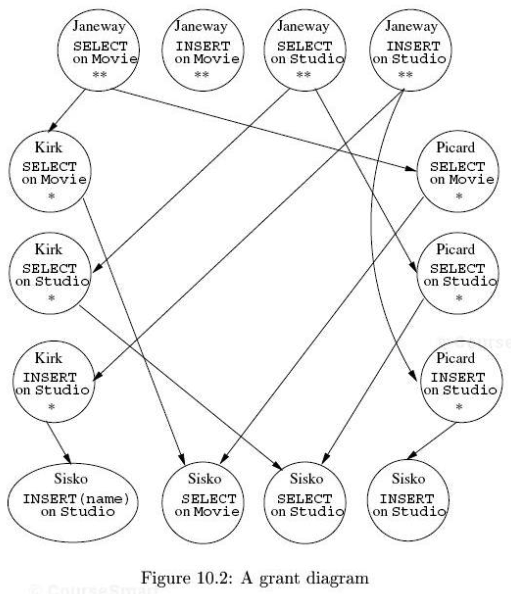

title:        COSC 4820 Database Systems
subtitle:     Advanced Topics in Relational Databases
author:       Ruben Gamboa
#logo:         uw-logo-small.png
#biglogo:      uw-logo-large.png
job:          Associate Professor
highlighter:  highlight.js
hitheme:      tomorrow
mode:         selfcontained
framework:    io2012
widgets:      [mathjax, bootstrap]

---

<style>
.title-slide {
     background-color: #EDE0CF; /* CBE7A5; #EDE0CF; ; #CA9F9D*/
     background-image: url(assets/img/uw-logo-large.png);
     background-repeat: no-repeat;
     background-position: center top;
   }
</style>

## Chapter Overview

* This chapter is a potpourri of advanced topics, including
  * Security
  * Recursion
  * Timeseries
  * Object-Relational Model
  * OLAP

---

# Relational Database Security

---

## Relational Database Security

* Access to a database is through **authorization IDs** or **usernames**
* Authorization IDs (usernames) may be grouped according to **roles**
* A given ID may have many roles, and a role may include many IDs

<br>

* Each ID or role can have **privileges**, which grant it access to 
  database objects

---

## SQL Privileges

* There are many different types of privileges an ID may have:

1. SELECT
2. INSERT
3. DELETE
4. UPDATE
5. REFERENCES
6. USAGE
7. TRIGGER
8. EXECUTE
9. UNDER

---

## Table Privileges

* SELECT, INSERT, DELETE, UPDATE apply to tables
* They can also apply to table attributes, e.g., SELECT(title, year, length)

<br>

* The privilege can be granted with SQL

```
GRANT SELECT(title, year, genre, length) ON Movies TO PUBLIC;
GRANT SELECT ON Movies TO movie_admin;
```

---

## Table Privileges

* REFERENCES also applies to tables
* This privilege allows the user to create a FOREIGN KEY constraint

<br>

* The privilege can be granted with SQL

```
GRANT REFERENCES(title, year) ON Movies TO movie_users
```

* Now the movie_users user (or role) can create a table such as

```
CREATE TABLE ShowTimes (
    theater_id  VARCHAR(10) REFERENCES Theaters(id),
    title       VARCHAR(40),
    year        INTEGER,
    show_time   DATETIME,
    PRIMARY KEY (theater_id, title, year),
    FOREIGN KEY (title, year) REFERENCES Movies(title, year)
)
```

---

## Table Privileges

* TRIGGER also applies to tables
* It grants the user the ability to create triggers on a particular table

---

## Active Element Privileges

* EXECUTE applies to active elements
  * User-defined functions
  * Stored procedures
  * Triggers
* It grants the user the ability to run the active element

---

## Other Privileges

* The USAGE privilege is a bare bones privilege that everyone should have
  * MySQL uses this privilege as a synonym for "no privileges"!
* Basically, if you have USAGE to a catalog, you can see the relations it contains

<br>

* The UDNER privilege applies to user-defined types
* If you have UNDER privilege to a type, you can create a subtype of that type

---

## Active Elements and Privileges

* A subtlety of privileges is that active elements run assuming the privileges of the **creator**, not the user executing the code

<br>

* Consider a trigger
* The creator must have TRIGGER privilege on the given table
* The trigger may have a condition, and also code that is executed
  * The creator must have SELECT privileges on the condition tables
  * He or she must also have SELECT/INSERT/DELETE/UDPATE privileges appropriate to the body

---

## Connections and Privileges

* When a session is initialized with CONNECT, you can provide an AUTHORIZATION clause

```
CONNECT TO sql-server AS conn AUTHORIZATION john_galt
```

* Check the specific syntax for your database!
* If you do not use an AUTHORIZATION class, your database may use a fallback mechanism
  * E.g., your Unix username
  * Or a one-time session authorization

---

## Creating Privileges

* When you create an object, you become its **owner**
* That means you have all privileges on that particular object

<br>

* Optionally, you may specifically mention another user that should be the owner

---

## Checking Privileges

* Every SQL statement will take into consideration
  * The database elements that are accessed
  * The current agent (or authorization ID)

<br>

* The database will check the privileges of the current agent
  * The owner has all required privileges
  * The owner can delegate (actually GRANT) privileges to other agents
  * The PUBLIC agent is an "everyman". so if PUBLIC has access, so does everyone else
  * If an active element is executed, then the privileges of the owner **or** the current user are sufficient

---

## Granting Privileges

* We have already seen the GRANT statement

```
GRANT SELECT(title, year, genre, length) ON Movies TO PUBLIC;
GRANT SELECT ON Movies TO movie_admin;
```

* Now we add one more wrinkle
* If you add `WITH GRANT OPTION`, then the new user can also GRANT his or her privileges to other users

```
GRANT SELECT ON Movies TO movie_admin WITH GRANT OPTION;
```

---

## Grant Diagrams

* There are two ways for a user to have a privilege
  * The user can be the owner
  * The user can receive the privilege from another user who has the GRANT OPTION

<br>

* It is important to know why a user has a particular privilege
* This is because privileges can also be REVOKEd
* If I grant you a privilege, I can REVOKE it, too
* But you may still keep it, if somebody else also granted it!

---

## Grant Diagrams

<div class="centered">
    
</div>

---

## Revoking Privileges

* You can revoke a privilege as follows

```
REVOKE SELECT ON Movies FROM movie_user
```

* You can also just remove the ability to grant the privilege to other users

```
REVOKE GRANT OPTION FOR SELECT ON Movies FROM movie_user
```

---

## Cascading Revoking Privileges

* If you add CASCADE to a REVOKE statement, then any other privileges that were granted
  by this user will also be revoked
* But only if the privilege was not **also** granted by somebody else

```
REVOKE SELECT ON Movies FROM movie_user CASCADE
```

<br>

* Alternatively, you can specify RESTRICT, in which case the revoke statement will fail
  if any privileges remain that depended exclusively on this particular privilege

---

# Recursion in SQL

---

# Timeseries in SQL

---

# The Object-Relational Model

---

# user-Defined Types in SQL

---

# Operations on Object-Relational Data

---

# On-Line Analytic Processing (OLAP)

---

# Data Cubes


