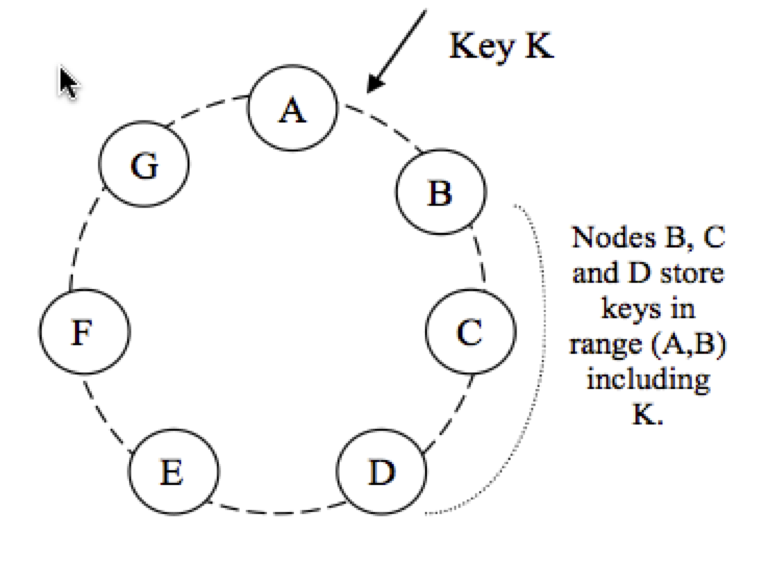
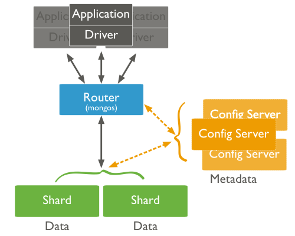
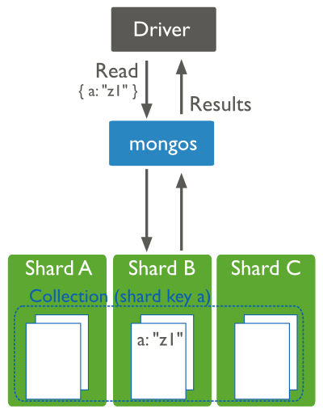
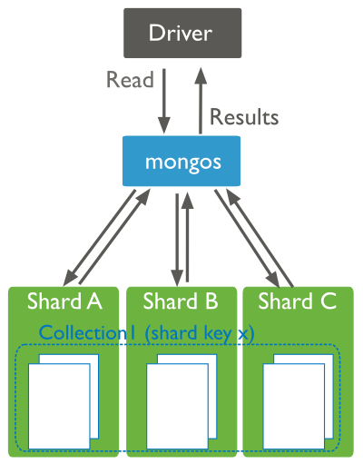
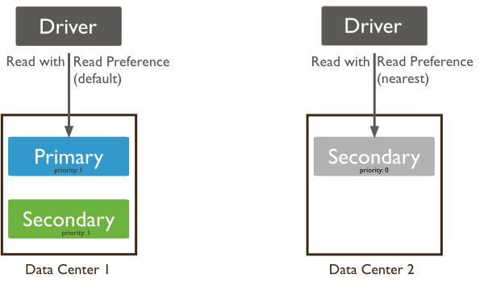

title:        COSC 4820 Database Systems
subtitle:     Introduction to NoSQL
author:       Ruben Gamboa
#logo:         uw-logo-small.png
#biglogo:      uw-logo-large.png
job:          Associate Professor
highlighter:  highlight.js
hitheme:      tomorrow
mode:         selfcontained
framework:    io2012
widgets:      [mathjax, bootstrap]

---

<style>
.title-slide {
     background-color: #EDE0CF; /* CBE7A5; #EDE0CF; ; #CA9F9D*/
     background-image: url(assets/img/uw-logo-large.png);
     background-repeat: no-repeat;
     background-position: center top;
   }
</style>

## Chapter Overview

* This chapter covers NoSQL databases at a very high level
  * Motivation for NoSQL
  * Types of NoSQL Databases
  * MongoDB

---

# Motivation for NoSQL

---

## Data Model

* The relational data model is remarkably weak
* That is both a strength and a limitation
* In many cases, it is more convenient to use an "OO" data model

<br>

* E.g, think of Twitter's tables
  * Tweets
  * Users
  * Follows
* To look at your page requires joining these tables **all the time**

---

## Database Joins

* Some NoSQL advocates consider joins to be the death of your application
* And yet, database researchers have concentrated their efforts on joins
* So what gives?

<br>

> * Joins are fast when all but one of the tables fit in memory
* Joins can be superfast in combination with a selection (and the right indexes)

---

## Twitter's Joins

* Think again of Twitter's tables
  * Tweets
  * Users
  * Follows

<br>

* Not a single one of these tables fits in memory!
* We can take advantage of selections and indexes, but only if we have the right type of indexes
  * Clustered indexes won't work, because the data in Tweets cannot be in the "right" order for different users
  * The best the database can do is follow disk pointers around

---

## Facebook's Database Evolution

* Facebook started with MySQL
* Pretty soon, they pushed the boundaries of MySQL, so they instituted code discipline:
  * No joins in SQL
  * Instead, get references (PKs) to the application side, and chase PKs from there
* The database got too large, so they instituted more discipline:
  * Split the database into lots of smaller databases (e.g., As go here, Bs go there, etc.)
  * This is called **sharding**
  * All the code needed to know the sharding strategy

<br>

> * Eventually, they built their own database, called **Cassandra**
* It has the same underlying storage architecture as Amazon's **Dynamo**
* It uses the data model from Google's **BigTable**

---

## Dynamo/Cassandra Storage Model

<div class="centered">
    
</div>

* The ring takes care of replication
  * Redundancy
  * Speed

---

## Web 2.0

* Another driver for NoSQL databases is Web 2.0
* Tim O'Reilly noted a distinction:
  * Web 1.0: Content producers (e.g., movie studios) generate content, and the rest of us enjoy it on the Internet
  * Web 2.0: Content is generated both by producers and by "consumers", and it is served seamlessly and typically with user preferences in mind

<br>

* The big consequence of this is that **caching** no longer works
* There is some thought that caching works for the 80%, but not for the 20% 
  * *Pareto Principle*
  * Also, the *Long Tail*
* But it really doesn't work well for Facebook, Twitter, etc.
* So we have to make the databases more responsive

---

## The CAP Theorem

* This is one of those "pick any 2" triangles
* It applies to any distributed system (e.g., the Internet, distributed databases)

<br>

No distributed system can achieve all three of these goals
1. Consistency
2. Availability
3. Partition tolerance

---

## Giving Up Consistency

* We have Availability and Partition Tolerance

<br>

* All clients can access some version of the data (but not necessarily the same one)
* Data is split across different servers
* e.g., DNS, web caching

<br>

* Typical issues
  * expiration/leases
  * conflict resolution
  * optimistic locking

---

## Giving Up Availability

* We are left with Consistency and Partition Tolerance

<br>

* If clients can connect to the server, they see the same data at any time.  But the server may be unavailable.
* Data can be distributed across several nodes
* E.g., Distributed databases, distributed locking, majority protocols

<br>

* Typical issues
  * pessimistic locking
  * minority partitions are unavailable

---

## Giving Up Partition Tolerance

* We are left with Consistency and Availability

<br>

* All clients see the same data at any given time, but they may not be able to see all of the data
* Data can be distributed across several nodes
* E.g., single-server and cluster databases, LDAP

<br>

* Typical issues
  * 2-phase commit
  * cache validation protocols

---

## What Should We Give Up?

* It depends on your situation, of course
* But if you are a large Internet company with millions of users, the most reasonable choice is **consistency**

<br>

* Giving up partition tolerance is not good for your users
  * E.g., they can use Twitter, but not tweets from their favorite sources
  * Or they can see Amazon, but not the science-fiction books
* Giving up availability is even worse
  * Users will find an alternative
  * Amazon loses millions of dollars when their system is even slightly slow

---

## From ACID to BASE

* **B**asic **A**vailability
  * System is available
  * Not all items are available are any given point in time
  
* **S**oft State
  * State information is not necessarily persisted immediately
  * Maybe it needs to be refreshed
  * Maybe it is saved locally and persisted later

* **E**ventual Consistency
  * At any given point, the nodes in the database may be inconsistent
  * Eventually, after sufficient downtime, they will become consistent

---

## Quick Review: Why NoSQL?

* Better data models
* Efficiency
* Work with Internet scale
* Don't need all the ACID overhead

---

# Types of NoSQL Systems

---

## Types of NoSQL Systems

* There are many types of NoSQL systems
  * Some of us were building NoSQL databases before there was a name for them!

<br>

* Today, three main types are recognized
  1. Key/Value Stores
  2. Graph Databases
  3. Document Databases

---

## Key-Value Stores

* At its simplest, a key-value store looks just like a hash table:
  * PutItem(Key, Value)
  * GetItem(Value)

<br>

* The important characteristics are scalability and speed
  * The data is stored in one of many different nodes (e.g., by hashing)
  * Data is replicated across several nodes automatically
  * Data can be retrieved from any replicant
  * Storing a value is atomic
  * But storing two values is not

* E.g., Riak, Dynamo

---

## Key-Value Stores

* A "pure" key-value store does not know anything about the structure of the value
* The value is just a binary object, as far as the database is concerned

<br>

* Some key-value stores provide more structure
* BigTable & Cassandra treat values as "records"
* These are not traditional database records, though
* They are also (large) collections of key-value pairs!
* Bottom line: two different records may have totally different columns
* E.g., a "record" can contain all of the tweets you ever made
  <br><br>
* There can even be support for indexes (but you may have to do all the work)
* I.e., where are the record IDs for the users with lastname "Gamboa"
  * Key: "Gamboa", Value: the record IDs

---

## Graph Databases

* Graph databases focus on the data model and query language aspects of NoSQL
* The idea is that many problems can be usefully thought of as graph problems
  * That's why so much of 3020 is spent on graph algorithms!
* The internet is basically a large graph
* The Facebook network of friends is also a graph
  * The Facebook API is called "the Graph API"

<br>

* So why not design a database that can support large-scale graphs?
* E.g., Neo4J

<br>

* In practical terms, we can do very cool things with graph databases
* But they are mostly limited to in-memory applications

---

## Document Databases

* A document database is the logical extension of key-value stores
* The database consists of a number of "documents"
* Each document is of a given type, e.g., JSON or JPEG
* Documents can be grouped into **collections**

<br>

* Try not to think of
  * documents as records
  * collections as tables
* But you can go far with that analogy

<br>

* The key point is that the database understands the content of your documents
* So it can help you by creating indexes, performing searches, etc.

---

# MongoDB

---

## MongoDB

* MongoDB is a document database
  * high performance
  * high availability
  * easy scalability

---

## MongoDB: Document Database

* Rich data model maps naturally to program data structures
* Embedded (nested) documents and arrays mostly replace joins
* Dynamic schema supports polymorphism

---

## MongoDB: High Performance

* Embedding is key to making reads and writes fast
* Indexes can include keys from top-level documents
* Indexes can also include keys from nested documents and arrays
* Optional "streaming" writes (i.e., no ACKs)

---

## MongoDB: High Availability

* Replicated servers
* Automatic master failover

---

## MongoDB: Easy Scalability

* Automatic **sharding**
* Reads are automatically distributed over replicated servers
* Eventual consistency

---

## Data Model

* A **database** consists of many **collections**
* A **collection** contains many **documents**

<br>

* A document is essentially a JSON document
* It is stored in a binary form (BSON) for efficiency

```
var mydoc = {
               _id: ObjectId("5099803df3f4948bd2f98391"),
               name: { first: "Alan", last: "Turing" },
               birth: new Date('Jun 23, 1912'),
               death: new Date('Jun 07, 1954'),
               contribs: [ "Turing machine", "Turing test", "Turingery" ],
               views : NumberLong(1250000)
            }
```

---

## Documents

* The document type is really the central type in MongoDB
* It is (of course) the natural unit of storage
* ACID properties are guaranteed on document writes, but not across document writes

<br>

* But documents are also used throughout MongoDB
  * query selectors
  * update definitions
  * index specification
  * status reporting
  * database configuration

---&twocol

## Queries

* A query is a set of operations that determine which records are desired
* The find() method of a collection executes queries

*** =left

```
db.users.find(
    { age: { $gt: 18 }, 
      class: "senior" },
    {name: 1, address: 1}
).limit(5)
```

*** =right

```
SELECT _id, name, address
  FROM users
 WHERE age > 18
   AND class = 'senior'
 LIMIT 5
```

---

## Cursors

* The result of a find() operation is a **cursor**
* Cursors have methods such as hasNext() and next()

```
var students = [];
var cursor = db.users.find(...);
while (cursor.hasNext()) {
    var doc = cursor.next ();
    students.push ({ sid:  doc._id,
                     name: doc.name });
}
```

---

## Indexes

```
db.users.find(
    { age: { $gt: 18 }, 
      class: "senior" },
    {name: 1, address: 1}
).limit(5);

db.users.createIndex( { class: 1 } );
db.users.createIndex( { class: 1, age: 1 } );
db.users.createIndex( { class: 1, age: 1, name: 1, address: 1 } );
```

* The query optimizer determines which index to use
* Unlike relational query optimizers that use **estimates**, the MongoDB optimizer 
  uses **experiments** to find the best index

---

## Insertions

```
db.users.insert({
    firstname: "Dagny",
    lastname:  "Taggart",
    age:       20,
    class:     "junior",
    interests: [ "railroads", "leadership", "progress" ]
})
```

---

## Updates

```
db.users.udpate(
    {  age: { $ge: 18 } },
    { $set: { vote: true } },
    {multi: true }
)
```

---

## Deletes

```
db.users.remove(
    {  age: { $lt: 18 } }
)
```

---

## Sharding

<div class="centered">
    
</div>

---

## Reads with a Key

<div class="centered">
    
</div>

---

## Reads without a Key

<div class="centered">
    
</div>

---

## Replication

<div class="centered">
    
</div>


---

## Reading from Replicants

<div class="centered">
    
</div>

---

## Getting MEAN

* The MEAN stack is a new/hot/trending/hyped web development platform
* It is an alternative to LAMP for small sites, and maybe will be a serious competitor to Java/Struts or Java/Spring in the future
  * LAMP = **L**inux, **A**pache, **M**ysql, **P**hp

<br>

* **M**ongoDB
* **E**xpressJS
* **A**ngularJS
* **N**odeJS

