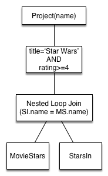
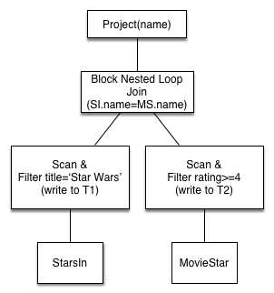

---

title:        COSC 4820 Database Systems
subtitle:     Indexes and Introduction to Query Optimization
author:       Ruben Gamboa
#logo:         uw-logo-small.png
#biglogo:      uw-logo-large.png
job:          Professor
highlighter:  highlight.js
hitheme:      tomorrow
mode:         selfcontained
framework:    io2012
widgets:      [mathjax, bootstrap]

---

<style>
.title-slide {
     background-color: #EDE0CF; /* CBE7A5; #EDE0CF; ; #CA9F9D*/
     background-image: url(assets/img/uw-logo-large.png);
     background-repeat: no-repeat;
     background-position: center top;
   }
</style>

# Indexes in SQL

---

## Indexes in SQL

* An **index** is a **data structure** that makes it more efficient to retrieve tuples that have a given value 
  for a given attribute
  <br><br>
* For example, an index on the **Student ID** attribute would make it efficient to find a student with W# "W123456789"
* Or an index on **phone number** would make it efficient to find a student or students with phone number "307-234-5678"

---

## Indexes in SQL

* In memory, you would solve this problem by using a data structure such as
  1. a sorted array
  2. a (binary) search tree
  3. a hash table
  <br><br>

> * Actually, all of these are used in databases
  1. A sorted file
  2. A B-tree with as many children as fit in a disk page
  3. A hash table, with "buckets" mapping to different disk pages
  <br><br>

> * Note: Sorted files and B-trees can handle comparisons with <, <=, >, >=, and =
* But hash tables can only handle equality checks
* And (rule of thumb) they are more efficient than the others

---

## Motivation for indexes

* Suppose we need to compute $S \bowtie S$, where $S$ is the Students table at UW
* Since $|S| \approx 14000$, the naive method takes up $14000^2 =$ 1.96 &times; 10<sup>8</sup> steps
* Each step is a disk access, so even if disk I/O is 1ms, that works out to 1.96 &times; 10<sup>5</sup> seconds
* Which is 3266.6666667 minutes
* Which is 54.4444444 hours
* Which is 2.2685185 days
  <br><br>
  
> * That's a little unfair
* Instead of reading each tuple at a time, we can read many tuples at the same time, since they are 
  on the same disk page

> * Disk I/Os is what matters, so we'll stop worrying about seconds
* After all, disks get faster!

---

## Motivation for indexes

* Suppose we need to compute $S \bowtie S$, where $S$ is the Students table at UW
* Suppose each disk page can handle 100 students
* Since $|S| \approx 14000$ or 140 pages, the **Block Nested Loop** join method takes up $140+140^2 =$ 1.974 &times; 10<sup>4</sup> disk I/Os
  <br><br>

* That's a lot better, but it's still quadratic!
* A good index will bring that **up** to 3.514 &times; 10<sup>4</sup> disk I/Os
* But it's **linear**
* You'd see an improvement in a larger school
* E.g., with 100,000 students, it becomes
  * Without an index: $1000^2 =$ 10<sup>6</sup> disk I/Os
  * With an index: 2.51 &times; 10<sup>5</sup> disk I/Os

---

## Motivation for indexes

* The "hard" numbers in the previous slides involve joins
* Here's a similar argument with selections

* Suppose we need to compute $\sigma(S)$, where $S$ is the Students table at UW
* Suppose each disk page can handle 100 students
* Since $|S| \approx 14000$ or 140 pages, without an index, we can execute the selection with $140$ disk I/Os

<br>

* A good (and applicable) index will bring that down to 2.5 disk I/Os!
* Actually, it could be a few more, depending on the **selectivity** of the index (more on this later)
  * If we're looking for a single record, then 2.5 disk I/Os is about right
  * If we're looking for all students in COSC, it may take $300$ disk I/Os!

---

## Motivation for indexes

* Indexes can be used to speed up queries that involve selections, e.g.,

```
SELECT title, year
  FROM Movies
 WHERE year = 2000
```

* They can also be used to speed up queries involving joins

```
SELECT title, year, name
  FROM Movies JOIN MovieExecs ON producerC# = cert#
 WHERE year = 2000
```

* And indexes can speed up checking of integrity constraints, e.g., W# must be unique

---

## Declaring Indexes

* Making an index is as easy as calling `CREATE INDEX`

```
CREATE INDEX MovieYearIdx ON Movies(year)
```

* You would not have to make an index on cert#, because databases automatically create an index on the PRIMARY KEY


---

## Multidimensional Indexes

* You can create an index that spans more than one attribute

```
CREATE INDEX StudentNameIdx ON Students(first_name, last_name)
```

* The order of the attributes matters!
* If you know the first_name, but not the last_name, you may still be ab;e to use the index above effectively
* But if you know the last_name and not the first_name, this index is useless
  <br><br>

> * Note that if the index is a hash index, then knowing one or the other does not help!
* This only helps for indexes that have a sort order, e.g., sorted files or tree indexes

---

## Dropping Indexes

* No surprises here:

```
DROP INDEX MovieYearIdx
```

---

# What Indexes to Pick?

---

## What Indexes to Pick?

* The choices you make when picking indexes will likely determine whether the database performance is acceptable or not
  <br><br>
* One approach is to create all possible indexes! (Why not?)
  * If you have a table with 10 attributes, that's 1023 indexes
  * If you have a table with 20 attributes, that's 1.048575 &times; 10<sup>6</sup> indexes
  <br><br>
* OK, that may be too much
* How about an index on each column?
* 10 attributes means 10 indexes, 20 attributes means 20 indexes
  <br><br>
* This is manageable, but consider that each update to the database needs to update each of the indexes!

---

## Basic Tradeoffs

* Indexes may speed up queries with selections and joins
  <br><br>
* Indexes may slow down insertions, deletions, and updates

<br>
  
> * These are just guidelines!
* An index may slow down a query, e.g, adding an index on "gender" may confuse the optimizer
* An index may speed up an insertion, e.g., by making a constraint check faster

<br>

> * We'll now discuss some indexes that are usually good ideas

---

## Primary Key Indexes

* It is usually a good idea to have an index on a primary key
  * Queries typically join on primary keys, so the index will be used a lot
  * The index returns at most one tuple, so at most one page will need to be read
  <br>
* Suppose we need to compute $S \bowtie S$, where $S$ is the Students table at UW
* Suppose each disk page can handle 100 students
* Since $|S| \approx 14000$ or 140 pages, the **Index Nested Loop** join method takes up
  * $140$ disk I/Os to read the entire table
  * for each tuple, at most one more disk I/O to find the matching tuple
* The grand total is $140 + 14000 \times 1 =$ 1.414 &times; 10<sup>4</sup> disk I/Os

---

## Primary Key Indexes

* Actually, the analysis is slightly wrong
* We counted the disk I/Os to read the tuples, but **we never counted the disk I/Os for the index itself**

<br>

* Rule of thumb: Each lookup on a tree-based index costs 3 disk I/Os (but it would be probably be just 2 on 14,000 rows)
* Rule of thumb: Each lookup on a hash-based index costs 1.5 disk I/Os

<br>

* Using these rough estimates, we find
  * Using a tree index: $140 + 14000 \times (1 + 3) =$ 5.614 &times; 10<sup>4</sup> disk I/Os
  * Using a hash index: $140 + 14000 \times (1 + 1.5) =$ 3.514 &times; 10<sup>4</sup> disk I/Os

---

## Primary Key Indexes

* These indexes are such a good idea that databases routinely build them for us!
* So you should not to build your own primary key indexes, **ever**
  <br><br>
* If you use synthetic keys, then the comparison $K_1 < K_2$ is probably not meaningful
* I.e., all lookups will be based on equality ($K1 = \dots$)
* That means you should be using hash indexes on *synthetic* primary keys

> * Hint: The default is usually a tree index

---

## Clustered Indexes

* An index is **clustered** if all the entries for a given value are on one (or just a very few) pages
* Extreme case: If there's only one matching tuple, then of course it's on only one disk page
* Another case: If the data is sorted on the index attributes, then it's clustered

---

## Clustered Indexes

<div class="centered">
    
    <br>    
    An Unclustered Index
</div>

---

## Clustered Indexes

<div class="centered">
    
    <br>    
    A Clustered Index
</div>

---

## Clustered Indexes

```
SELECT title, year
  FROM Movies
 WHERE year = 2000
```

* If the index is clustered, an index on year is very likely to be efficient
  * How likely depends on how **selective** year is in this table
  * I.e., if there are only movies from the year 2000, then the index is useless (selectivity 100%)
  * But if there are movies from all years from 1980-2010, then the index is good (selectivity $\approx$ 3%)

---

## Clustered Indexes

```
SELECT title, year
  FROM Movies
 WHERE year = 2000
```

* If the index is unclustered, an index on year may be worse than useless
  * Even if there is data from 1980-2010, we still have to read each tuple separately
  * That means we need $0.03 \times N$ disk I/Os
  * If a block holds more than 33 records, we would be better off ignoring the index!

---

## Picking Indexes

* It's hard to pick indexes in a vacuum
* What you really need is a list of queries that are important to your application(s)
* Also, these queries should be weighted, since some queries may be **more important or frequent** than others

<br>

* With this information, you can compare the cost of implementing different indexes

---

## Example

* Q1, with probability $.6$

```
SELECT movieTitle, movieYear
  FROM StarsIn
 WHERE starName = ?
```

* Q2, with probability $.3$

```
SELECT starName
  FROM StarsIn
 WHERE movieTitle = ? AND movieYear = ?
```

* Q3, with probability $.1$

```
INSERT INTO StarsIn VALUES(?,?,?)
```

---

## Example (Assumptions)

1. StarsIn takes up 10 pages
2. Typically, a star appears in 3 movies and each movie has 3 stars
3. The 3 movies a star is in will be in different pages of StarsIn, so it will take 3 disk I/Os 
   to fetch these 3 movies, even with an index
4. 1.5 disk accesses are required to read the index for an equality lookup
5. For inserts, we need 1 disk I/O to read the original page, 1 disk I/O to write the modified page,
   and 2.5 disk I/Os to update the index (1.5 read, 1 write) -- for a total of 4.5 disk I/Os

---&twocol

## Example

*** =left

Query | No Index                 | starName Index              | movieTitle Index            | Both Indexes
------|--------------------------|-----------------------------|-----------------------------|--------------------
Q1    | 10                       | 4.5                         | 10                          | 4.5
Q2    | 10                       | 10                          | 4.5                         | 4.5
Q3    | 2                        | 4.5                         | 4.5                         | 7
Total | 9.2 | 6.15 | 7.8 | 4.75

*** =right

* Q1, with probability $.6$

```
SELECT movieTitle, movieYear
  FROM StarsIn
 WHERE starName = ?
```

* Q2, with probability $.3$

```
SELECT starName
  FROM StarsIn
 WHERE movieTitle = ? AND movieYear = ?
```

* Q3, with probability $.1$

```
INSERT INTO StarsIn VALUES(?,?,?)
```

---&twocol

## Example

*** =left

Query | No Index                 | starName Index              | movieTitle Index            | Both Indexes
------|--------------------------|-----------------------------|-----------------------------|--------------------
Q1    | 10                       | 4.5                         | 10                          | 4.5
Q2    | 10                       | 10                          | 4.5                         | 4.5
Q3    | 2                        | 4.5                         | 4.5                         | 7
Total | 6 | 5.6 | 6.15 | 5.75

*** =right

* Q1, with probability $.3$

```
SELECT movieTitle, movieYear
  FROM StarsIn
 WHERE starName = ?
```

* Q2, with probability $.2$

```
SELECT starName
  FROM StarsIn
 WHERE movieTitle = ? AND movieYear = ?
```

* Q3, with probability $.5$

```
INSERT INTO StarsIn VALUES(?,?,?)
```

---

## Picking Indexes Globally

* We only considered two indexes
* But what if we had dozens of tables with dozens of attributes?

<br>

* This is where automated tools come in
* A typical approach is to choose indexes **greedily**
  1. First, fix a workload of queries
  2. Consider the cost of executing these queries with no index
  3. Now consider the cost of executing these queries with one (out of many possible) indexes
  4. Pick the index that works best
  5. Keep adding one index at a time, until it stops helping

---

# The Query Optimizer: Cost Estimation

---

## Approach to Selections
    
* Find the **most selective access path**
* Selective: retrieve fewest number of tuples up front (using an index)
* Apply any remaining conditions to the tuples returned

<br/>

* In other words, pick most selective index, and filter remaining tuples

<br/>

* Yeah, that's the big reveal
* Now, onto the details

---

## Approach to Selections
    
* What is the **most selective access path**?

<br/>

* Answer: An index or file scan that (we estimate) will require the fewest page I/O operations

<br/>

* The remaining terms on the condition are applied to the tuples read with the most selective access path
* But the remaining terms do not affect the \#tuples or \#pages fetched
* So the cost of the other terms is *zero* (since we only count I/O)

---

## Example
    
* Consider this condition:
```
date < 5/1/19 AND voter_id=5 AND precinct_id=3
```
* Here are two different query plans:
  * Use a B+ tree on the date field, then filter the remaining tuples using
                the condition voter_id=5 AND precinct_id=3

  * Use a hash index on voter_id and precint_id and then check each tuple
    to see if it matches day<5/1/19

<br/>
    
* **Main Question:** Which is better?  How do we even think about answering this question?

---

## Implementing Selections


* Cost of using an index for selection depends on
  * #matching tuples
  * clustering

<br/>

* **Cost of finding** matching tuples is usually small
* **Cost of retrieving** matching tuples is 
  * small for clustered index
  * large for unclustered index (linear in #matches)
  * totally impractical for unclustered index when many tuples match

---

## Cost Example

```
SELECT *
  FROM MovieStars
 WHERE name < 'C'
```

* "Benign" assumptions:
* Uniform distribution of names
* I.e., about 10% (2/26) of tuples qualify
* 40,000 tuples in 500 pages (80 per page)

<br/>

* Note: Catalog knows min and max of names, so it can compute the percentage
  using the uniformity assumption
* Note: But if uniformity assumption isn't realistic, keep histograms instead!

---

## Cost Example

```
SELECT *
  FROM MovieStars
 WHERE name < 'C'
```

* I.e., about 10% (2/26) of tuples qualify
* 40,000 tuples in 500 pages (80 per page)

<br/>

* Cost estimates:
  * **Clustered index:** a little more than 50 I/Os (e.g., 3+50)
  * **Unclustered index:** a little more than 4,000 I/Os (e.g., 3+4,000)

---

## Implementing Joins: Nested Loop Joins

$$R(x,y) \bowtie S(y,z)$$

```
foreach tuple r in R do:
    foreach tuple s in S where r.y=s.y do:
        add <r,s> to result
```

* If there is an index on the join column of one relation (i.e., on column y of relation S), 
  make it the inner relation to exploit the index:
* Cost: #Pages(R) + #Tuples(R)*(IndexLookup(S)+Lookup(S))
* Cost assumptions: 
  * R: 100,000 tuples in 100 pages (1,000 per page)
  * S: 40,000 tuples in 500 pages (80 per page)
  * index cost is 1.2 (hash) or 2-3 (tree)
  * read matching tuple of S is 1

---

## Implementing Joins: Nested Loop Joins

$$R(x,y) \bowtie S(y,z)$$

```
foreach tuple r in R do:
    foreach tuple s in S where r.y=s.y do:
        add <r,s> to result
```

* Hash index, column y of table S
* Scan R: 1,000 pages
* For each (100,000) R tuple:
  * 1.2 to read from the hash index on S.y (on average)
  * 1 to get corresponding tuple from S
* Total cost: 221,000

---

## Implementing Joins: Nested Loop Joins

$$R(x,y) \bowtie S(y,z)$$

```
foreach tuple s in S do:
    foreach tuple r in R where r.y=s.y do:
        add <r,s> to result
```

* Hash index, column y of table R
* Scan S: 500 pages
* For each (40,000) S tuple:
  * 1.2 to read from the hash index (on average)
  * 2.5 movies per star on average (100,000/40,000)
  * Cost to fetch movies is 1 (for clustered) or 2.5 (unclustered)
* Total cost: 88,500 (clustered) or 148,500 (unclustered)

---

## Implementing Joins: Sort-Merge Joins

$$R(x,y) \bowtie S(y,z)$$
    
* Basic Idea: Sort both $R(x,y)$ and $S(y,z)$ on $y$
  * Note: It's possible that $R$ or $S$ is already sorted on $y$
* Then read the sorted versions of $R$ and $S$ as in merge sort
* The merge implements the join

<br/>

* Some $y$ values will be in both $R$ and $S$, e.g., $y_1$, $y_2$, ..., $y_n$
* For each $y_i$, let $X_i\equiv\{x \mid \langle x, y_i \rangle \in R\}$ and $Z_i\equiv\{z \mid \langle y_i,z \rangle \in S\}$
* The answer is the cross product $X_i \times \{y_i\} \times Z_i$
* We can implement that cross product by scanning $R$ only once, but 
  possibly scanning each $Z_i$ once per tuple in $X_i$
* Hopefully,all or most of the pages of $Z_i$ remain in memory, so we can do a single scan of $S$ as well

---

## Cost of Sort-Merge Joins

* Cost: Sort(R) + Sort(S) + #Pages(R) + #Pages(S)
  * #Pages(R) + #Pages(S) is the likely (and best possible) cost of the merge operation
  * But the merge could cost as high as #Pages(R) * #Pages(S)
  * This depends entirely on the characteristics of the data
  * Worst case: There is only one distinct $y$, so $R \bowtie S \approx R \times S$

* Cost of sorting depends on how much data we can load into memory
* External sorts require a number of passes
* For these tables, 2 passes should be enough
* Each pass reads and writes data, so the total cost is
* Cost: $2\cdot2\cdot1,000 + 2\cdot2\cdot500 + 1,000 + 500 = 7,500$ I/O operations

---

## Index Join or Sort-Merge Join?

Join Type       | Cost
----------------|---------
Index Join      | 221,000 I/O ops
Sort-Merge Join | 7,500 I/O ops

* Easy call, right?

<br/>

* Not so fast!
* Suppose the join appears in the query $\sigma(R \bowtie S)$
* And suppose the selection filters the movies for a specific movie star or even a few stars
* Index join could be orders of magnitude faster than sort-merge join!
  * Sort-merge still has to scan all records, while index join may fetch only the necessary records

<br/>

* Moral of the story: **Optimization must be global**

---

# System R Optimizer

---

## System R Optimizer

* System R project developed the first query optimizer
* It is still the most widely used approach today

<br/>

* Works really well for queries with at most 10 joins

<br/>

* **Cost estimations:**
  * Statistics (in system catalog) used to estimate **cost of operations** and **result sizes**
  * Cost considers a combination of CPU and I/O costs

---

## System R Optimizer: Query Plans

* **Query plan space:**

  * It's too big
  * I.e., there are too many (exponential) possible query plans, so there is not enough time to consider them all

<br/>

* **Solution:** consider only **left-deep** plans
  * The tree looks more like a linked list!
  * This allows output of each operator to be **pipelined** into the next operator 
    without storing results in temporary tables
  * This depends on the cursor interface

---

## System R Optimizer: Cost Estimator

* Optimizer must estimate cost of each plan considered

<br/>
* Estimate cost of each operation in query plan
  * We've already discussed how to estimate the cost of operations
    (sequential scan, index scan, joins, etc.)
  * This depends on the size of the inputs

* Must also estimate size of result for each operation in tree!
  * Use information about the input relations
  * Make "reasonable" assumptions
  * Assumption: uniformity of data
  * Assumption: independence of conditions in selections and joins

* Quality of optimizer is empirical: Does it find good query plans for typical queries?

---

## Size Estimator

```
SELECT attributes
  FROM relations
 WHERE cond1 AND cond2 AND ... AND condk
```

*  Maximum #tuples in result is the cardinality of the cross product of relations in the FROM clause
*  I.e., worst case is always the cross product

<br/>

*  **Reduction factor (RF)** associated with each condition reflects the impact of the condition in reducing the result size
*  Cardinality of result = Max #tuples * RF1 * RF2 * ... * RFk

*  Assumes conditions are independent

---

## Reduction Factors

* The secret to having good size estimators is to know the reduction factors of different types of conditions
    
Condition        | Reduction Factor
-----------------|-----------------
col = value      | $1 / NKeys(I)$, for some index $I$ on col
col1 = col2      | $1 / \max(NKeys(I_1),NKeys(I_2))$, for indexes $I_1$ and $I_2$ on col1 and col2
col1 > value     | $\frac{High(I)-value}{High(I)-Low(I)}$, for some index $I$ on col

---

## Examples: Sample Schema

```
StarsIn (name, title, year)
MovieStar (name, address, genre, birthdate, rating)
```
* Similar to old schema, but with *rating* added to MovieStar

* StarsIn
  * Each tuple is 40 bytes long, 1,000 tuples per page, 1,000 pages

* MovieStar
  * Each tuple is 500 bytes long, 80 tuples per page, 500 pages

---&twocol

## Motivating Example

```
SELECT MS.name
  FROM StarsIn AS SI, MovieStars AS MS
 WHERE SI.name = MS.name AND SI.title='Star Wars' AND MS.rating>=4
```

*** =left

<div class="centered">
    
</div>

*** =right

* Cost: 500 + 500*1,000 I/Os 
* Scan MovieStars, then Scan StarsIn for each MovieStar block
* Actually not the worst plan!
* Can be improved considerably, e.g., by using indexes
* Goal is to find more efficient plan that computes the same answer

---&twocol

## Alternative Plan #1

```
SELECT MS.name
  FROM StarsIn AS SI, MovieStars AS MS
 WHERE SI.name = MS.name AND SI.title='Star Wars' AND MS.rating>=4
```

*** =left

<div class="centered">
    
</div>

*** =right

* Main difference: push selects
* With 5 buffers, cost of plan:
  * Scan StarsIn (1,000) + write T1 (1 page, assuming < 1,000 matches)
  * Scan MovieStars (500) + write T2 (200 pages, if ratings are 1-5)
  * Sort T1 (2), sort T2(2*3*200), merge (1+200)
  * Total: 1,701 (selections) + 1,403 (join) = 3,104 page I/Os

---&twocol

## Alternative Plan #1

```
SELECT MS.name
  FROM StarsIn AS SI, MovieStars AS MS
 WHERE SI.name = MS.name AND SI.title='Star Wars' AND MS.rating>=4
```

*** =left

<div class="centered">
    
</div>

*** =right

* Using BNL join, join cost = 1+1*200
* Total: 1,701 (selections) + 201 (join) = 1,902 page I/Os
* If we push projections, T2 has only name and title
* That lowers the #pages requires (albeit slightly)

---&twocol

## Alternative Plan #2

```
SELECT MS.name
  FROM StarsIn AS SI, MovieStars AS MS
 WHERE SI.name = MS.name AND SI.title='Star Wars' AND MS.rating>=4
```

*** =left

<div class="centered">
    
</div>

*** =right

* Suppose we have a clustered index on title of StarsIn
* We get 1,000,000/40,000 = 25 StarsIn tuples for each MovieStar tuple
* INL join, Filter, and Project are all pipelined, so there's no benefit to pushing the projection in
* Pushing the selection rating >= 4 into the join would make it worse, 
  because we can't use index on MovieStars

---&twocol

## Alternative Plan #2

```
SELECT MS.name
  FROM StarsIn AS SI, MovieStars AS MS
 WHERE SI.name = MS.name AND SI.title='Star Wars' AND MS.rating>=4
```

*** =left

<div class="centered">
    
</div>

*** =right

* Cost:
  * Selection of StarsIn: 2.2 I/O ops
  * For each movie, must get matching MovieStar tuple (10*1.2)
  * Question: How many different movies in StarsIn, and how does that translate to MovieStar? 
* Total cost: 15 I/O operations

---

## Summary

```
SELECT MS.name
  FROM StarsIn AS SI, MovieStars AS MS
 WHERE SI.name = MS.name AND SI.title='Star Wars' AND MS.rating>=4
```

Method                                  | Cost
----------------------------------------|----------------
Nested loop                             | 500,500
Push selections                         | 3,104
Push selections, BNL join               | 1,902
Push selections & projections, BNL join | ~1,700
Clustered index on StarsIn              | 15

---

## Extended Example

* Consider this query (inspired by a previous course project):

```
SELECT count(distinct courses.crn), sum(courses.credits)
  FROM enrolled, students, courses
 WHERE enrolled.wnumber = students.wnumber
   AND enrolled.crn = courses.crn
   AND courses.subject = 'COSC'
```

* What is the best way to execute it?

---

## Extended Example

```
SELECT count(distinct courses.crn), sum(courses.credits)
  FROM enrolled, students, courses
 WHERE enrolled.wnumber = students.wnumber
   AND enrolled.crn = courses.crn
   AND courses.subject = 'COSC'
```

* First, find all **courses** with subject=COSC
* Then, use that to find all the **enrolled** records for COSC courses
* Finally, look up the **students** enrolled in those courses

<br/>

* That's my buest guess, but let's ask the database to **EXPLAIN** its plan

---

## Extended Example

```
EXPLAIN
SELECT count(distinct courses.crn), sum(courses.credits)
  FROM enrolled, students, courses
 WHERE enrolled.wnumber = students.wnumber
   AND enrolled.crn = courses.crn
   AND courses.subject = 'COSC'
```

id | select_type | table    | type   | possible_keys   | key     | key_len | ref              | rows  | Extra      
---|-------------|----------|--------|-----------------|---------|---------|------------------|-------|------------
 1 | SIMPLE      | students | index  | PRIMARY         | PRIMARY | 12      |                  | 10473 | Using index
 1 | SIMPLE      | enrolled | ref    | PRIMARY,wnumber | wnumber | 12      | students.wnumber |     2 | Using index
 1 | SIMPLE      | courses  | eq_ref | PRIMARY         | PRIMARY | 7       | enrolled.crn     |     1 | Using where

* Note that the only tables we actually read is **courses** and **enrolled**
* We only read the index for **students**

---

## Extended Example

```
EXPLAIN
SELECT count(distinct courses.crn), sum(courses.credits)
  FROM enrolled, students, courses
 WHERE enrolled.wnumber = students.wnumber
   AND enrolled.crn = courses.crn
   AND courses.subject = 'COSC'
```

* Why aren't we following the "obvious" efficient plan?

<br/>

* Problem: possible_keys for **courses** does not include **subject**
* So our imagined "optimal" query plan is no good

---

## Extended Example

```
EXPLAIN
SELECT count(distinct courses.crn), sum(courses.credits)
  FROM enrolled, students, courses
 WHERE enrolled.wnumber = students.wnumber
   AND enrolled.crn = courses.crn
   AND courses.subject = 'COSC'
```

```
CREATE INDEX courses_subject_idx 
 USING HASH 
    ON courses (subject)
```

---

## Extended Example

```
EXPLAIN
SELECT count(distinct courses.crn), sum(courses.credits)
  FROM enrolled, students, courses
 WHERE enrolled.wnumber = students.wnumber
   AND enrolled.crn = courses.crn
   AND courses.subject = 'COSC'
```

id | select_type | table    | type   | possible_keys               | key                 | key_len | ref                    | rows | Extra       
---|-------------|----------|--------|-----------------------------|---------------------|---------|------------------------|----|-------------
 1 | SIMPLE      | courses  | ref    | PRIMARY,<br/>courses_subject_idx | courses_subject_idx | 7       | const                  | 58 | Using where 
 1 | SIMPLE      | enrolled | ref    | PRIMARY,wnumber             | PRIMARY             | 7       | courses.crn      |  9 | Using index 
 1 | SIMPLE      | students | eq_ref | PRIMARY                     | PRIMARY             | 12      | enrolled.wnumber |  1 | Using index 

---

## Extended Example

```
EXPLAIN
SELECT count(distinct courses.crn), sum(courses.credits)
  FROM enrolled, students, courses
 WHERE enrolled.wnumber = students.wnumber
   AND enrolled.crn = courses.crn
   AND courses.subject = 'COSC'
```

* **Enrolled** has a PRIMARY index (on crn & wnumber), and a SECONDARY index on wnumber
* But no indexes on crn
* Would that help?

```
CREATE INDEX enrolled_crn_idx 
 USING HASH 
    ON enrolled (crn)
```

---

## Extended Example

```
EXPLAIN
SELECT count(distinct courses.crn), sum(courses.credits)
  FROM enrolled, students, courses
 WHERE enrolled.wnumber = students.wnumber
   AND enrolled.crn = courses.crn
   AND courses.subject = 'COSC'
```

id | select_type | table    | type   | possible_keys               | key                 | key_len | ref                    | rows | Extra       
---|-------------|----------|--------|-----------------------------|---------------------|---------|------------------------|----|-------------
 1 | SIMPLE      | courses  | ref    | PRIMARY,<br/>courses_subject_idx | courses_subject_idx | 7       | const                  | 58 | Using where 
 1 | SIMPLE      | enrolled | ref    | PRIMARY,wnumber,<br/>enrolled_crn_idx | enrolled_crn_idx             | 7       | courses.crn      |  6 | Using index 
 1 | SIMPLE      | students | eq_ref | PRIMARY                     | PRIMARY             | 12      | enrolled.wnumber |  1 | Using index 

* BTW, the only table actually read is **courses**

---

## Extended Example

```
SELECT count(distinct courses.crn), sum(courses.credits)
  FROM enrolled, students, courses
 WHERE enrolled.wnumber = students.wnumber
   AND enrolled.crn = courses.crn
   AND courses.subject = 'COSC'
```

Index                             | Cost
----------------------------------|-----------
S(w#), E(crn,_wnumber_)           | 20,946
C(subj), E(crn,_wnumber_), S(w#)  | 522
C(subj), E(crn), S(w#)            | 348

---

## Summary

* The are several alternative evaluation algorithms for each relational operator
* A query is evaluated by converting to a tree of operators and evaluating the operators in the tree
* You must understand query optimization in order to fully understand the performance impact of a 
  given database design (relations, indexes) on a workload (set of queries)

---

## Summary

* To optimize a query:

<br/>

* Consider a set of alternative plans
  * Must prune search space
  * Typically: only consider left-deep plans
* Estimate cost of each considered plan
  * Must estimate size of result and cost for each plan node
  * Key issues: Statistics, indexes, operator implementations


